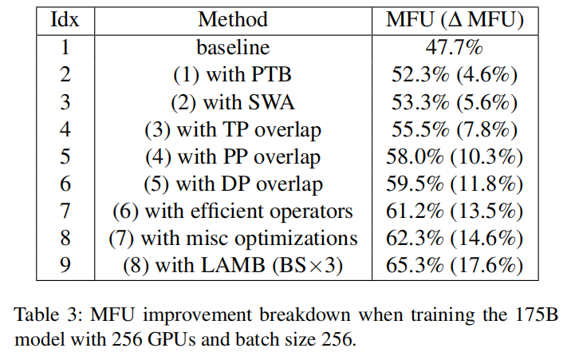

## CLIP模型FLOPs计算

执行

```
python calculate_flops.py
```

即可得到三种不同规模的CLIP模型的FLOPs。这里**假设文本和图片的批大小均为128， 文本的序列长度为64**。下表是计算结果：

| 模型规格                                                                                                   | 模型参数量 | TFLOPs |
| ------------------------------------------------------------------------------------------------------ | ----- | ------ |
| [CLIP-vit-large-patch14-336](https://huggingface.co/openai/clip-vit-large-patch14-336)                 | 400M  | 50     |
| [laion--CLIP-ViT-H-14-laion2B-s32B-b79K](https://huggingface.co/laion/CLIP-ViT-H-14-laion2B-s32B-b79K) | 2B    | 48     |
| [EVA02_CLIP_E_psz14_s4B](https://huggingface.co/QuanSun/EVA-CLIP)                                      | 4B    | 295    |

>[! note]
>- 这里的FLOPs是把浮点数的加、减、乘、除、指数、根号等都算上了
>- 当前只统计了前向传播的FLOPs，后续会加上反向传播
>- 注意到表格第1、2行，模型参数量上升，TFLOPS反而下降了，这是因为两个模型要求的输入图片大小不同。第1行模型要求输入图片长宽为336，第2行模型要求输入图片长宽为224。若统一输入图片大小，则第二行模型TFLOPs高于第一行模型

### CLIP-vit-large和laion

这两个模型架构采用的是transformers库中的CLIPModel。其配置文件（config.json）中的关键配置如下，使用这些配置即可估算出模型的TFLOPs。

- projection_dim：分别把来自text model和vision model的输出的embedding维度，映射到projection_dim的长度
- text_config_dict：
	- hidden_size：embedding维度的长度
	- intermediate_size：MLP的中间层的embedding维度的长度
	- num_attention_heads：attention头数
	- num_hidden_layers：Encoder里有多少个Encoder Layer（一个Encoder Layer里包含layernorm、attention、mlp）
	- projection_dim：当使用CLIPTextModelWithProjection时，会将encoder的输出映射到projection_dim。CLIPModel中默认使用的是CLIPTextTransformer，并没有用到该参数。
- vision_config:
	- hidden_size、intermediate_size、num_attention_heads、num_hidden_layers、projection_dim：同上
  - image_size：输入图片长宽
  - patch_size：一个patch的长宽。一个patch转换为1个token，token数量即为patch数量，即$(image\_size/patch\_size)^2$

### EVA02_CLIP_E_psz14_s4B

从https://github.com/baaivision/EVA/tree/master/EVA-CLIP/README.md 中的信息可以看出，EVA02_CLIP_E_psz14_s4B的模型架构是EVA02-CLIP-bigE-14

- 模型类：
	- 视觉模型： https://github.com/baaivision/EVA/blob/master/EVA-CLIP/rei/eva_clip/eva_vit_model.py  -> EVAVisionTransformer
	- 语言模型： https://github.com/baaivision/EVA/blob/master/EVA-CLIP/rei/eva_clip/transformers.py  -> TextTransformer
- 配置文件： https://github.com/baaivision/EVA/blob/master/EVA-CLIP/rei/eva_clip/model_configs/EVA02-CLIP-bigE-14.json

结合代码，对配置文件中的各项进行解读：

- embed_dim：视觉模型和语言模型输出的embedding维的长度
- vision_cfg：
	- image_size：图片宽高
	- layers：encoder里有多少个encoderlayer
	- width：embedding维度的长度
	- head_width：一个head的embedding维度的长度。
		- 即num_heads = width / head_width
	- mlp_ratio：mlp的中间层是embedding长度的几倍
	- patch_size：一个patch的长宽
	- drop_path_rate：一个类似dropout的东西
	- xattn：使用memory_efficient_attention
	- postnorm：
		- 若为True，则先做Attntion/MLP，再做LayerNorm
		- 若为False，则先做LayerNorm，再做Attention/MLP
	- fusedLN：是否使用融合了的LayerNorm
- text_cfg：
	- context_length：句子长度
	- vocab_size：词典大小
	- width、 layers、xattn、fusedLN：同上
	- heads：头的个数
	-

## 问题

**0.CLIP 模型的参数量和 CLIP 模型对应的 TFLOPS 之间是什么关系？**

在输入形状完全相同的情况下，其参数量和TFLOPs之间是一次增长的关系。

经过简单修改calculate_flops.py，使其在计算CLIP-vit-large-patch14-336的FLOPs时，结果里带着符号变量。结果如下：

```
590848*id**2*il + 295424*id*il*im + 171789056*id*il + 88082560*id + 369280*il*im + 1362790912*il + 65536*td**2*tl + 32768*td*tl*tm + 2244608*td*tl + 270336*td + 40960*tl*tm + 12517376*tl + 32244224 FLOPs
```

符号含义：

- 前缀i（**i**mage）代表视觉模型，t（**t**ext）代表文本模型。
- 后缀d（embe**d**ding）代表嵌入维度，m（inter**m**ediate_size）代表MLP中间层的维度，l（**l**ayer）代表层数

可以看出，结果中的高次项是$id^2*il$和$td^2*tl$。考虑到$im$通常是$id$的整数倍，所以类似$id*il*im$的项可以归入$id^2*il$。我们忽略低次项。

同时我们知道，Transformer模型中的模型参数，与$d^2l$成一次关系（Attention和MLP中的Projection权重与$d^2$呈一次关系，再乘以$l$层）。

所以，参数量和TFLOPs之间呈现一次增长的关系。

**1.TFlops 有哪些计算方法？你使用了哪几种**

以下是个人思考，还没有看到一些官方资料。

- **从统计指标上**：
	- 可以仅统计乘法、除法等重操作。 [thop](https://github.com/Lyken17/pytorch-OpCounter/tree/master/thop)中就是这么做的。
	- 也可以将加、减法一起统计进来。
- **从工程实现上**：
	- 若模型结构确定，可以写出特定的计算FLOPs的公式或函数，带入模型超参数即可得到FLOPs结果
	- 若模型结构不定，可以参考 [thop](https://github.com/Lyken17/pytorch-OpCounter/tree/master/thop)的实现方法。实现基础算子的FLOPs计算公式，利用钩子函数/torch.fx/onnx对计算图进行遍历，将遍历到的每个基础算子的FLOPs相加。

本项目的实现方式：

- **从统计指标上**，本项目将浮点操作分为两类：将mul/div/exp/sqrt等重操作分为一类，统称为mul；将add/sub作为轻操作分为一类，统称为add。分别统计这两类操作，以及他们的总和。
- **从工程实现上**，本项目专注于CLIP模型结构，利用sympy可得到整个模型的FLOPs计算公式，并带入具体的超参数可计算得到FLOPs。使用sympy的好处是，通过观察公式，可以更有助于理解各个超参数对整体FLOPs的影响。


**2&3. 是否能找到这个模型在不同的硬件，比如 A100、H800 等上面的 sota 的 MFU？对应的 sota 指标是如何达到的？**

**暂未找到CLIP模型的MFU数据**。考虑到CLIP和LLM都属于Transformer，很多优化方法可以借鉴，所以这里参考了LLM模型上的一篇SOTA工作：**MegaScale: Scaling Large Language Model Training to More Than 10,000 GPUs**。他们是在Ampere架构上做的实验。

下表是论文中MegaScale与Megatron-LM在不同配置下的MFU对比


在论文中，给出了不同优化手段对MFU的影响。如下表所示。



上述优化手段分别为：

**1) PTB(Parallel Transformer Block)**

修改模型结构，将MLP和Attention由串行改为并行。


**2) SWA(Sliding window attention)**

滑动窗口注意力。


**3) TP overlap**

该论文采用了序列并行和张量并行。观察到All-Gather和Reduce-Scatter处于关键路径上，该论文将All-Gather与ColParaLinear进行融合，Reduce-Scatter与RowParaLinear进行融合，掩盖掉通信开销。

融合：矩阵分块计算，相邻块的通信和计算可以重叠。


**4) DP overlap**

该论文中的数据并行，采用Zero2中的策略。存在两类通信：

- all-gather：前向传播时，让每个gpu上都能拿到当前层的全部权重。
- reduce-scatter：反向传播时，将梯度reduce后，再分发给不同gpu。


模型可以被切分为不同的chunk。重叠通信的方式为：

- all-gather：
  - 当前chunk的all-gather操作，与前面的chunk的前向计算重叠。
  - 第一个chunk的all-gather与输入数据加载重叠。
- reduce-scatter：
  - 当前chunk的reduce-scatter操作，与后面的chunk的反向计算重叠。


**5) PP overlap**

采用1F1D的流水并行，并将send/receive与计算重叠。如下图所示：


**6) Efficient Operators**

用了FlashAttention V2；对layernorm、gelu做了算子融合，说原先这些算子是由更基本的算子组合出来的。


**7) misc（其他杂项的优化）**

包括Data Pipeline、Collective Communication Group Initialization、 Network Performance Tuning

- **Data Pipeline**包括：
  - **Asynchronous data preprocessing**：数据预处理与最后一个批次的梯度同步重叠。
  - **Redundant dataloader elimination**：
    - 问题：多个GPU workers在加载输入数据时，同时读硬盘，使得硬盘成为瓶颈；
    - 解决：观察到一台机器中的GPU workers位于同一个tensor parallel group中，它们是共享输入数据的；所以，该论文用一个专门的数据加载器，将输入数据从硬盘加载到共享内存，然后由各个GPU workers将输入数据从共享内存加载到各自的GPU显存中。

Collective Communication Group Initialization和Network Performance Tuning的优化后续再补充上来。


**8) LAMB**

一种优化器，能在增大batch size时保持模型训练精度。


**4.我们使用的 clip 会切换调整，如何实现一个 python 函数快速计算当前给定的 clip 规格，返回 TFLOPs ？**

只需提供模型的config.json文件（需符合一定格式），并将其路径记录在calculate_flops.py里，随后执行完成计算。后续会进一步完善，将config.json的路径以参数的形式传给calculate_flops.py

**5.有没有遇得到一些困难或者不理解的概念？具体有哪些可以展开说说**

1）为何这三个CLIP模型的文本序列的最大长度都很短，只有77？

2）CLIP模型能在不同大小的输入图片之间迁移，并保持精度吗？还是从训练到推理必须固定输入图片大小？

3）CLIP模型主要就是两个Transformer，对于Transformer的优化已经有很多工作，那CLIP模型特定的优化点在哪里？

我的一个想法：两个Transformer并行起来后，输入的文本和图片的大小不固定：有时图片大，使得视觉模型成为瓶颈；有时文本长，使得文本模型成为瓶颈。若给视觉模型和文本模型分配的gpu数量是固定的，则有可能导致负载不均衡的情况。所以是否需要在不同输入的情况下，自动分配给视觉模型和文本模型不同数量的gpu？

进一步的问题是，在训练期间，每一个训练轮次，都有可能需要重新分配gpu，那重新分配的成本是否较高？感觉这里可用有很多优化的点。

不知道上述想法是否成立，是否已经有工作实现了类似的想法。