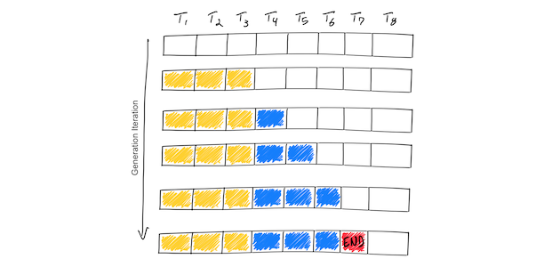

最近提出的优化叫 continuous batching，又叫 dynamic batching 或者是 iteration-level 的调度。

发现：

* 使用 continuous batching(cb) 和相关的显存优化（PagedAttention）之后，速度提升23倍
* 使用 cb 8倍吞吐的提升
* 4倍吞吐，使用优化后的模型实现（FasterTransformer)

# LLM 推理的基本概念
推荐：[Efficient Inference on a Single GPU](https://huggingface.co/docs/transformers/perf_infer_gpu_one) 和 [Optimization Story: Bloom inference](https://huggingface.co/blog/bloom-inference-optimization)

从更高维度来看，LLM 推理比较简单

每个请求而言：
1. 起始时有一个序列的 token （叫做 prefix 或者 prompt）
2. LLM 会产出一系列的补全 token，达到上限或者产出停止token后停止

这是一个迭代的过程：在模型的每次 fwd 里产出一个补全的 token。

ASCII 字符和 token 并不是一一对应的。比较流行的 token 编码方式是 [Byte-Pair Encoding](https://en.wikipedia.org/wiki/Byte_pair_encoding)

深入：

1. 初始的prompt：和产出每个后续 token 的过程耗时差不多。因为 prefill_phase 预先计算了一些 attention 机制里的输入（kv cache），在整个产出过程中是不变的。prefill 阶段对 GPU 并行很友好，因为各自独立
2. LLM 推理是显存 IO bound 的，不是计算 bound。换言之，加载1MB数据到GPU里耗时比 1MB 之上计算开销要大。明 LLM 推理的吞吐绝大部分取决于 在 GPU 显存里能放下多大的 batch。[NVIDIA docs](https://docs.nvidia.com/deeplearning/performance/dl-performance-gpu-background/index.html#understand-perf)：
3. 消耗的 GPU 显存与基模型大小和token序列长度相关。在 Numbers every LLM developer should know 里，预估出13B参数的模型，序列里的每个 token 花费几乎 1MB 的数据。
