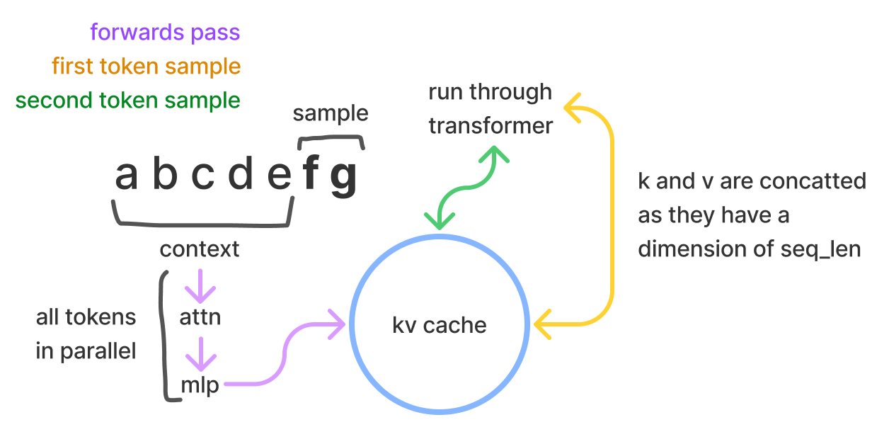

本文呈现的是几个 LLM 推理性能相关的原则，没有经验或者困难的数学。非常简单的推理延迟模型就可以是经验结果的很好的拟合。让我更好地预测并形成了更好的 transformer 推理的解释

## 目录：
### kv cache
解释了在推理的时候把 self-attention 向量缓存来带来性能收益，也讲了可能得收益和容量代价

在采样时，transformer 推理包含处理一个提供的 prompt/context（可以并行发生(这里指的 embedding? 比如 byte pair encoding），然后一个个 **采样** 额外的 tokens（这就是自回归的含义）。在采样的时候，transformer 执行 self-attention，这里采样时需要当前在序列(sequence)（无论是在 prompt/context 或者生成的 token 里）里的每个 item（指 token？）的 kv 值。这些向量被叫做 kv cache，即 past cache(GPT-2的开源代码里这么叫）。而 kv cache 的 shape 是 [batch, 2(k,v), num\_heads, seq\_len, features]



上图里清晰看出来 context/prompt, sample(生成的），以及第一个采样 token 和 第二个采样 token，拿到这俩 token 的 kv 之后，就需要去走 transformer

问题：为什么叫采样 token？

目的是避免每次采样token时，都重计算这些向量。有了已经计算好的 k、v 的值，我们可以以存储开销来节省大量的计算开销。对于每个 token，需要存储的字节数量：
```
2*2*nlayers*nheads*dhead
```
相当于每个 k or v 的维度是 [nheads, dhead] # 那 dhead = seq_len*features?

> 如何计算一个矩阵乘的 flops？
> 1. 对于矩阵(m,n)和向量(n)，是 2mn
> 2. 对于矩阵(m,n)和矩阵(n, p)，是 2mnp
> mn 意味着很多，而2倍来自于一个矩阵乘法是由两个算子组成：乘法和加法的操作


在 token embeddings 里乘起来的权重是 Wk, Wv 属于 R(dmodelxdmodel)，因此每个 token embeddings 是 te 属于 R(1xdmodel)。所以计算所有层的 k 和 v 的 flops 是：

(dmodel 就是上文里的 features？）
```
2*(2*nlayers*dmodel^2)

```
这意味着对于 52B 参数量的模型（比如以 Anthropic 为例，dmodel=8192，nlayers = 64），那么 flops是：

```
2*2*64*8192^2 = 17,179,869,184
```

如果我们有 A100 的 GPU，它的每秒运算次数是：312e12 flops/seconds，而显存带宽是 1.5e12 bytes/seconds。下面的数字是给 kv 权重和计算用的：

```
memory = 2bytes*2*nlayers*dmodel^2 / 1.5e12
compute = 2flops*2*nlayers*dmodel^2 / 312e12
```


此时模型的结构就不重要了 -- 我们在给定 A100 硬件的情况下，得到了特定的比例: 312/1.5 = 208。意味着我们给一个 token 计算一次 kv，会和计算 208 个 token 的KV耗时相当(读取一个 token后，计算一次和计算208次耗时一样的)。在这个线之下，是受限于显存带宽，之上，是受限于计算

对于一个 52 B 的模型，完整的 fwd 里:

1. 208 tokens 的情况下，读取数据所需耗时 `12*2*nlayers*dmodel^2/1.5e12=69 ms`(为什么是6*2？）（实践中，会使用4个 GPU 并行地做，所以实际是 69/4= 17ms）
2. 如果有416（翻倍）的上下文 tokens，那么会花费两倍的代价
3. 312 个 tokens ，会花费 312/208 = 1.5 倍耗时

计算一个 kv cache 里 token 的代价是把这个 token传入到模型里进行计算的代价的 1/6。简言之，fwd 过程很轻量，因为并行度相比把每个token的权重读取出来然后做回归的高很多。（没懂，权重是给每个 token 使用的吧，并不是每个token都有对应的权重

这并不意味着节省了 1/6 的时间。假设我们是 flops 受限制。在每个 sample 开始时，节省了 2*2*ntokens*nlayers*dmodel^2 / 312e12 ，而解码时花费 2*12*nlayers*dmodel^2/312e12。因此每个步骤里，节省了1/6 * ntokens 数量的 flops 耗时。即当随着 tokens 数量变大，收益变大。假设没有 kv cache，采样会是 O(n^2)的时间复杂度，而n是 token 数量

并不是全部。当使用小的 bs，就是内存受限，此时都不需要使用 past cache 来节省时间，开心地重计算。


### capacity
kv cache 的存储代价，模型权重的存储代价，对于性能而言，capacity 意味着什么

对于A100，有40G or 80G的显存。给定参数的数量，可以简单乘以2来获得字节数。所以 52B的模型，大小为 52e12 * 2bytes = 104GB，显然放不下，需要至少3台 A100 40G。这样只有 120-104 = 16 GB的空闲。这个足够吗？回到等式里，再看一个 52B 的模型的 kv cache memory per token：
```
2*2*nlayers*nhead*dhead = 4*64*8192 = 0.002GB
```

那么16GB的空闲显存里，可以放得下 16/0.002 = 8000 个 tokens，或者我们可以做 bs 为 4，每个请求最大 2048 token

这很糟糕，因为我们希望能做更高的 batch size，而不是受限于显存。更高的 bs 收益更大，因为处理同样的请求，bs增大后 GPU 耗时并没有增加多少。另外如果 bs 这么低，那我们就受限于显存，那么就没必要使用 kv cache


### model parallelism
解释 TP 来清楚地描绘通信的代价

### latency 计算
给推理速度计算出了天花板

### batch sizes
讨论了 batch size 对性能的影响，以及什么 bs 是最优的

### flops counting
浏览了 transformer blocks，识别出哪些操作对 flops 速度有影响

### intermediate memory cost
激活值如何占用内存，内存带宽看起来是什么样

### 和真实的 benchmark 做比较
我们计算的和 NV FasterTransformer 里的 benchmarks 报告作比较，得到差异
