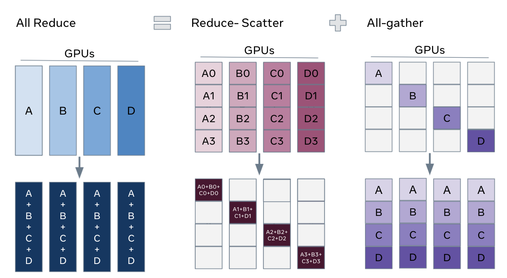
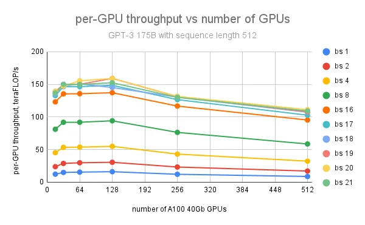

## [fairscale 官方的 fsdp 的文档](https://fairscale.readthedocs.io/en/latest/api/nn/fsdp.html)
reshard_after_forward=False 就是等价于 ZeRO2
flatten_parameters : 把所有参数搞成一个连续的 tensor，能提高训练速度
bucket_cap_mb: 和 DDP不同，需要后续看一下

## [PyTorch 的 fsdp 的实现](https://pytorch.org/docs/stable/fsdp.html)
```
limit_all_gathers=False 可以显示显存的使用，避免 oom。prevent too many in-flight all-gathers
sync_module_states=False 会增加 GPU 间通信
sharding_strategy=FULL_SHARD, SHARD_GRAD_OP, NO_SHARD, HYBRID_SHARD, 主机内 FULL，但是之间是 NO。_HYBRID_SHARD_ZERO2: 主机内 zero2，主机间 NO
auto_wrap 可以控制哪些部分被 shard ？
forward_prefetch 这个是用来fwd里做的，那应该是 prefetch sharded parameters？

```

## [facebook 对 FSDP 的博客](https://engineering.fb.com/2021/07/15/open-source/fsdp/)
ZeRO2 原理：把原来的 allreduce 梯度，改为了 Reduce-Scatter 梯度，然后各自shard负责计算自己的优化器状态和参数，然后 all-gather 参数给所有其他人



而且里面介绍了 LM 和 CV 里的不同。也介绍了 lightning 里的用法

## [fairscale 里加入这个 feature 的 PR：Add FullyShardedDataParallel (FSDP) #413](https://github.com/facebookresearch/fairscale/pull/413)
reshard_after_forward=False 类似 ZeRO-2

FSDP 比 PyTOrch  DDP 要快，因为优化器状态被 sharded，而且额外的通信(0.5倍的参数 all-gather？）可以被 fwd 掩盖

## 参考资料
1. PyTorch 官网的文档，里面有主机节点增多情况下的 GPT 系列模型的吞吐量： [Introducing PyTorch Fully Sharded Data Parallel (FSDP) API](https://pytorch.org/blog/introducing-pytorch-fully-sharded-data-parallel-api/)


