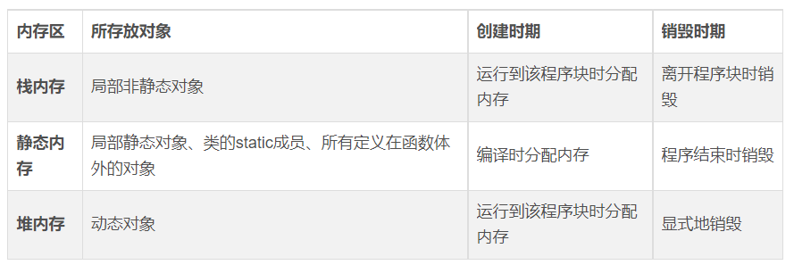
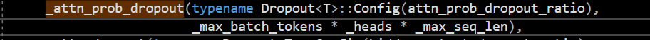
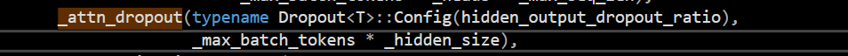
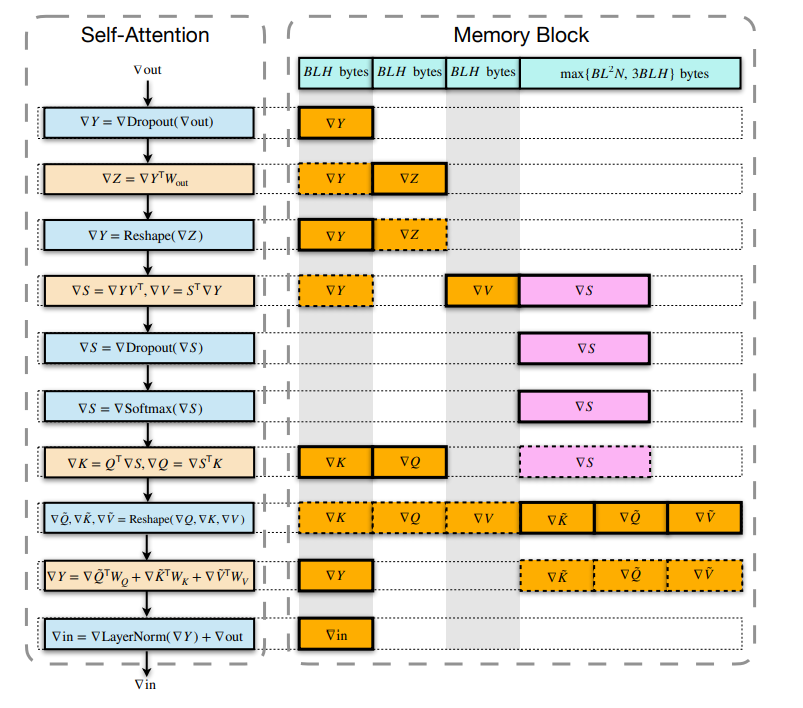

## 总体分析

- layer A  18

- layer B  34

也就是这个Transformer共有52个Encoder


分析两个文件

## 1.先分析这个类的内存占用情况

- TransformerEncoderLayer类

- 下载 lightseq项目，创建visual studio CUDA项目，在编译选项命令行中添加

- ```
  /d1 reportAllClassLayout
  ```

- 然后编译transformer_encoder_layer.cpp, 得到TransformerEncoderLayer类的内存分布， 是488个字节

- ```
  +    class TransformerEncoderLayer<float>	size(488):
  +    	+---
  +     0	| {vfptr}
  +     4	| _layer_id
  +     8	| _H
  +    12	| _heads
  +    16	| _intermediate_size
  +    20	| _max_batch_tokens
  +    24	| _max_seq_len
  +    28	| _pre_or_postLayerNorm
  +      	| <alignment member> (size=3)
  +    32	| ?$basic_string@DU?$char_traits@D@std@@V?$allocator@D@2@ _activation_fn
  +    60	| _batch_size
  +    64	| _seq_len
  +    68	| _batch_tokens
  +    72	| _batch_heads
  +    76	| _batch_dim
  +    80	| _training
  +      	| <alignment member> (size=3)
  +    84	| _cublasHandle
  +    88	| _stream
  +    92	| ?$FeedForward@M _qkv_linear
  +    112	| ?$FeedForward@M _attn_out_linear
  +    132	| ?$Normalize_Layer@M _attn_ln
  +    148	| ?$Normalize_Layer@M _ffn_ln
  +    164	| ?$FeedForward@M _ff1
  +    184	| ?$FeedForward@M _ff2
  +    204	| ?$Softmax@M _softmax
  +    208	| ?$Dropout@M _attn_prob_dropout
  +    224	| ?$Dropout@M _attn_dropout
  +    240	| ?$Dropout@M _ffn_activation_dropout
  +    256	| ?$Dropout@M _ffn_dropout
  +    272	| ?$StridedBatchGemm@M _attn_scores
  +    316	| ?$StridedBatchGemm@M _attn_context
  +    360	| _gemmQKV_inp_ptr
  +    364	| _qkv_ptr
  +    368	| _soft_out_ptr
  +    372	| _ctx_bufB_ptr
  +    376	| _attn_o_inp_ptr
  +    380	| _ff1_inp_ptr
  +    384	| _relu_inp_ptr
  +    388	| _ff2_inp_ptr
  +    392	| _attn_qkvw_ptr
  +    396	| _attn_qkvb_ptr
  +    400	| _attn_ow_ptr
  +    404	| _attn_ob_ptr
  +    408	| _attn_nw_ptr
  +    412	| _attn_nb_ptr
  +    416	| _inter_w_ptr
  +    420	| _inter_b_ptr
  +    424	| _output_w_ptr
  +    428	| _output_b_ptr
  +    432	| _ffn_nw_ptr
  +    436	| _ffn_nb_ptr
  +    440	| _grad_attn_qkvw_ptr
  +    444	| _grad_attn_qkvb_ptr
  +    448	| _grad_attn_ow_ptr
  +    452	| _grad_attn_ob_ptr
  +    456	| _grad_attn_nw_ptr
  +    460	| _grad_attn_nb_ptr
  +    464	| _grad_inter_w_ptr
  +    468	| _grad_inter_b_ptr
  +    472	| _grad_output_w_ptr
  +    476	| _grad_output_b_ptr
  +    480	| _grad_ffn_nw_ptr
  +    484	| _grad_ffn_nb_ptr
  ```

- 仔细分析如下

  ```C
  【1】
  0字节-3字节是class TransformerEncoderLayer类虚函数表指针的空间
  【2】
  4字节-31字节是EncoderLayer的一些常量参数，都是const修饰的常量，一般是初始化给定
  【3】
  32-59字节： string
  【4】
  60-83字节是一些EncoderLayer的变量
  【5】
  84-91字节是两个cublas结构体
  【6】
  92-131字节是两个前向传播层的结构体
  【7】
  132-163字节是两个正则化层Normalize_Layer的结构体
  【8】
  164-203是两个前向传播层的结构
  【9】
  204-207字节是Softmax层
  【10】
  208-271字节是4个Dropout层
  【11】
  272-359字节是2个矩阵乘法层
  【12】
  360-391GPU本地内存，8个指针，分别代表层间的训练权重的指针，共32字节
  【13】然后注意到类中有一个静态变量，是层与层之间共享的变量，放在shared GPU mem中，猜想对应于GPU硬件中的共享内存区域
    // shared GPU memory between layer
    static T *_shared_mem_ptr;
  【14】
  392-439字节，用于存放EncoderLayer中的参数指针，LayerA中用到
  【15】
  440-484字节，用于存放EncoderLayer中后向传播的梯度，LayerB中用到
   
  ```

- 然后看下分为几种类别

  - 

  - 

    

- 接着来看，什么是中间值，就是指运行过程构造函数会动态分配内存的量

  - **中间值**也就是

    - allocate_mem_buffer()
    - free_mem_buffer()

    中涉及到的变量指针

  - - ```
      为了便于查看，我们做如下约定
      max_batch_tokens = B
      nhead = H
      max_seq_len = L
      heads = N
      intermediate_size = I
      ```

    - 具体来看，内存中分配空间大小如下

      - ```
        _gemmQKV_inp_ptr:   B * H 
        
        _qkv_ptr: B * H * 3 【用来生成KVQ矩阵】
        
        _soft_out_ptr: B * N * L 	用在【soft(KQ/sqrt(d_k))】
        
        _ctx_bufB_ptr: B * N * L
        
        _attn_o_inp_ptr = B * H
        
        _ff1_inp_ptr = B * H
        
        _relu_inp_ptr = B * I
        
        _ff2_inp_ptr = B * I
        ```

      - 如果层与层之间要共享gpu内存，就需要给__shared_mem_ptr分配空间smem_size

        - ```
          - smem_size = max(3 * B * H + B * I, 5 * B * H + std::max(3 * B * H,  B * N * L))
          ```

## 2. 分析任务中的52个Layer，运⾏起来⼤概会占⽤多少显存？


layer a与layer b 计算方法相同

显存占用就是  ：

- 固定大小的永久内存, 如：\__device__修饰的量、 \__global__修饰量 ，这里没有找到，也可忽略。
- 存储参数及其梯度
- 可变大小的临时内存来存储中间状态
  - 包括cuda_malloc分配的量
  - TransformerEncoderLayer中运算过程中申请的中间占用


## 2.1 存储参数以及梯度

- assign_weight_ptr() 函数以及 assign_grad_ptr()函数传入的指针指向的显存，前者指向权重参数，后者指向梯度参数

  ```C
      const T *wptr = weights_ptr;
      // assign weights ptr
      _attn_qkvw_ptr = wptr;
      wptr += _hidden_size * _hidden_size * 3;
      _attn_qkvb_ptr = wptr;
      wptr += _hidden_size * 3;
      _attn_ow_ptr = wptr;
      wptr += _hidden_size * _hidden_size;
      _attn_ob_ptr = wptr;
      wptr += _hidden_size;
      _attn_nw_ptr = wptr;
      wptr += _hidden_size;
      _attn_nb_ptr = wptr;
      wptr += _hidden_size;
  
      _inter_w_ptr = wptr;
      wptr += _hidden_size * _intermediate_size;
      _inter_b_ptr = wptr;
      wptr += _intermediate_size;
      _output_w_ptr = wptr;
      wptr += _hidden_size * _intermediate_size;
      _output_b_ptr = wptr;
      wptr += _hidden_size;
      _ffn_nw_ptr = wptr;
      wptr += _hidden_size;
      _ffn_nb_ptr = wptr;
      wptr += _hidden_size;
  ```

  - ```
    - wptr = gptr 
    
    	   = 3 * H * H + 3 * H + H * H + H + H + H + H * intermediate_size + intermediate_size + H * intermediate_size + H + H + H 
    	   
    	   = 9 * H + 4 * H * H + 2 * H * I + I
    ```


## 2.2 cuda_malloc 分配的量

	为了便于查看，我们做如下约定
	max_batch_tokens = B
	nhead = H
	max_seq_len = L
	heads = N
	intermediate_size = I


- ```
  运算之前，就需要分配好的变量
  
  - qkv_ptr= 3 * B * H
  
  - soft_out_ptr = B * N * L
  
  - ctx_bufB_ptr = B * N * L
  
  - attn_o_inp_ptr = B * H
  
  - ff1_inp_ptr = B * H
  
  - relu_inp_ptr = B * I
  
  - ff2_inp_ptr = B * I
  
  - smem_size = max(3 * B * H + B * I, 5 * B * H + std::max(3 * B * H,  B * N * L))
  其中smem_size是gpu中的全局共享内存，就是一些前后顺序上互相不依赖的tensor，可以共享显存。
  
  ```

​    加到一起  

​	5B * H + 2B * N * L + 2B * intermediate_size + max(3 * B * H + B * intermediate_size,   5 * B * H + max(3 * B * H, B * N * L))

- 前向传播中

  - 

  - 每一个TransformerEncoderLayer可以划分为这些子层，在运算过程中会产生一些显存占用

  - ```c++
    对应于TransformerEncoderLayer.cpp中类构造函数：
          
          _qkv_linear(typename FeedForward<T>::Config(3 * hidden_size, hidden_size)),
    		  
          _attn_out_linear(typename FeedForward<T>::Config(hidden_size, hidden_size)),
    		  
          _attn_ln(typename Normalize_Layer<T>::Config(hidden_size, false),_max_batch_tokens),
    			   
          _ffn_ln(typename Normalize_Layer<T>::Config(hidden_size, false), _max_batch_tokens),
    			  
          _ff1(typename FeedForward<T>::Config(_intermediate_size, hidden_size)),
          _ff2(typename FeedForward<T>::Config(hidden_size, _intermediate_size)),
          
          _softmax(typename Softmax<T>::Config(num_heads)),
    	  
          _attn_prob_dropout(typename Dropout<T>::Config(attn_prob_dropout_ratio),_max_batch_tokens * _heads * _max_seq_len),
    						 
          _attn_dropout(typename Dropout<T>::Config(hidden_output_dropout_ratio),_max_batch_tokens * _hidden_size),
    					
          _ffn_activation_dropout(typename Dropout<T>::Config(activation_dropout_ratio),_max_batch_tokens * _intermediate_size),
    		  
          _ffn_dropout(typename Dropout<T>::Config(hidden_output_dropout_ratio), _max_batch_tokens * _hidden_size),
    				   
          _attn_scores(typename StridedBatchGemm<T>::Config((T(1.0) / T(sqrt(_hidden_size / _heads))), T(0.0), CUBLAS_OP_T, CUBLAS_OP_N)),
    		  
          _attn_context(typename StridedBatchGemm<T>::Config(T(1.0), T(0.0), CUBLAS_OP_N, CUBLAS_OP_N))
    	  {
    			assert(_hidden_size % _heads == 0);
    	  }
    ```

  - 细看Forward函数

    

    ```
    attn_buffer 指针指向已经分配好的临时内存，所以attn_buffer只占8字节
    同理，ffn_inp_ptr也一样，总共占16字节
    ```

    - 第一步是self-attention

    ```C
    大概流程如下，
    【1】定义了一个指针，这个指针指向__qkv_ptr 这个显存已经计算过，所以这里只需要三个指针大小的显存，8*3 = 24字节
      T *q_tf_ptr = _qkv_ptr;
      T *k_tf_ptr = q_tf_ptr + _batch_dim;
      T *v_tf_ptr = k_tf_ptr + _batch_dim;
    
    【2】是否先进行layerNorm，如果先进行，执行第一句， _attn_ln_层对应LayerNorm操作，也有可能最后执行，总之需要正则化一次，需要显存
    ```

    

    

    需要显存大小 B 或者 2B

    ```
    【3】接着对上一步的数据进行_qkv_linear操作，这里的操纵不需要临时显存
    
    【4】添加Bias 然后Reshape Q，K，V
    
    【5】_attn_scores， Q*K， 这里也不需要临时显存
    
    【6】_softmax, 不需要临时显存
    
    【7】_attn_prob_dropout， 需要临时显存，得到score
    ```

    

    大小为 B * N * L

    ```
    【8】_attn_context score和V注意力乘， 不需要额外显存
    
    【9】reshape，不需要额外显存
    
    【10】输出前进行线性变换，_attn_out_linear，不需要额外显存
    
    【11】_attn_dropout，需要显存
    ```

    

    大小为 B * H

    - 第二步是ffn

      ```
      【1】 第一步或者最后一步LayerNorm，需要参数
      ```

      

      需要显存大小 B 或者 2B

      ```
      【2】 _ff1，无需显存
      
      【3】 _activation_ffn_dropout, 需要显存
      ```

      

      大小为 B * intermediate_size

      ```
      【4】 _ff2, 无需显存
      
      【5】_ffn_dropout，需要
      ```

      

      大小为 B * H

      总共加起来  2B + B * N * L + B * H + 2B + B * intermediate_size +  B * H

    

- 反向传播中

  可以同理分析

  

  需要临时现存的有

  

  

  

  

  

  

  总共加起来

  ​		B* H  + B \*N* L + 2B + B\* H + B * intermediate_size + 2B

## 2.3 计算过程中存在的临时变量

### 反向传播中：

- lightseq论文作者发现，transformer在训练和推理过程中，pytorch、tensorflow版代码gpu会频繁地释放和申请显存空间，导致gpu的显存利用率出现波动，如图：

  

  ​	所以lightseq针对此做了一些改进，在训练之前，预先估计gpu显存峰值大小，固定分配这么大的显存，然后就节约了训练过程中显存的动态申请和释放开销，举例来说，就是反向梯度传播中，同一列的数值可以共享显存，总共的显存占用就是3BLH + max{BLLN, 3BLN}

  

  

  - 右边部分的图的每一行列出了一步中**临时张量**的内存占用情况。

  - 同一列中的张量重用同一内存块。

  - 橙色张量和紫色张量的大小分别为BLH和BLLN。

  - 虚线内存块中的张量不会在这个步骤中更新，而实心内存块中的张量会更新。

  - 我们可以看到，只需要**3BHL(前三个块)+ max{3BHL, BNL^2}** (最后一个块)的内存字节.

  - 相反，如果不使用共享内存块策略，

    - **▽**Y, **▽**Z, **▽**K, **▽**Q, **▽**V, **▽**in 大小都是 B * L * H
    - ▽S 大小是 3 * B * L * H
    - ▽ ~K + ▽ ~Q + ▽~V 大小是 B * L^2 * N

    则总共需要**9 * B * L * H + B * L^2 * N**字节的临时内存。

- 在ffn的反向传播中，需要的临时变量如图

  - 
  - 只需要 B * L * H ，而且其实和self-atten里面的还可以共享，所以这 B * L * H 也可以忽略

​	

### 同理，正向传播中

- 需要保存的就是，Y, Z, K, Q, V, in, S, ~K, ~Q, ~V 也需要**3BHL(前三个块)+ max{3BHL, BNL^2}**


所以临时变量大小   6 * B * H * L+ 2 * max{3 * B * H * L, B * N * L * L}


综上，总结到一起

```
B = 1
L = 8836
H = 1152 
N = 9 
I = intermediate_size = 2*H = 2*1152 = 2304
bool pre_or_postLayerNorm = true


9 * H + 4 * H * H + 2 * H * I + I + 5 * B * H + 2 * B * N * L + 2 * B * I + max(3 * B * H + B * I,   5 * B * H + max(3 * B * H, B * N * L)) + B* H  + B * N * L + 2 * B + B * H + B * I + 2 * B + 6 * B * H * L+ 2 * max(3 * B * H * L, B * N * L * L)

对于18个 layer A 
	总共需要 38412163400
	大概26.59 * 2^30
    26.59 * sizeof(T) GB 数据
    
    
同理，对于34个B
B = 1 
L = 4418 
H = 576 
N = 18 
I = intermediate_size = 5*hidden_size = 2880

	24.58 * 2^30
	需要 24.58 * sizeof(T) GB 数据
	
加到一起，需要51.17 * sizeof(T) GB数据

- half数据类型用16位来表示浮点数，就是2字节，sizeof(half)=2
需要102.34GB数据

- float数据类型32位，sizeof(float)=4
需要204.68GB数据
```


## 3.再分析有52各这⼏类内存如何优化？

- **显卡内存可以分为**
  - 固定大小的永久内存
  - 存储参数及其梯度
  - 可变大小的临时内存来存储中间状态。


- 可以共享一些显存，理由是：

  - 某些中间结果仅在某些步骤内用，如果不需要了，就可以覆盖掉他
  - 频繁地动态申请和释放显存会导致gpu开销变大。

  

- 共享需要一些前提条件

  - 共享显存的变量之间无依赖关系
  - 共享显存的量大小比较接近或相等

  

- lightseq中的策略：

  - 通过压缩内存来减少分配和释放，并且没有额外的成本，从而减少内存占用。
  - 为了避免临时内存的频繁分配，对训练集进行扫描并估计其容量的上界。因此，在训练开始前分配一次大小最大的临时内存，并对不同批次进行重复使用，在训练结束后释放。具体方式就是第二问提到的。

  

  

  ```python
  import torch
  from lightseq.training.ops.pytorch.transformer_encoder_layer import LSTransformerEncoderLayer
  
  
  def train(model, inputs, masks):
  
      inputs = inputs.to(device="cuda:0")
      masks = masks.to(device="cuda:0")
      model.to(device="cuda:0")
      model.train()
      opt = torch.optim.Adam(model.parameters(), lr=1e-3)
  
      for epoch in range(1):
          opt.zero_grad()
          outputs = model(inputs, masks)
          loss = torch.square(outputs).mean()
          loss.backward()
          opt.step()
          if epoch % 200 == 0:
              print("epoch {:>3d}: loss = {:>5.3f}".format(epoch, loss))
  
  if __name__ == "__main__":
  
  
      config = LSTransformerEncoderLayer.get_config(
          max_batch_tokens=8836,
          max_seq_len=8836,
          hidden_size=1152,
          intermediate_size=1152*2,
          nhead=9,
          attn_prob_dropout_ratio=0,
          activation_dropout_ratio=0.1,
          hidden_dropout_ratio=0,
          pre_layer_norm=True,
          fp16=False,
          local_rank=0
      )
  
  
      bsz, sl = 8, 512
      inputs = torch.randn(bsz, sl, config.hidden_size)
      masks = torch.zeros(bsz, sl)
  
  
      model = LSTransformerEncoderLayer(config)
      train(model, inputs, masks)
  
      total_params = sum(p.numel() for p in model.parameters())
      print(f'{total_params:,} total parameters.')
      total_trainable_params = sum(
          p.numel() for p in model.parameters() if p.requires_grad)
      print(f'{total_trainable_params:,} training parameters.')
  
  
  ```

  由于GPU内存不够，test_ls_ops 和 单层Encoderlayer A 都没法跑起来。

  

  

  

  ## 4.优化对精度的影响？

   

- 为了防止x不同维度之间的过度差异导致数值不稳定性。

- 找到x最小值，然后让所有值都减去这个最小值

- 再进行softmax，这个和原本softmax相比不一样

虽然计算公式发生了一定变化，但是注意到，softmax是为了找到每个类别的样本在整体中所占的比例，而加上了以e为底的指数函数，可以让exp(x_min - x_min)仍有可能被预测到

**举个例子，通过若干层的计算，最后得到的某个训练样本的向量的分数是[ 2, 3, 4 ],
那么经过softmax函数作用后概率分别就是= [0.09003057 0.24472847 0.66524096]**

如果采用上述的改进算法，得到的结果就是[2-2,3-2, 4-2] = [0, 1, 2] 

softmax([0,1,2]) = [0.09003057 0.24472847 0.66524096]

相对误差   =   [0.0000000e+00 0.0000000e+00 1.6689036e-16] ，  相对误差非常小， 如果只是softmax层对于计算进行了一些改变，那么可以猜测到softmax对模型的最终影响结果并不大。


```
import numpy as np


def softmax(z):
    z = np.array(z)
    z = z - max(z)
    z = np.exp(z)
    softmax_z = z / np.sum(z)
    return softmax_z

if __name__ == "__main__":
    x = [0,1,2]
    y = [2,3,4]
    softy = softmax(y)
    print(softy)
    diff = softmax(x) - softy

    print(diff)

    for i in range(len(diff)):
        diff[i] = float(diff[i]) / float(softy[i])

    print(diff)
```


[ref] LightSeq: Accelerated Training for Transformer-based Models on GPUs, arXiv2021

