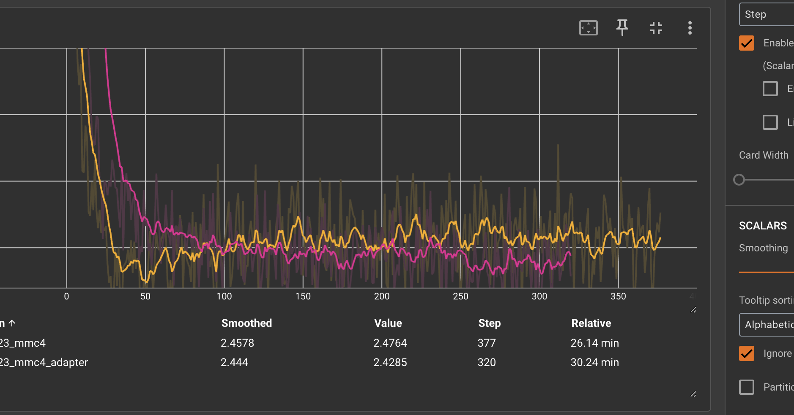
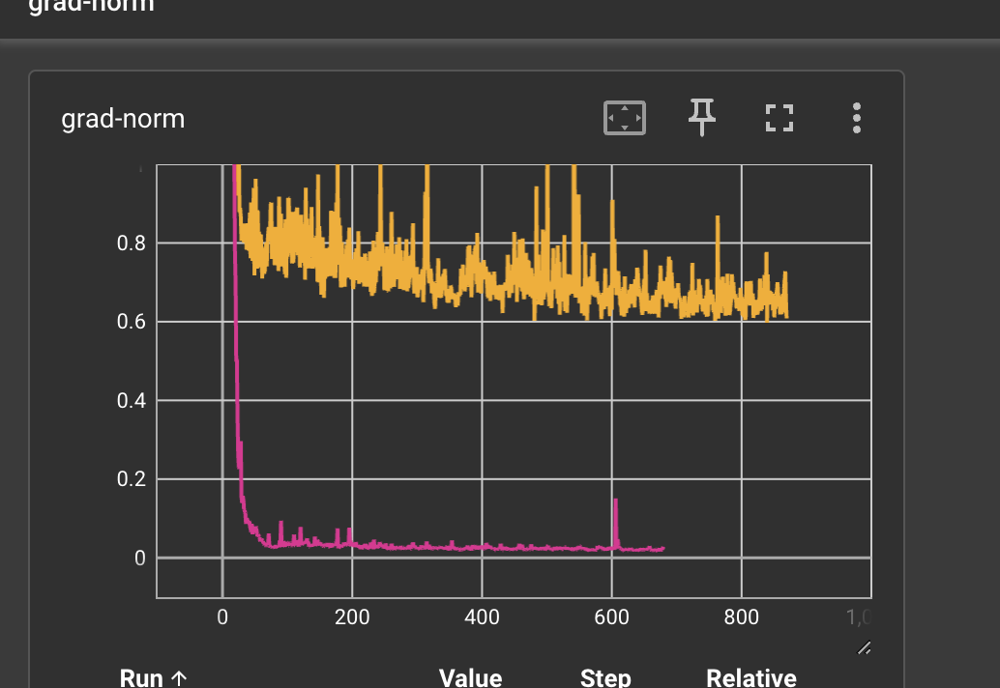
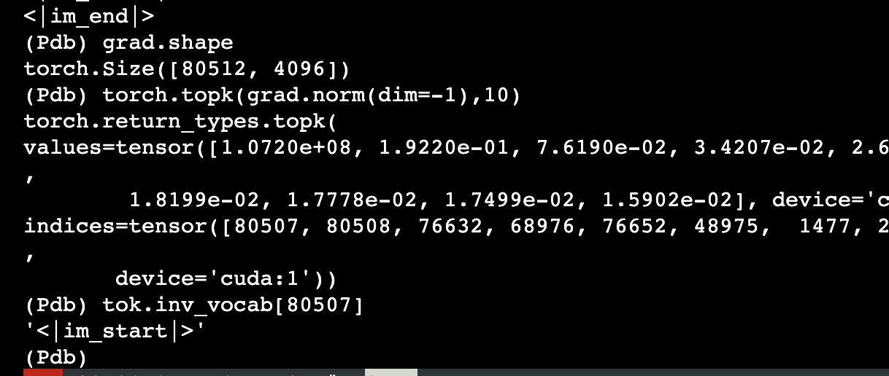

## loss 在训练过程中没有迅速降低
红色是正常的，黄色是不正常的，loss 虽然也降低了，但在 50 之后就波动式向上走了

看 grad-norm，发现一直相对较大

所以思路是排查看 grad-norm 是咋回事，有谁比较大：

## 有些参数的梯度为 0
pp=2，此时查看是哪些参数的梯度为 0:

然后发现这部分参数虽然初始化了，但是并没有参与计算，所以梯度是0: optimizer 里有个 [zero grad](https://github.com/NVIDIA/Megatron-LM/blob/5f9c870f9f24b482509699d206a9dbb00958f6fc/megatron/training.py#L531)，然后再 fwd bwd 的阶段
