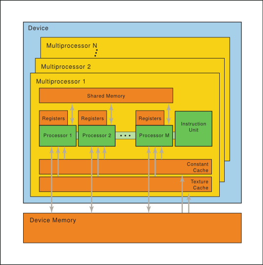
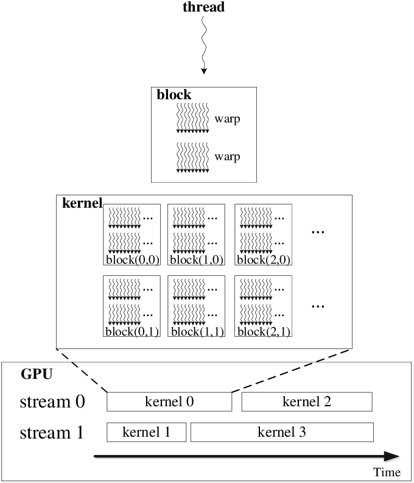

## GPU 里基本结构
如下图左侧，GPU 被叫做 device，每个 kernel 运行在不同的 Grid(卡） 上，Grid 可以和卡对应起来。每个 grid 内部可以跑很多 block（比如发射一个 kernel<0, 128>，即128个block，block数量和block里线程数量都是程序员决定的)，而每个 block 里有很多threads，这些threads以32为一个warp进行调度。这里每个层级比如 block，都可以是一、二、三维的。

从右侧图可以看到：Thread Block 内部threads之间有共享的显存(\__share__)。而每个thread有自己独占的 local memory（这个是固定的吗？还是像 register一样编译时分配好？）和寄存器。 Block 之间要通过 Global Memory 来交换数据


下面是物理的gpu视图。CUDA 调度以 Warp 为单位，一次调度一个 Warp（这个算实现细节了，甚至有warp instruciton 这种warp级别的api），也就是32个线程，这就是所谓的 CUDA 的 SIMT 模型，也就是说一个 warp 的 32 个线程必须执行相同的指令（用的同一个 instruction unit?)。这个也是 SIMT 的意思了。一条指令，同时跑在32个线程上。跑在 SM(streaming multi-processor) 上，里面是有多个核的(processor)



一个 SM(有多个 core) 上可以同时跑多个 Block。由于每个 core 采用流水线机制，所以一个 SM 处理的 thread 数量往往大于 core 的数量

关于 thread, core, block 和 SM的关系可以见下图。一个 thread 由一个 core 运行，一个 Thread block 由一个 SM 运行。


## stream、kernel（blocks）和threads、warp的层级关系
一个block里有多个warp，当一个warp在sm上跑时遇到需要等资源等情况，其他warp 就可以调度上来




具体这些数量，可以根据 CUDA Occupancy Calculator 里看到。比如 A100里面：
108个 SM，每个 SM 里有 64 个 FP32的 cuda cores，4个 3th Tensor Core
max thread block size: 1024
Max Block: 65536

max shared memory / block (bytes) = 102400

每个 multiprocess 上可以有 48 个 warp，每个warp里有32个 thread

参考资料：

1. [课堂里的讨论](http://15418.courses.cs.cmu.edu/spring2014/lecture/gpuarch/slide_052)
V100 老黄说这是06年以来显卡的最大创新。添加了 **Tensor Core** 能对矩阵乘这种 DL 里的最常见操作进行加速，分离了 fp32和int32操作(两者可并行）。

## cuda 显存
不同op的 kernel间，交换数据，需要通过 global memory。而切换 op 时，会涉及 register 上数据(on and off chip data movement)的搬移

## cuda 运算 API 举例

All platforms supported by CUDA use little-endian byte ordering and use IEEE-754 [2008] floating-point types, with 'float' mapped to IEEE-754 'binary32'

### 1.1.2. Half2 Arithmetic Functions
To use these functions, innclude the header file `cuda_fp16.h` in your program.

#### __hmul2():
Performs `nv_bfloat162` vector multiplication in round-to-nearest-even mode

#### __hadd2(): 

Performs half2 vector addition in **round-to-nearest-even** mode.

```
__device__ __half2 __hadd2(const __half2 a, const __half2 b)
```

### float4

it's simply a struct of four 'float' components named 'x', 'y', 'z', 'w'.

The GPU hardware provides load instructions for 32-bit, 64-bit and 128-bit data, which maps to the float, float2 and float4 data types, as well as to the int int2, int4 types. It has higher peak memory bandwidth.
相当于 load 一个数据和4个数据是一样的速度和代价

### 精度
float 提供了几乎7位小数粒度的精度，如果需要更高精度，就需要考虑 double, 有几乎 16 位精度

float 计算有好几种方式：

1. xxx_rn(): round-to-nearest-even 
2. xxx_rz(): round-towards-zero
3. xxx_ru(): round-up mode
3. xxx_rd(): round-down mode

## 限制
[CUDA Version Features and specifications](https://en.wikipedia.org/wiki/CUDA#Version_features_and_specifications)

threads per block is maximum 1024: [Kernel invocation syntax](http://docs.nvidia.com/cuda/cuda-c-programming-guide/index.html#execution-configuration)

## CMDs
`nvidia-smi dmon` is used to monitor one or more GPUs plugged into the system.

```
-i <device1,device2, .., deviceN>

nvidia-smi dmon -s <metric_group>

t - PCIe Rx and Tx throughput
```


## Execution Configuration
首先如果一个函数是 cuda 的 kernel 函数，那需要用 `__global__` 来标识出来。其次执行时配置定义了 grid 和 blocks 上的维度。通过插入 `<<<DimGrid, DimBlock, NumSharedMem, stream>>>` 来做。

对于 shared 的数组，不能在 global or device 函数里动态申明(on the fly), 所以需要静态分配(__shared__ tile[8][128])，或者在kernel 调用时传入大小

其中：

1. DimGrid 是 dim3 类型，指定了 grid 的维度和各维度大小，而 DimGrid.x * DimGrid.y * DimGrid.z 会和发射的 blocks 数量相等。刚接触不适应的地方在于这里 DimGrid 不是说 Grid 的维度，而是里面 Block 的维度和数量
2. DimBlock 是 dim3 类型，指定了 block 的维度和各维度大小，而 DimBlock.x * DimBlock.y * DimBlock.z 会和每个 block 里的线程数量相等

注意：DimGrid 或 DimBlock 不能大于设备的能力，否则会报错失败

### CUDA runtime 会隐式设置的变量：
1. blockIdx: dim3 类型的变量，代表在 grid 内部的 block 序号
2. threadIdx: dim3 类型的变量，代表在 block 内部的 thread id

假设每个维度都是一维的，那么 index = threadIdx.x + blockIdx.x*blockDim.x, 而如果希望一个 kernel 里多干活，index = index + stride. stride = gridDim.x

对于 DimGrid 和 DimBlock，GPU 都有最大限制，不同类型的 GPU 限制不同

关于 gid 与 threadIdx, blockIdx, blockDim, gridDim 的关系，可以参考[这片文章的最后部分](https://medium.com/analytics-vidhya/cuda-compute-unified-device-architecture-part-2-f3841c25375e)
### 原则
1. 让 number of threads per block 是32的倍数
2. 尽量让 blocks 数量和 threads-per-block 相等或差距不大？

## 常见 CUDA 相关报错及解决办法
1. "too many resources for launch": 很有可能是 Block 里threads 使用的寄存器超出限制了（比如 32K 32bit register），hitting a registers-per-block limit. 此时方法是减少 Block 里 thread 的数量
2. "misaligned address": 也是类似3的问题，是给的指针有问题，没有对齐。有可能把类型弄错了
3. "an illegal memory access was encountered": 可能给的指针并不在 cuda的memory里，跟 C++ 里遇到类似错误差不多

## debug 工具
### cuda-gdb
常用命令：
```
info cuda threads
info cuda kernels
print blockIdx
print gridDim
next
backtrace
print array[0]@12 # check 12 elements
cuda thread 170 # switch focus to thread 170
```

Kernel focus: 某一刻只会关注其中的一个：
```
(cuda-gdb) cuda device sm warp lane # display HW coords
(cuda-gdb) cuda kernel block thread # display SW coords
(cuda-gdb) cuda device 0 sm 1 warp 2 lane 3 # switch focus
```
### cuda-memcheck 工具
A suite of tools:

1. Memcheck
2. racecheck
3. initcheck
4. synccheck

对于 "unspecified launch failure" 非常有用：比如 out-of-bound access, memory leaks

单独执行的结果并不是很准确，在 cuda-gdb 里开启比较好：
1. (cuda-gdb) set cuda memcheck on
2. cuda-gdb --args python ./train.py

#### cuda-memcheck 还可以检查 race conditions:
cuda-memcheck -tool racecheck myapp.x

#### Stack Backtraces
如果没用 cuda-memcheck，那么无法准确显示出出错的位置和堆栈信息。而使用了 cuda-memcheck，会产生堆栈信息，有两部分：

1. saved host backtrace that leads upto the CUDA driver call site
2. device backtrace at the time of the error

为了拿到对人友好的函数名字，需要在编译时使用 -g 和 -G 分别带上 Host 代码和 Device 代码的调试信息。这俩都是要加到 nvcc 的命令行里的

还可以使用 `-gencode` 选项，比如a100架构：

`-gencode arch=compute_80,code=sm_80`

Compile params:
```
-G : generate debug info for CUDA app
-lineinfo: generate line number information
-rdynamic: the host compiler retains function symbols
-Xcompiler: specify flags to the host compiler
```

具体可见[cuda-memcheck Stack Backtraces](https://docs.nvidia.com/cuda/cuda-memcheck/#stack-backtraces)

```
========= CUDA-MEMCHECK
========= Invalid __global__ write of size 8
=========     at 0x00003b10 in ampere_fp16_s16816gemm_fp16_128x128_ldg8_f2f_stages_32x5_tn
=========     by thread (31,0,0) in block (25,0,8)
=========     Address 0x7fb3e6f45db8 is out of bounds
=========     Device Frame:ampere_fp16_s16816gemm_fp16_128x128_ldg8_f2f_stages_32x5_tn (ampere_fp16_s16816gemm_fp16_128x128_ldg8_f2f_stages_32x5_tn : 0x3b10)
=========     Saved host backtrace up to driver entry point at kernel launch time
=========     Host Frame:/usr/lib64/libcuda.so.1 (cuLaunchKernel + 0x2b8) [0x222dc8]
=========     Host Frame:/mnt/cache/share/cuda-11.2/lib64/libcublasLt.so.11 [0x124c04b]
=========     Host Frame:/mnt/cache/share/cuda-11.2/lib64/libcublasLt.so.11 [0x1298b00]
=========     Host Frame:/mnt/cache/share/cuda-11.2/lib64/libcublasLt.so.11 [0x11f4a0c]
=========     Host Frame:/mnt/cache/share/cuda-11.2/lib64/libcublasLt.so.11 [0x11f4a2e]
=========     Host Frame:/mnt/cache/share/cuda-11.2/lib64/libcublasLt.so.11 [0x5df1d7]
=========     Host Frame:/mnt/cache/share/cuda-11.2/lib64/libcublasLt.so.11 [0x66cf2f]
=========     Host Frame:/mnt/cache/share/cuda-11.2/lib64/libcublasLt.so.11 [0x52c29a]
=========     Host Frame:/mnt/cache/share/cuda-11.2/lib64/libcublasLt.so.11 (cublasLtHSHMatmul + 0x263) [0x55e153]
=========     Host Frame:/mnt/cache/share/cuda-11.2/lib64/libcublas.so.11 [0x9efe82]
=========     Host Frame:/mnt/cache/share/cuda-11.2/lib64/libcublas.so.11 [0x9d471f]
=========     Host Frame:/mnt/cache/share/cuda-11.2/lib64/libcublas.so.11 (cublasGemmStridedBatchedEx + 0x99c) [0x9def9c]
=========     Host Frame:/mnt/cache//chenshengdong/torch_extensions/lightseq_layers/lightseq_layers.so (_Z27cublas_strided_batched_gemmP13cublasContextiiiPKfS2_PK6__halfS5_PS3_17cublasOperation_tS7_iiii16cublasGemmAlgo_t + 0xea) [0x22c4a]
=========     Host Frame:/mnt/cache//chenshengdong/torch_extensions/lightseq_layers/lightseq_layers.so (_ZN23TransformerEncoderLayerI6__halfE13attn_layer_bwEPKS0_S3_S3_PS0_S4_ + 0x35d) [0x46cdd]
=========     Host Frame:/mnt/cache//chenshengdong/torch_extensions/lightseq_layers/lightseq_layers.so (_Z28transformer_encoder_layer_bwI6__halfESt6vectorIN2at6TensorESaIS3_EEiRKS3_S7_S7_S7_ + 0x234) [0x73ee4]
=========     Host Frame:/mnt/cache//chenshengdong/torch_extensions/lightseq_layers/lightseq_layers.so [0x763ac]
=========     Host Frame:/mnt/cache//chenshengdong/torch_extensions/lightseq_layers/lightseq_layers.so [0x67569]
=========     Host Frame:python (_PyCFunction_FastCallDict + 0x154) [0x111c54]
=========     Host Frame:python [0x199abc]
```
cuda-gdb 里集成了这个功能

### Enable GPU core dumps
`export CUDA_ENABLE_COREDUMP_ON_EXCEPTION=1`

`CUDA_ENABLE_LIGHTWEIGHT_COREDUMP`

### Tips
1. 在 device code 里使用 printf 后，记得添加 synchronize 来让这片输出缓冲区能打印出来
2. 使用 `CUDA_LAUNCH_BLOCKING=1` 来让 kernel 是顺序发射的
3. 使用 nvcc -g -G 来和 cuda-gdb 配合时，可能出现 too many resources requested for launch 的问题。可以用 -maxrregcount 开关

### Block 内部共享变量
`__shared__` Block 内部所有线程共享的空间，使用时要注意避免 race conditions。比如 A 和 B 同时 load 数据，而 A 要读取 B load 的数据，此时可能 B 还没有 load 完。

`__syncthreads()` 一般用到 __shared__ 显存后，都需要用一个 barrier 来同步所有线程。比如上述场景，我们可以在 load 之后加入 barrier，这样所有人都 load 完，才接着去做读取的操作: 只有当 block 内部的线程都执行完 `__syncthreads()` 之后，

注意分叉的代码里调用 __syncthreads() 可能会出现死锁

### cudaDeviceSynchronize(stream)
1. cudaDeviceSynchronize(device) 用来同步某个设备：会等待设备上所有的 stream 里的 host 线程都结束
2. cudaStreamSynchronize(stream) 用来同步某个特定 stream：会等待所有给定 stream 里当前的所有线程都结束 

一般框架里有两类执行流：

1. 计算:同一个计算流里，顺序发射的
2. 搬运数据
### maxrregcount
对于 too many resources requested for launch,可以有两种解决办法：

1. maxrregcount 来限制使用的寄存器数量，比如设置为40
2. 在核函数申明时，使用 `__launch_bounds__` 来限制 kernel 的 `MAX_THREADS_PER_BLOCK`(自己用 k<<,threadsPerBlock>>() 写死也行), `MIN_BLOCKS_PER_MP`

### printf
CUDA 2.0 之后开始支持在 kernel 函数(\__global\__) 里直接调用 [`printf`](https://docs.nvidia.com/cuda/cuda-c-programming-guide/index.html#formatted-output)。指 `-arch sm_20`

其中提到： kernel 里的 printf 函数是在device 侧执行，所以：per-thread, in the context of the calling thread. 而且会占用线程的数据。


#### 以下情况下，才会 flush 到输出：
1. CUDA\_LAUNCH\_BLOCKING=1 // 会关闭 kernel 异步发射的能力，这样发射后会阻塞，执行完才继续。这样能让 cuda 在真正出错的地方报错
2. 某种方式的同步(等 stream 里的所有kernel 执行完): cudaDeviceSynchronize() 或者pytorch里：torch.cuda.synchronize(): 等待所有 streams 里的 kernel 运行完
3. 通过 cudaMemorycpy* 等来执行阻塞的拷贝

buffer 里的内容并不会在程序退出时自动 flush，用户必须显示调用 cuCtxDestroy 或 cudaDeviceReset.

printf 内部是使用一个共享的数据结构，所以执行 printf 可能会改变线程的执行顺序。由于调用  printf 的线程可能比其他没执行 printf 的线程速度慢，所以不能靠 printf 来推测线程执行的早晚

## random generator
有大概九类 generator：mtgp32, scrambledSobo, `Philox4_32_10` 等

使用/区分方法是 :

1. `curand(不同类型的参数)` 初始化 state, 然后传递到 `curand_init(direction\_vectors, scramble_c, offset, state)`
2. `curand_uniform2/4(state)` 函数来产生随机数

这个和 pytorch，numpy 等的随机函数生成器类似。只不过它参数较多，而且有个 state，只有当 state 和 seed 一样时，才能产生一模一样的随机数序列

## global, devcie, host keyword
两类 kernel 函数：

`__global__`: mark a function as code that the **host can call to cause the invocation** of a parallel kernel on the device. 它也是kernel，可以从 cpu 或 GPU 上进行调用的代码。所以  它可以调用 device 修饰的 kernel 函数

`__device__` 它是kernel，只能从 GPU 上进行调用，执行在 GPU 上的代码. 它只能调用其他的 device 函数

所以一般都是 `__global__` 函数里做一些准备工作，然后调用 `__device__` 修饰的函数
## 问题
1. kernel 发射都是
