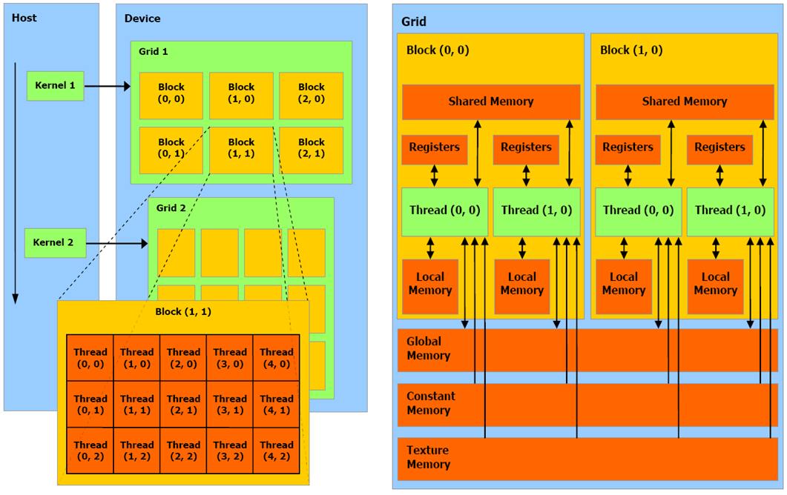
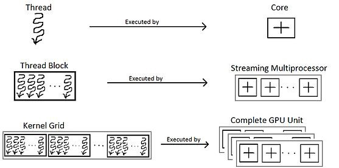

## GPU 里基本结构



如图左侧，GPU 被叫做 device，每个 kernel 运行在不同的 Grid 上，Grid 可以和卡对应起来，每个 grid 内部有很多 block，而每个 block 里有 threads。这里每个层级比如 block，都可以是一、二、三维的。

如图右侧，Threads 有自己的寄存器，内存。而Block 内部(threads之间)有共享内存，而 Block 之间要通过 Global Memory 

 CUDA 调度以 Warp 为单位，一次调度一个 Warp，也就是32个线程，这就是所谓的 CUDA 的 SIMT 模型，也就是说一个 warp 的 32 个线程必须执行相同的指令。跑在 SM(streaming multi-processor) 上。


一个 SM(有多个 core) 上可以同时跑多个 Block。由于每个 core 采用流水线机制，所以一个 SM 处理的 thread 数量往往大于 core 的数量

关于 thread, core, block 和 SM的关系可以见下图：



V100 老黄说这是06年以来显卡的最大创新。添加了 **Tensor Core** 能对矩阵乘这种 DL 里的最常见操作进行加速，分离了 fp32和int32操作(两者可并行）。


## cuda 运算 API 举例

All platforms supported by CUDA use little-endian byte ordering and use IEEE-754 [2008] floating-point types, with 'float' mapped to IEEE-754 'binary32'

### 1.1.2. Half2 Arithmetic Functions
To use these functions, innclude the header file `cuda_fp16.h` in your program.

#### __hmul2():
Performs `nv_bfloat162` vector multiplication in round-to-nearest-even mode

#### __hadd2(): 

Performs half2 vector addition in **round-to-nearest-even** mode.

```
__device__ __half2 __hadd2(const __half2 a, const __half2 b)
```

### float4

it's simply a struct of four 'float' components named 'x', 'y', 'z', 'w'.

The GPU hardware provides load instructions for 32-bit, 64-bit and 128-bit data, which maps to the float, float2 and float4 data types, as well as to the int int2, int4 types. It has higher peak memory bandwidth.
相当于 load 一个数据和4个数据是一样的速度和代价

### 精度
float 提供了几乎7位小数粒度的精度，如果需要更高精度，就需要考虑 double, 有几乎 16 位精度

float 计算有好几种方式：

1. xxx_rn(): round-to-nearest-even 
2. xxx_rz(): round-towards-zero
3. xxx_ru(): round-up mode
3. xxx_rd(): round-down mode

## 限制
[CUDA Version Features and specifications](https://en.wikipedia.org/wiki/CUDA#Version_features_and_specifications)

threads per block is maximum 1024: [Kernel invocation syntax](http://docs.nvidia.com/cuda/cuda-c-programming-guide/index.html#execution-configuration)

## CMDs
`nvidia-smi dmon` is used to monitor one or more GPUs plugged into the system.

```
-i <device1,device2, .., deviceN>

nvidia-smi dmon -s <metric_group>

t - PCIe Rx and Tx throughput
```


## Execution Configuration
首先如果一个函数是 cuda 的 kernel 函数，那需要用 `__global__` 来标识出来。其次执行时配置定义了 grid 和 blocks 上的维度。通过插入 `<<<DimGrid, DimBlock, NumSharedMem, stream>>>` 来做。

其中：

1. DimGrid 是 dim3 类型，指定了 grid 的维度和各维度大小，而 DimGrid.x * DimGrid.y * DimGrid.z 会和发射的 blocks 数量相等。刚接触不适应的地方在于这里 DimGrid 不是说 Grid 的维度，而是里面 Block 的维度和数量
2. DimBlock 是 dim3 类型，指定了 block 的维度和各维度大小，而 DimBlock.x * DimBlock.y * DimBlock.z 会和每个 block 里的线程数量相等

注意：DimGrid 或 DimBlock 不能大于设备的能力，否则会报错失败

### CUDA runtime 会隐式设置的变量：
1. blockIdx: dim3 类型的变量，代表在 grid 内部的 block 序号
2. threadIdx: dim3 类型的变量，代表在 block 内部的 thread id

假设每个维度都是一维的，那么 index = threadIdx.x + blockIdx.x*blockDim.x, 而如果希望一个 kernel 里多干活，index = index + stride. stride = gridDim.x

对于 DimGrid 和 DimBlock，GPU 都有最大限制，不同类型的 GPU 限制不同

关于 gid 与 threadIdx, blockIdx, blockDim, gridDim 的关系，可以参考[这片文章的最后部分](https://medium.com/analytics-vidhya/cuda-compute-unified-device-architecture-part-2-f3841c25375e)
### 原则
1. 让 number of threads per block 是32的倍数
2. 尽量让 blocks 数量和 threads-per-block 相等或差距不大？

## 常见 CUDA 相关报错及解决办法
1. "too many resources for launch": 很有可能是 Block 里threads 使用的寄存器超出限制了（比如 32K 32bit register），hitting a registers-per-block limit. 此时方法是减少 Block 里 thread 的数量
2. "misaligned address": 也是类似3的问题，是给的指针有问题，没有对齐。有可能把类型弄错了
3. "an illegal memory access was encountered": 可能给的指针并不在 cuda的memory里，跟 C++ 里遇到类似错误差不多

## debug 工具
### cuda-memcheck 工具

## 问题
1. 
