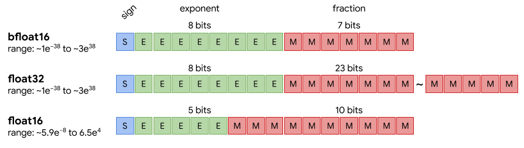

BF16是最早 google 推出的，后来 nvidia 也支持了，特点是 float32 转过来很方便（就丢掉最后16位底数），范围跟 fp32 一样，但是精度差了不少

使用 bf16 训练 LLM 时需要注意：如果梯度不使用 fp32，可能导致梯度爆炸，loss 不降低

不需要 loss scaling 了，因为和 fp32 的表示范围一样。而 fp16 下，gradients 是 fp16 存储的，但是在 bf16 下，得用 fp32 来存储

最后的结论：
0. 梯度用 fp32
1. 梯度累加顺序会影响精度(浮点数求和)
2. 通信的精度：allreduce 里 ring 和 tree 的精度不一样，[后者更高](https://github.com/NVIDIA/nccl/issues/1055]: 这里提到了，使用tree allreduce时，节点内是链状结构，求和的顺序是rank的反序。而且 allreduce 的精度也会影响结果的精度

[由A800平台训练InternLM-7B无法收敛引发的思考](https://zhuanlan.zhihu.com/p/701623664)

[Megatron 里也是使用的 fp32 来做累加和通信](https://github.com/NVIDIA/Megatron-LM/issues/372)

[DeepSpeed 里是支持了两个选项，可以分别指定梯度累加和 allreduce gradients 时的梯度](https://github.com/microsoft/DeepSpeed/issues/1835)
