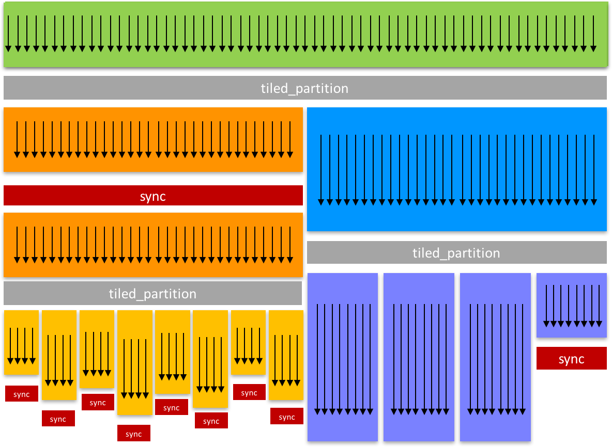

## 用途
cuda 9.0 之前，CUDA 只支持线程块内的同步：__syncthreads()。这个粒度比较粗，所以 cooperative groups 是后来提出用于更细/大粒度控制同步的

从上图可以看到里面有几个概念，而且左右两侧是不同的级别，而每个级别内部还可以再划分层级

特点：更加灵活、动态分组

问题：

1. 给定一个矩阵，如何快速求出挨个元素求和后的总和？
2. 
## 几个概念

让 groups 成为第一类公民，提高了软件组合性：**collective 函数** 可以 **显示** 得到代表参与的 threads 分组的参数

在一个 group 里，可以知道大小：

1. size()
2. thread\_rank: 自己排第几号
3. is\_valid

可以通过 g.sync() 或者 cg::synchronize(g) 来同步当前的 group

### thread_block

### tiled_partition

### thread block tiles

## 网格级别的同步

## 多设备同步

## 问题
1. 这个特性页面提到可以支持生产者-消费者并发模式。那以前不支持？ 可能指的是先并发 load，再并发消费的模式，而非一个人不断消费，另一个人生产的模式
