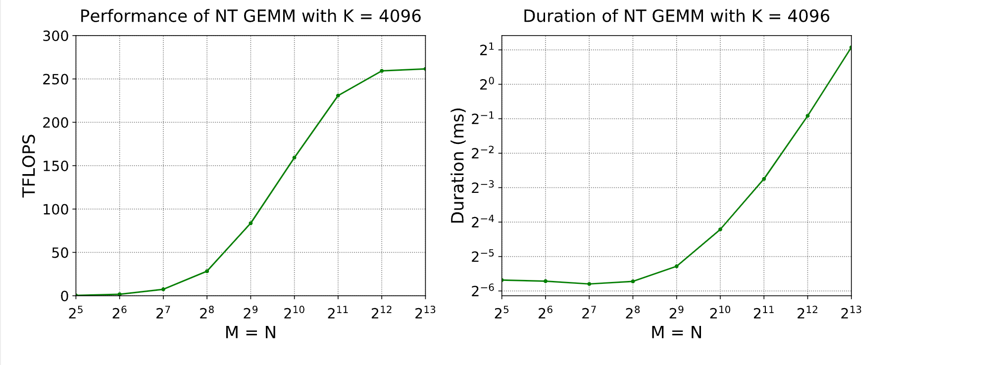
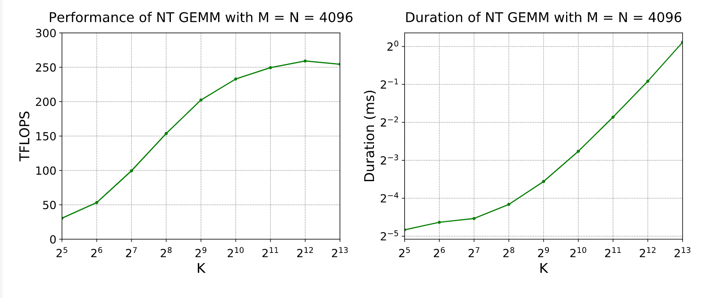
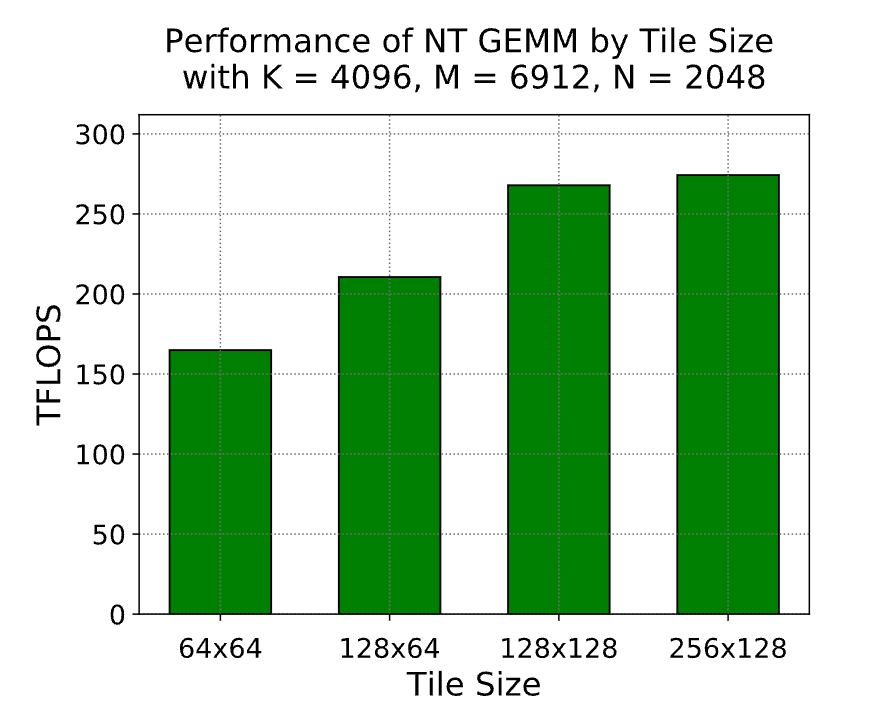
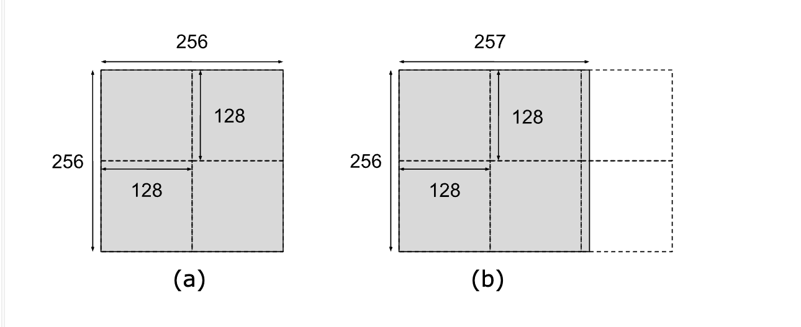
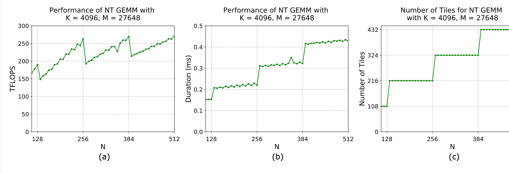

本文来自：https://docs.nvidia.com/deeplearning/performance/dl-performance-matrix-multiplication/index.html

本文描述的也是 fc，conv，recurrently layers 等里面的性能基础知识

## 1. 背景：矩阵乘法

GEMMs (General Matrix Multiplications) 操作的定义：`C= alpa*AB+beta*C`，A和B是输入矩阵，alpa和beta是标量输入，C是已经有的matrix。纯矩阵乘 AB 是一个 apla 是1，beta是0的 GEMM。比如在fc里，权重矩阵是参数 A，输入激活值是参数 B，alpa和beta基本都是1和0. 一些情况下 beta 是是1，比如把 skip-connect 和 linear 的加法

## 2. 数学和内存限制(Math and Memory Bounds)
按照不同 linear 算术库里的约定，矩阵 A 是 MxK的矩阵，B和C假设为 KxN 和 MxN。

A和B的乘积有 MxN 个值，每个是K个元素的向量的 dot-product（点积，标量积）。因此总共有 `M*N*K` 个 fused multiply-adds (FMAs)。每个 FMA 是两个操作：乘法和加法，因此总共的 FLOPS 是 2*M*N*K 的 FLOPS。为了简单，我们暂时忽略 alpa和beta。只要K是足够大，那 alpa和beta对算术密度的贡献就可以忽略。

为了预估一个特定的矩阵乘法是算术还是显存限制的，需要拿算术密度和 GPU 的 ops:byte 的比值做比较，在 Understanding Performance 一节里讲到了。假设 V100 GPU 上，Tensor Core 操作是 FP16 的输入，使用 FP32 做累加，它的 FLOPS:Byte 比例是 138.9 （数据从global memory读取）

算术密度(Arithmetic Intensity) = number of FLOPS / number of byte accesses = 2*(M*N*K)/2*(M*K+N*K+M*N) = MNK/(M*K+N*K+M*N)

举例，MxNxK = 8192*128*8192 的 GEMM。对于这个特定的 case，算术密度是 124.1 FLOPS/B，比V100的 138.9 FLOPS:B 要低，因此是 memory limited。当把 K 增加到 8192，算术密度增加到 2730，此时是 math limited。而且如果 M=1 或者 N=1(GEMV)，那么算术密度小于1，所以肯定是 memory limited

需要注意比较算术密集度只是简单的一个规则，没有考虑这个计算上的特定实现（比如非算法的指令如指针运算，或者是 GPU 里芯片内部的显存层次）

### 2.1 GPU 实现
GPU 实现 GEMMs 是通过划分输出矩阵到 tiles，这个 tiles 可以被分配到 thread blocks 里

Tile size，在本指导文档里，通常指的是这些维度的 tiles(图一里的 Mtile x Ntile)。每个线程块通过 step through K 维度，计算它的输出 tile，从 A 和 B 矩阵里加载所需的值，乘法和累加到输出里。

图1. GEMMs 上的 Tiled outer product

### 2.2 Tensor Core 的要求
在 GPU架构基础 一节里讨论过，最新的 NV 系列 GPU 引入了 Tensor Cores 来最大化 tensor 乘积的速度。使用 Tensor Cores的要求决定于 NV 的 library versions。当 M、N、K 对齐到 16 字节的整数倍(A100 上是 128 字节） 时，性能最高。如果 cuBLAS 版本 < 11.0 或者 NVIDIA cuDNN 版本 < 7.6.3，前者是要求。但是自从 cuBLAS 11.0 和 cuDNN 7.6.3 之后，Tensor Cores 就没有这个要求了，但是当维度是16字节的整数倍时，效率更高。比如当使用 FP16 的数据，每个 FP16 元素由两个字节组成，因此矩阵维度需要是 8 个元素的整数倍（A100 上是64个元素）

Table 1：不同的 cuBLAS 或者 cuDNN 版本下，4种数据类型上 Tensor Cores 的使用情况（惊讶的是，TensorCore 可以用在 INT8、FP16、TF32、FP64 上！）

实际上要求比较宽松 -- 只有显存里的 fastest varying dimensions 是需要遵守这个规则的，但是把三个维度都用一种要求来考虑会简单一些。遵守上述对齐，能确保 TC 会被启用，而且很高效。从图 5 里能看到，当 K 可以被 8 整除时，及计算很快。需要注意在 cuBLAS 11.0 下，即使是 K 不能被 8 整除，偶数值依然比奇数值计算的要快。如果 K 无法达成 16 字节的倍数，那就选择是2的次方倍(比如 8 或者 4 字节）。

### 2.3 在 cuBLAS 里典型的 Tile Dimensions 和性能
cuBLAS 库包含 NV 优化后的 GPU GEMM 实现

当多个 tiling 策略可用时，更大的 tiles 能提高数据复用，让占用的显存带宽更低，比起更小的 tiles 更高效。但是另一方面给定的规模下，更大的 tiles 会导致并行的 tiles 数量更少，潜在导致 GPU 利用率不高。在 TF、PyTorch 使用给定 GEMM 维度调用到 cuBLAS 时，在 cuBLAS 内部使用启发式算法来选择 tiles，使性能最好。一些框架里提供了 ”benchmark“ 模式，训练前就选择最快的那个。

这个在tile 效率和tile并行度上的折中，说明 GEMM 如果更大，那这个折中的影响更小：某种程度来说，一个 GEMM 有足够的工作来来使用更多的可用的 tiles，而且依然让GPU用满。相反，如果GEMM 较小，在 tile efficiency 或者 tile 并行度上的降低极有可能没法让 GPU 运行在 peak match 利用率。下图3和4展示了这种趋势；更大的 GEMMs 获得了更高的吞吐。

图三：当 M-N 增大时，性能提高。虽然耗时也增加，但是没有 M-N 维度本身那么快。有时少量增加 gemm 大小（比如用更多权重），耗时增加缺不多。

图四：当 K 维度增加，即使 M=N 相对大，因为 setup 和 tear-down 的成本，在dot product 更长时被均摊的更好

对于 cuBLAS GEMMs，thread block tile 大小典型的但不是必须的，会使用2的幂的维度。不同的tiles size 用途不同，但是一般起步可以用：

* `256*128` 和 `128*256` （最高效)
* 128x128
* 256x64, 64x256
* 128x64, 64x128
* 64x64 ( 效率最低）

图5 展示了这些 tiles size 之间的效率差异： 更大的 tiles下运行更高效。256x128 的 GEMM 运行时每个 SM 里就一个 tile，其他的 GEMMs 产出更多的 tiles。
NVA100-SXm4-80G，CUDA 11.2， cuBLAS 11.4

上面图表展示了一个 MxNxK = 6912x2048x4096 GEMM 上不同 tiles size 下的性能（达到的 tflops）。证明了使用更小的tiles(64*64)来增加tile并行度之后带来的性能损失很明显。实际中，cuBLAS 对于更大 tiles 下、也可以有足够并行度的 GEMMs，会避免使用小的 tiles，只有当 GEMMs 足够小时采用更小的 tiles。当 M 和 N 很小，而 K 很大时，NV的库也有沿着 K 维度来 tile 的能力。因为 K 是dot product 的方向，在K上tiles需要再最后做规约，会限制可达的性能。为了简单起见，本文档假设不用 K 上的 分块

## 3. Dimension Quantization Effects
在 GPU Execution Model 一节里杰介绍的，一个 GPU 函数可以通过发射大量 thread blocks 来执行，每个里面都是相同的线程。下面介绍两个可能影响执行效率的因素：tile 和 wave quantization

### 3.1 Tile Quantization
当矩阵规模无法被 thread block 上的 tile 大小划分时，会发生 Tile quantization

thread block tile 里的数量足够大，能保证所有的输出元素都被覆盖到，但是，一些 tiles 里面可能如图6所示，实际工作并不多。

图6：128x128的thread block tiles下，两个矩阵的乘法。

a): 最好的情况：矩阵维度可以被 tile dimensions 整除

b): 最坏的情况：tile quantization 导致发射了6个线程块，但是有2个浪费了绝大部分给他们的资源

图7：Tile 量化效果：

a) 达到的 FLOPS 吞吐
b）耗时
c）创建的 tiles 数量

实际中，cuBLAS 会选择更窄的 tiles （比如 64-wide）来复用 quntization effect

### 3.2 Wave Quantization
尽管 tile 量化意味着问题规模被量化到每个 tile 大小，有另外一个量化效果，总共的tiles 数量会被量化到GPU的多处理器上：Wave quantization

尽管吞吐和耗时的图，在上述两个量化上看起来一样，但是有个不同是竖轴上的scale。区别在于：tile quantization 意味着工作呗划分到 tile 的大小上，而 wave quantization 意味着工作被划分到了GPU上。

## 参考资料：
1. [GPU Performance Background User's Guide](https://docs.nvidia.com/deeplearning/performance/dl-performance-gpu-background/index.html#understand-perf)
2. [GPU架构基础](https://docs.nvidia.com/deeplearning/performance/dl-performance-gpu-background/index.html#gpu-arch)
