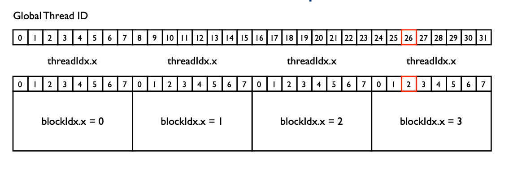
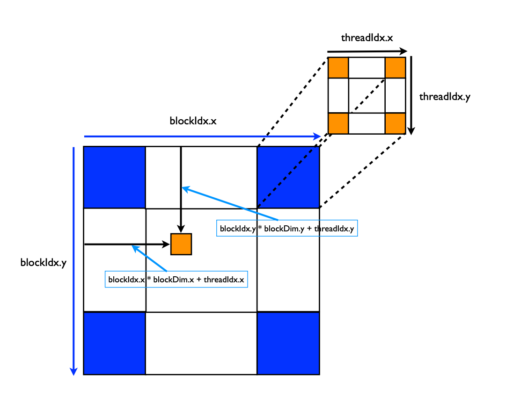

问题：CUDA C 中的 threadIdx 是当前 block 里的顺序，那么一个 thread 的 Global Thread ID 如何计算？

## 1D Grids and 1D Blocks

如上图，有4个 Block，每个 block 里有8个线程，所以：

1. gridDim.x = 4, blockDim.x = 8
2. threadIdx.x 代表在各自 block 里的序号
3. blockIdx.x 代表是第几个 block

此时 Global Thread ID = threadIdx.x + blockIdx.x*blockDim.x

## 2D Grids and 2D Blocks


Grids 和 Blocks 都是二维的，所以此时，x 和 y 方向上的偏移分别是：
1. x = blockIdx.x*blockDim.x + threadIdx.x
2. y = blockIdx.y*blockDim.y + threadIdx.y

## 把矩阵拉平到线性内存里
C 语言里是行优先来存储多维数组的，所以 a[row]columnn] = a[offset], offset = column + row * N

在 CUDA 里：

```
row = x = blockIdx.x*blockDim.x + threadIdx.x
column = y = blockIdx.y*blockDim.y + threadIdx.y
N = blockDim.x*threadDim.x
index = column + rown*N
A[index] === ...

```
## 参考资料
[CUDA Thread Basics](http://users.wfu.edu/choss/CUDA/docs/Lecture%205.pdf)
