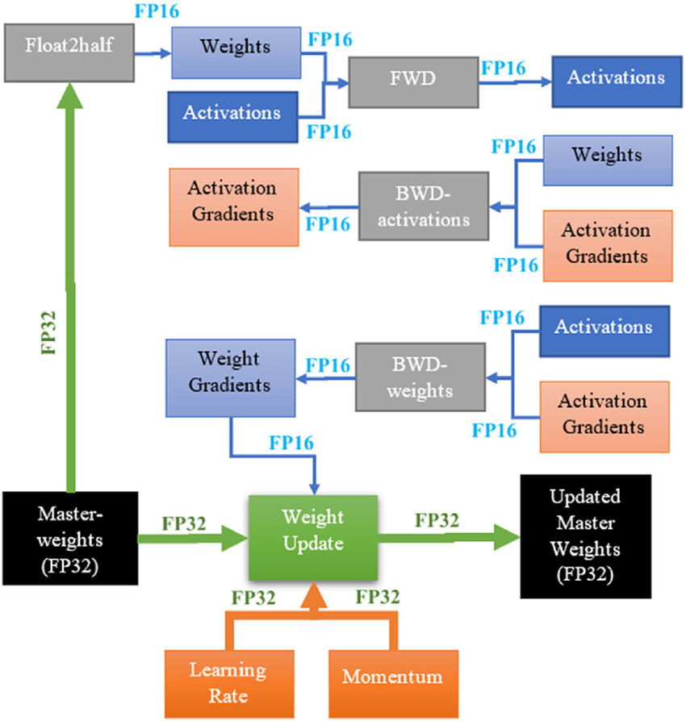
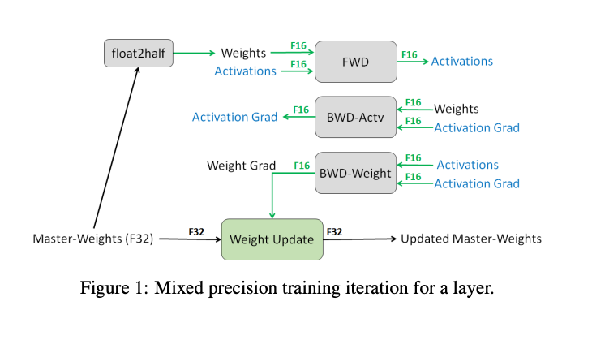
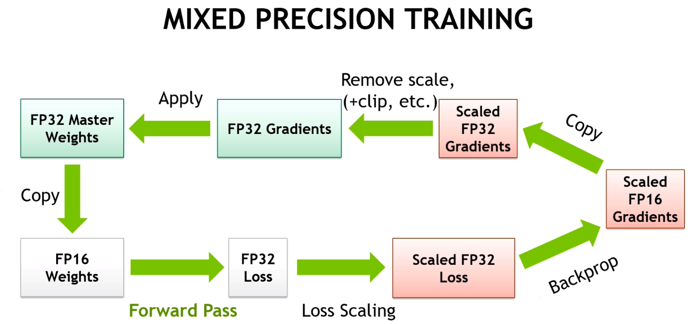

## 1. 什么是混合精度训练

混合精度训练的目标是什么？在不需要修改超参数、以**媲美全精度训练的准确率**前提下，尽可能扩大reduced precision的使用。这里是**混合了多种精度**，避免单纯用损失精度来换更快速度。

### 混合精度训练与 Tensor Core 之间的关系：


TC 是 16bit floating point 运算的硬件。它为了确保精度， 内部是混合精度的：乘积用 fp32，内部累加使用fp32

被 cuDNN 和 cuBLAS 库使用来加速 矩阵乘和卷积

在 CUDA 中以 WMMA(Warp-Level Matrix Operations) 的形式暴露出来

所以类似混合精度训练，都是需要硬件层面支持+配套软件

## 2. 混合精度训练的考量和方法
三部分：

### 1. 模型转换，小心处理非 Tensor Core 操作
把所有都转换成跑在fp16上。但对于 loss function 和 normalization/pointwise 操作，插入 cast 到fp32精度计算
#### Tensor Core 算子
确保参数和输入都是 FP16，这样就可以跑在 Tensor Cores 上


#### 通用的不是矩阵乘或者卷积的操作
* Activation functions: ReLU, sigmoid, tanh, softplus
* Normalization functions: batchnorm, layernorm, sum, mean, softmax
* Loss functions: cross entropy, L2 loss, weight decay
* 其他：exp，log，pointwise-{add, subtract, multiply, divide}

虽然他们不能跑在 tensor core 上，但我么依然希望保证精度

对于 Tensor Core 是用两种方法保证精度(可看上文中的图):

1. 每个乘法用更高精度(fp32)
2. 乘积的累加，用更高精度(fp32)

对于非 TC 操作，遵照如下原则：

1. 中间或者临时值实用高精度
2. 加法(规约)使用更高精度

1. 中间值和临时值用高精度：

* 对于 pointwise 操作，直接用 fp16 一般没问题。
* 特殊情况：Exp，Log，Pow 这种 op，|f(x)| >> |x| ，需要用 FP32 的计算和存储。
* 大部分情况下上述操作以临时变量见于 loss 或者激活函数里，通过 op 融合能避免对 fp32 存储的需求。比如 batch norm, attention 里的 softmax

Loss Functions: input/output in FP32

```
def softplus(x):
    return log(1+exp(x))
```

2. 对加法和规约使用高精度

* 常见于归一化一个fp16值大集合，比如 softmax 层
* 两种选择：所有累加值都直接放到 fp16 累加器，然后执行fp16的除法: 可能引入 compounding precision error。或者执行更高精度（fp32 累加，除法），然后结果写回为 fp16: 类似 tensor core 做法


### 2. Master weight copy
保留模型参数为 fp32，在模型 forward/backward 过程中使用cast 到 fp16 进行计算


每个训练的迭代里，执行 weight update: W(t+1) = Wt-alpha*delta(t). alpha 通常小于1，而 delta(t) 作为梯度是比权重小的，所以整个变化量非常小。因此如果更新特别小，可能就失效了，因为无法得到一个可表示的数

因此，需要对 master copy of weights 保证高精度，以便微小的值也可以在**多次迭代**之间累加



上图主要看最下面的优化器部分：learning rate 和 momentum 都是f32



上图来自 MPT，主要能看出对于一个层，它的 master copy of weights 是 F32，就如上面所说，是为了保证多次迭代之间，微小的 loss 也能累加。能看到 master weight 要 half 以下，然后和f16的激活值一起做 forward。
backward 包含两部分：激活值和权重，都是f16。而权重更新（在优化器里了）时，是 f32 的


### 3. Loss scaling
Scale loss value，unscale the gradients in fp32. Check gradients at each iteration to adjust loss scale and skip on overflow

Gradients 非常小，有些快接近于0，而其中大概有 2^15 没有被用到（所以可以 scale 过去）

一般推荐初始 loss scale 为 2^24 ，单个overflow 出现后，乘以 1/2. 2000轮没有溢出后，乘以2




上述图里，提到了之前的图里没展示的：Loss Scaling, Gradients Clip

**loss scaling 的作用是保留住微小的梯度值**

下图是 Multibox SSD 网络在使用 FP32 训练过程中的激活值梯度的维度的直方图。x 和 y 轴都是对数形式的。


从上图可以看到FP32 里的31%的值，如果转换为 FP16，会变成0。而只有 5.3% 是非零。而FP16的可表达范围里大部分都是没有被梯度用到的值。因此我们想到可以变化梯度的值来占用更多的范围，这样可以在fp16下为非零。


amp.initializer loss_scale=1

## 3. 自动混合精度训练

上述操作都想自动完成。关键的观察：上述没有哪个是领域（cv/nlp）相关的。而且框架可以自动转换为混合精度

框架完成两件事：

* Automatic loss scaling with optimizer wrapping: create a wrapper object that manipulates loss and gradients in such a way the base optimizer only ever sees the true FP32 gradient values on non-overflow iterations
* Automatic casting with op classification(分类).

上述过程其实手工就可以搞定，所以所谓 Automatic MPT 也不过是一些规则:

Whitelist: MatMul, Conv2d ，使用 fp16输入来开启加速

Blacklist: Exp, Sum, Softmax, Weight update ，都是fp32计算

Everythin else:只有当输入是fp16，才进行 fp16计算

## 4. 性能指引和实用建议

### 如何 debug 混合精度

混合精度代码中的 bug，经常以训练精度下降的形式出现

遵守好的软件开发实践，尤其是测试

常见错误：

* 梯度没有在权重更新时正确unscale(AdaGrad/Adam 会尝试处理)
* Gradient clipping or regularization improperly using scaled gradients
* 没有在多 GPU 之间正确同步 master weight 更新
* loss function 没有用 FP32 

### 如何从 Tensor Core 最大受益
三级优化：

#### 1. 满足 TC 的 shape 约束
Matrix multiplication: **所有**三个维度(M, N, K) 都需要是 8 的倍数

卷积：输入和输出的channel 数量应该是8的倍数。但[并不是总要求这样]()

实践中：选择8的倍数的 minibatch，选择 layer dimensions 为 8 的倍数，对于分类问题，把 vocabulary 对齐到 8 的倍数。序列问题，对齐到 8 的倍数

是否用上了 Tensor Cores？cuBLAS 和 粗DNN 都是给 Tensor Core 优化的。使用 nvprof 来跑，查看 "s[数字]" 这种 kernel 名称。比如 `volta_fp16_s884gemm_fp16_128x128_ldg8_f2f_nn`

#### 2. 增加算术密度：flops per byte
每个输入数据的字节上，进行多少算术运算

为什么要关注算术密度：

* V100 GPU 有 125TFlops，900G/s 显存带宽 => 125000/900 = 138 Flops/Byte
* 如果算术密度小于 135 Flops per input byte，那么内存带宽就是限制因素。此时 Flops/Byte 低于 140， Tensor Core 的加速效果也会下降

模型实现层面，增加算术密集度：


模型架构层面，增加算术密集度:

* Prefer dense match ( vanilla convolutions vs depth separable convolutions)
* Prefer wider layers - often little speed cost
* Of course, always prefer accuracy first!

#### 3. 减小 non-TC 操作的比例
手工优化：实现 CUDA op
编译工具自动：XLA， PyTorch JIT


## TODO
1. How does dynamic scaling work?
2. 整个流程，为啥 backward 时不需要 unscale ？

## FAQ
### 1. overflow detected, skipping step, reducing loss scale: 
这个在 AMP 机制启用后的前几个 iteration 遇到是正常的，因为 AMP 刚开始会尝试较高的 loss scale。AMP 的机制就是会自动调整到合适的 scale。但是遇到 NaN 的 loss 是不正常的。而且这类报错不应该连续地密集出现。此时可以关注下 AMP 使用到的 loss 的值是多少

比如这个例子：
```
Gradient overflow.  Skipping step, loss scaler 0 reducing loss scale to 32768.0
Gradient overflow.  Skipping step, loss scaler 0 reducing loss scale to 16384.0
Gradient overflow.  Skipping step, loss scaler 0 reducing loss scale to 8192.0
Gradient overflow.  Skipping step, loss scaler 0 reducing loss scale to 4096.0
Gradient overflow.  Skipping step, loss scaler 0 reducing loss scale to 4096.0
Gradient overflow.  Skipping step, loss scaler 0 reducing loss scale to 4096.0
Gradient overflow.  Skipping step, loss scaler 0 reducing loss scale to 2048.0
Gradient overflow.  Skipping step, loss scaler 0 reducing loss scale to 2048.0
Gradient overflow.  Skipping step, loss scaler 0 reducing loss scale to 4096.0
```
从上面看到 reducing to 4096, 2048 出现了好几次，所以肯定是减少到2048,又增加到了 4096。意味着 gradient overflow 并没有连续出现

发现 loss 是 8.978，并不大，但关键是梯度溢出了(Nan or Infinite)，导致 loss scale 。此时为何 loss scale 要缩小？可能是一般梯度比较小，loss scale 比较大，相当于右移了，现在要左移

### 如果多卡训练，其中一个出现 overflow 会怎样？整个程序挂掉还是？

### 2. 如果多卡训练，其中一个出现 overflow 会怎样？整个程序挂掉还是？
如果溢出，就会把梯度设置为 0.

### 3. 其他还有哪些情况导致梯度为 NaN 或者 overflow 的？
数据里有 NaN 的值


## 参考资料

[GTC 2019 - Mixed Precision Training of Deep Neural Networks](https://github.com/mcarilli/mixed_precision_references/blob/master/GTC_2019/s9143-mixed-precision-training-of-deep-neural-networks.pdf)

[GTC 2019 - S9926 - Tensor Core Performance: The ultimate Guide](https://developer.nvidia.com/gtc/2019/video/S9926),  [pdf](https://developer.download.nvidia.cn/video/gputechconf/gtc/2019/presentation/s9926-tensor-core-performance-the-ultimate-guide.pdf)
