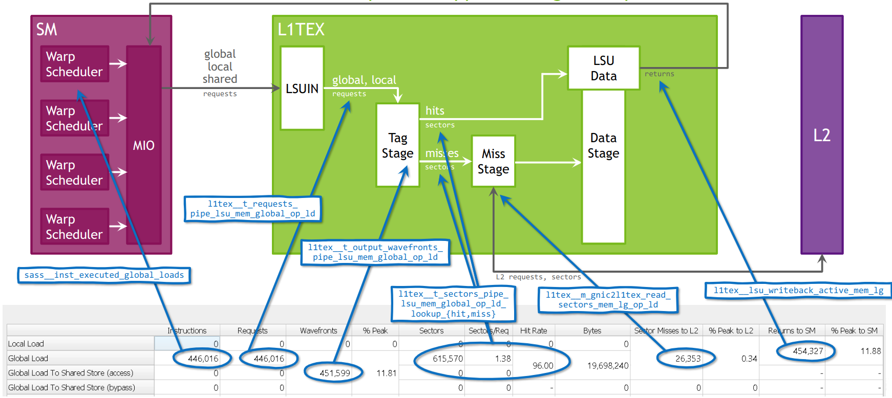
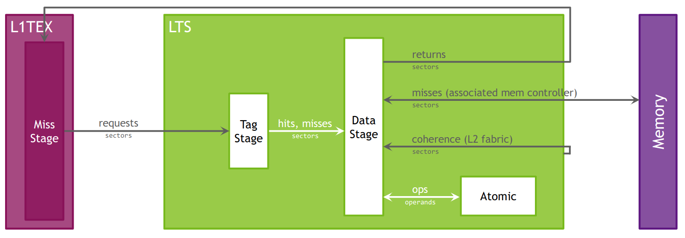
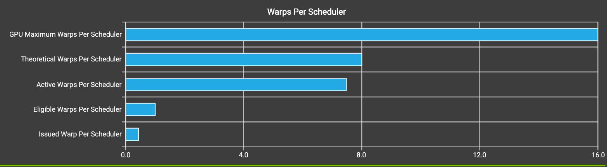

它支持收集很多指标，

`sm__inst_executed_pipe_tensor_op_hmma.sum` 代表 HMMA 指令执行了多少次

图里的例子：

Wavefronts: 对于每个request，在最终产生的唯一的“work package”，一个wavefront里的所有work item是并行处理的，但是不同wavefront里的work items是串行化并且在不同的cycles里执行的。每个request里，至少有一个 wavefront会被生成

Shared: 在每个chip上，所以相比local或者global memory，有更高的带宽，更低的延迟。它是在一个计算的 CTA 里共享的

这个 kernel 里，没用到 shared memory，而L2 Cache命中率42.32%，L1是36.91%

如何 apply rules(比如 Uncoalesced Memory Access，  non-fused floating-point instructions  ) 来找到

占用率，效率怎么算？

shared 和 cache （L1/L2）不是一回事? 在A100里，shared 和 L1 共享这部分

在 GA100 里，L1TEX cache 的 global load pipeline，映射到 memory 表格里：

L2 cache 的模型：

## GPU Speed Of Light

Latency Issue: 说明计算和内存利用带宽相比设备峰值低很多(< 60%)，查看 Scheduler Statistics 和 Warp State Statistics 查看潜在原因

### Roofline Analysis
Roofline里，可以看到当前 FLOPS/byte=2.86， 而 fp16(>10) 和 fp32(8 or 9 ?)

## Compute Workload Analysis

里面主要是各个pipeline(FMA, ALU, Tensor, FP16, FP64)上的利用率

## Scheduler Statistics
schedulers 发射指令的概览。每个 Scheduler 维护了一个warps的池子。这个池子的上限（理论 Warps） is limited by the launch configuration. scheduler会在每个周期检查池子里被分配的warmps（Active Warps）。活跃的 warps是
没有被暂停(Eligible Warps)，准备好在发射下个指令的。从可用的(eligible)warps集合里，scheduler选择一个单独的 warp 来发射一个或多个指令 (issued warp)。在没有 eligible warps的周期里，issue slot 会被跳过，没有指令发射。如果有很多
跳过的issue slots，说明延迟隐藏(poor latency)很槽糕

Issue Slot Utilization: 每个scheduler可以在每个周期里发射一个指令，但是这个kernel的每个调度器只能在每2.3个周期里发射一条指令。最大是每个调度器16个warps，而这个kernel分配了平均每个scheduler 7.48 个active warps，但每个周期里只有一个
warps可用。Eligible warps 是active warps里的子集，已经准备好发射下一条指令。每个周期里没有可用warps会导致不发射指令，issued slot就没被用到。

看下面Deformable Attention里的结果，更直观y

### 如何增加可用warps？
1. 避免每个warp里高度的不同的执行时长(highly different execution durations)
2. 减少 Warp State Statistics 和 Source Counters 部分
3. Occupancy 一节里可以找出谁限制了这个kernel的理论占用率

## Warp State Statistics
所有 warps 在 kernel 执行时花费的cycles 状态分析。warp state描述了warp是准备好了，还是无法issue下一条指令。每个指令的warp cyles 定义了两个连续指令之间的延迟。更高的值，代表需要更多的 warp 并行，才能隐藏延迟。对于每个warp state，图表展示了平均的，在每个
issued 指令上花费的平均周期数。Stalls 并不总会影响整体性能，也无法完全避免。只有当scheduler无法在每个周期里issue指令时，才需要关注 stall reasons。当使用 mixed library 和用户代码来执行kernel时，这些指标展示的是combined values。

问题：long_scoreboard: 平均下来，每个warp花费了10.2周期在stalled 状态，等待 a scoreboard dependency on a L1TEX(local, global, surface, texture, rtcore) 操作上。这个比例在两个指令issue之间的总共平均的17.3 cycles里，有59.1%的。
为了减少这个等待的时间，需要看下内存访问的patterns是否对GPU架构友好，尝试通过增加数据局部性或者修改cache 配置，来增加cache命中率，考虑把经常使用到的数据放到 registers 和 shared memory上

Warp Stall: 检查

## 问题
1. register 如何用？
2. cache configuration 如何修改
## 资料
1. [各种指标的含义](https://docs.nvidia.com/nsight-compute/ProfilingGuide/index.html#metrics-reference)
2. [Memory Tables](https://docs.nvidia.com/nsight-compute/ProfilingGuide/index.html#memory-tables-smem)
