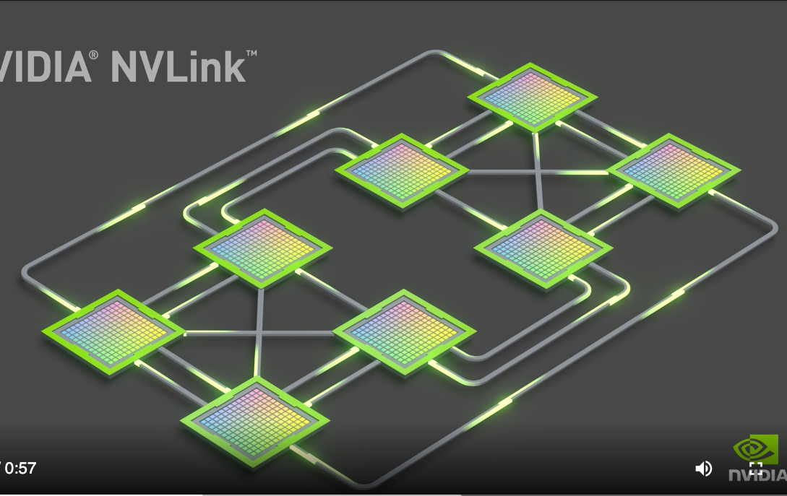

传统的从 CPU 给GPU喂数据方法是 PCI Express，它连接了 GPUs 和 CPUs。这种在桌主机和笔记本里常见

如图，NVLink 即连接了 GPU 和 CPU，又做了 GPU 间的连接。看起来 NVLink 更大价值是用于同主机 GPU 间通信加速

从下图看，是GPU间点对点都有专用的4条线路？

对于8卡，是这样的：

从图中看到并不是**完全**点对点，每个 GPU [最多支持6条线路(links)](https://en.wikipedia.org/wiki/NVLink)
