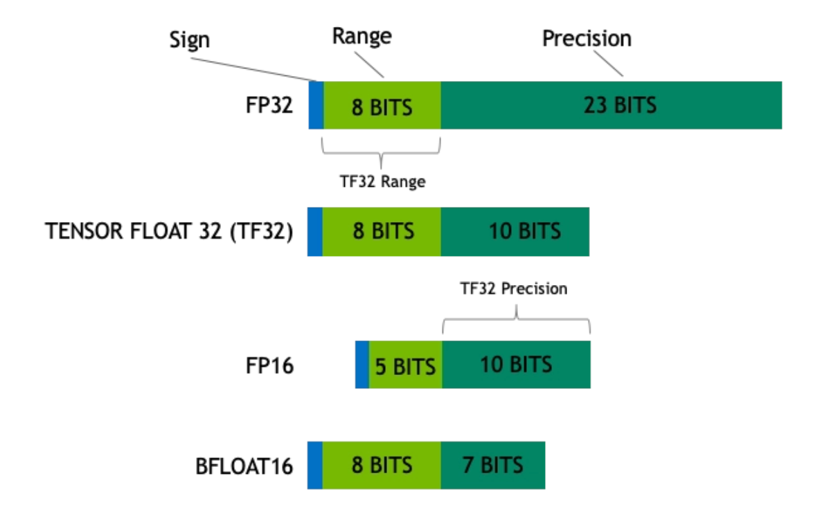

先要通过 `cuda_device = torch.device('cuda')` 或 `torch.device('cuda:0')` 来指定当前使用哪个 GPU 设备

然后在创建 tensor 时指定所在的设备: `x = x.to(cuda_device)`

## 其他 api

### `torch.tensor.is_contiguous(memory_format=torch.contiguous_format)`

Returns True if self tensor is contiguous in memory in the order specified by memory format

memory_format: memory allocation order. Possible values are : `torch.contiguous_format`, `torch.channels_last`, `torch.preserve_format`

### torch.cuda.memory_summary
输出举例：
```

```

### torch.cuda.memory_stats(devices=None)

输出举例：
```

```

### torch.tensor.detach()
返回一个新的 Tensor 对象，并且新 Tensor 是与当前的计算图分离的，其 requires_grad=False，反向传播时不参与计算梯度。而且与被 detach的tensor共享数据部分的存储空间

### torch.tensor.requires_grad_()
告知需要梯度

CHECK_GPU_ERROR(cudaStreamSynchronize(_stream));

疑问：默认不设置上述语句，此时难道是多个kernel 同时执行的？

### [].append()
list1: [x, y, z]
tuple: ('x', y, 1)

list.append(list1)
list.expand(tuple)

### torch.sum(tensor, dim)
在指定的维度上进行求和，比如 torch.sum(t) （所有维度上）; torch.sum(t, (1, 2)) (求和到第0维)

### unsqueeze
把 tensor 放到指定的那个维度上

### 切分

Tensor.chunk(chunks, dim=0) → List of Tensors

比如把 q 按照第一维切分两份： q.chunk(2, dim=0)

### 转换

torch.permute(input, dims) → Tensor

### torch.bmm
强制规定维度(3)和大小相同的矩阵乘操作，所以与 torch.matmul 的区别：它不会 broadcast。而且支持 TFloat 32

### torch.baddbmm
batch add matrix-matrix product 

Tensor.baddbmm(input, batch1, batch2, *, beta=1, alpha=1)

input: the tensor to be added

## matmuls use tf32
原理如下图：它使用类似fp16那样的16bit来表示fp32的数字，所以它的 range 和 fp32是一样的，但是精度差一些。即 range和fp32一样，而精度和fp16一样（见图）。而且用户不需要改代码，只需要开启这个开关就行
 


[python1.11及之前都是True的，但是1.12之后是False的](https://pytorch.org/docs/master/notes/cuda.html#tensorfloat-32-tf32-on-ampere-devices)。这个控制在自从A100开始，是否使用TensorFloat32(TF32)的 tensor cores 来计算 matmul和卷积

它举的 [10240,10240]的两个矩阵乘法的例子里，速度会快7倍

Since the release of Ampere GPUs, pytorch has been using tf32 by default. 


## FAQ
1. 打印 pytorch 里 tensor 时出现：`CUDA error: invalid configuration argument`: 是由于 tensor 元素个数太多，print 最终会调用 cuda ，使用预先分配给 print 的显存空间
2. 执行某个算子时提示：`RuntimeError: expected scalar type Half but found Float`：这个错误提示反了，最终发现是 需要调用 layer.to(torch.device("cuda:0"), dtype=torch.half) 来设置模型使用 fp16 精度
3. 如何打印某Tensor的指定一列？比如第一列： t[:,:,:1]
