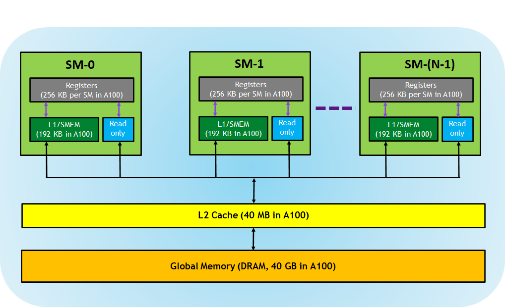
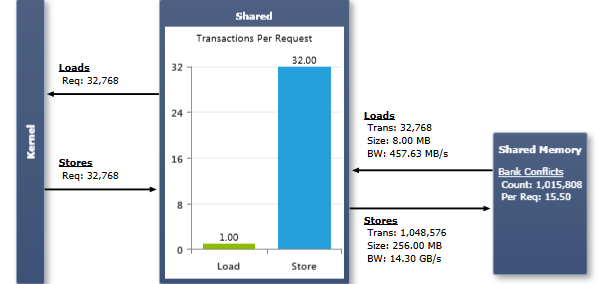

GPU 架构里的显存有以下几类：

* 寄存器：每个线程私有的。编译器决定寄存器使用率。A100 上有256KB per SM
* L1/Share memory (SMEM)：非常快，是芯片自带的 scratchpad memory，可以当做 L1 cache 和 共享显存。在同一个 block 里的所有线程之间进行共享，所有的运行在同一个 SM 上的所有 blocks 都可以共享 SM 提供的物理显存资源 (那不同blocks 之间，是不能共享的，因为从 << grids, blocks, shared_memory>> 可以看出来是block粒度内部共享的
* Read-only memory: 每个 SM 有指令缓存，常数显存，texture 和 RO cache 等
* L2 cache --  在所有 **SM 之间共享**，A100 上有40MB。 CPU 上是不是也是类似，L2 是多个核之间共享，L1 是核内部共享？
* Global memory

## Thread Synchronization
使用线程之间(同一个block内）共享显存时，需要注意避免 race conditions，因为尽管一个block里的所有线程都**逻辑**上并行，但并不是所有线程都在同一时刻**物理**上执行。所以在加载完 shared memory 后，需要用 `__syncthreads()` 来在同一个block内部，同步线程。

## Shared memory 上的 bank conflicts
Shared memory 等价于用户控制的 cache。为了达到高带宽，shared memory 被划分为相等大小的显存单元，叫做 banks，他们可以被并发访问。任意的显存读取或者写入请求，如果是n个地址，落到n个不同的memory banks 里，那么可以并行请求，这样整体带宽比单个bank要高n倍。但如果两个地址落到了同一个memory bank里，就会有 bank conflict 而无法并行，必须串行访问

## 图表

Load/Store Requests 数量是总共的 **shared memory 指令执行的次数**。当一个 warp 执行访问 shared memory 的执行时，它会先解决bank conflicts。然后每个冲突会强制一次新的内存transcation。所以一次请求，会产生多个 transactions

Transactions Per Request 图展示了每个贡献显存指令执行时所需的平均 sahred memory transactions 次数
## 分析
如果 Transactions Per Request 很高：

1. 运行 Memory Transactions 试验来找到触发了 shared memory 操作的代码行。检查访问的 pattern ，来尝试优化来避免 bank conflicts
2. 如果设备支持设置 shared memory 地址模式，尝试切换配置，重新试验。总体而言，64 byte 的访问模式对所有 8 byte 的访问都很有益。

如果 Load/Store Requests 很高：
看看是否shared memory 访问可以被 **shuffle** 操作代替。这个新的 warp-level 的intrinsic 可以让一个 warp 里的线程之间直接进行数据交换而不需要shared memory或者 global memory。这个 shuffle 指令的延迟比 shared memory 还低，不需要耗费shared memory 空间，所以适合在同一个warp里的线程间快速交换数据

## 参考资料
1. [Using Shared Memory in CUDA(2013)](https://developer.nvidia.com/blog/using-shared-memory-cuda-cc/)
2. [CUDA experiments: Memory Statics for Shared Memory](https://docs.nvidia.com/gameworks/content/developertools/desktop/analysis/report/cudaexperiments/kernellevel/memorystatisticsshared.htm)
