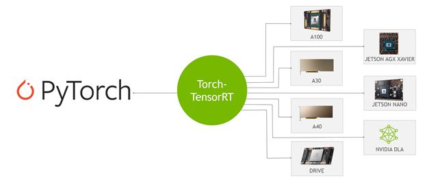
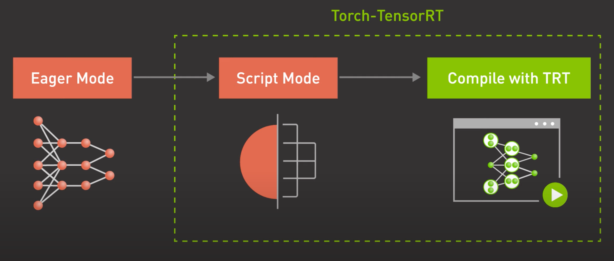

NVIDIA TensorRT，是一个SDK（而不是编译器），用来做高性能的深度学习推理，包括:

1. 一个深度学习推理优化器
2. 一个运行时，可以交付低延迟和高吞吐的推理应用

总结： TensorRT 是一个运行时，它需要提前编译一下，然后生成运行时

提供的能力：

1. 权重&激活值的精度校准：比如量化为int8的模型而且保留精度
2. 层和tensor的融合：通过融合kernel节点来优化 GPU 显存和带宽
3. 内核自动调油：根据gpu目标选择最好的数据层(?)和算法
4. 动态 tensor 显存 : 最小化显存占用并重用tensor显存
5. 多流执行：可扩展的设计，可以并行处理多种输入
6. Time fusion: 优化 RNN

生态：

通过 TensorRT 优化过的模型，可以直接通过 NV 的 Triton 来部署。

TensorRT 和 PyTorch 结合在一起，所以可以使用一行代码来完成6倍的推理加速

自定义时，是使用 tensorrt 自己提供的 api，来构建网络及其中的某个算子，见[例子](https://github.com/NVIDIA/trt-samples-for-hackathon-cn/blob/master/cookbook/02-API/Layer/ConvolutionNdLayer/SimpleUsage.py)

## PyTorch with Torch-TensorRT
Speed Up Inference in PyTorch with 1 Line of Code

### How Torch-TensorRT works

发现用了 torchDynamo 之后，拿到 GraphModule 之后，可以做很多事：
比如转换到 tensorrt 上做推理
https://github.com/pytorch/torchdynamo/blob/5fb502660e52a2e1f93ab0f148fd8776e1b56297/torchdynamo/optimizations/backends.py#L308-L320

