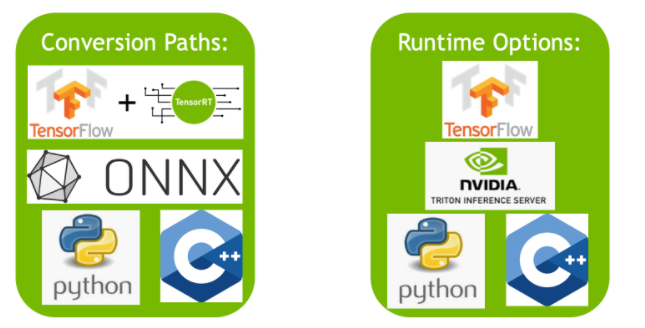

NVIDIA TensorRT，是一个SDK（而不是编译器），用来做高性能的深度学习推理，包括:

1. 一个深度学习推理的优化方式（比如启用plugins等)
2. 一个运行时，可以交付低延迟和高吞吐的推理应用，类似一个后端一样，此时不需要 PyTorch了

总结： TensorRT 是一个运行时，它需要提前编译一下，然后生成运行时

提供的能力：

1. 权重&激活值的精度校准：比如量化为int8的模型而且保留精度
2. 层和tensor的融合：通过融合kernel节点来优化 GPU 显存和带宽
3. 内核自动调优化：根据gpu目标选择最好的数据层(?)和算法
4. 动态 tensor 显存 : 最小化显存占用并重用tensor显存
5. 多流执行：可扩展的设计，可以并行处理多种输入
6. Time fusion: 优化 RNN

生态：

通过 TensorRT 优化过的模型，可以直接通过 NV 的 Triton 来部署。

TensorRT 和 PyTorch 结合在一起，所以可以使用一行代码来完成6倍的推理加速

自定义时，是使用 tensorrt 自己提供的 api，来构建网络及其中的某个算子，见[例子](https://github.com/NVIDIA/trt-samples-for-hackathon-cn/blob/master/cookbook/02-API/Layer/ConvolutionNdLayer/SimpleUsage.py)

## PyTorch with Torch-TensorRT
Speed Up Inference in PyTorch with 1 Line of Code


### How Torch-TensorRT works


发现用了 torchDynamo 之后，拿到 GraphModule 之后，可以做很多事：
比如转换到 tensorrt 上做推理
https://github.com/pytorch/torchdynamo/blob/5fb502660e52a2e1f93ab0f148fd8776e1b56297/torchdynamo/optimizations/backends.py#L308-L320


## 相关工具
ONNX GraphSurgeon : python的lib，提供方便的可以创建和修改 ONNX 模型的方法

Polygraphy : 辅助在各种框架下运行和debugging DL models

PyTorch-Quantization Toolkit: 使用模拟量化来训练和评估 PyTorch 模型。量化可以被自动或者手工插入到模型里去，让模型可以在精度和性能之间调优。量化模型可以被导出为
ONNX，然后再TensorRT里倒入


## 3.1 TRT的相关生态
TRT的工作流里，都包含把模型转化为优化后的表示(an optimized representation)，叫做 engine。
### 基本 TRT 的5步工作流
导出模型，选择batchsize，选择精度，转换模型，部署模型
## 3.2 转换和部署的选项
TRT生态分为两块：
1. 有不同方法来把模型转换为 TensorRT 引擎
2. 用户可选不同的运行时来部署他们的优化后的 TensorRT engine



### 3.2.1 转换(Conversion)
有三种主要的转换一个模型的方法：

* 使用 TF-TRT 或者 PyTorch-TRT
* 从 .onnx 文件自动转换。可以使用 TensorRT api 或者 trtexec 来做onnx到 engine 的转换。这个转换要么成功，要么失败。模型里所有op都必须是 TRT 支持的。转换结果是一个单个的 TRT engine，开销非常小
* 使用 TRT api(C++ or python)来构建一个网络

### 3.2.2 部署(Deployment)
有三种方式来使用 TRT 来部署模型：
* 使用 TensorFlow、PyTorch：此时就跟普通模型一样，不过其中有一段被 TRT 执行，好处是 PyTorch、Python和TRT混合
* 使用标准的 TRT 运行时 API: 全都是 TRT ，所以开销(python <-> TRT) 最小，但是对于TRT不支持的算子，需要自己实现。大部分场景是使用 ONNX export 来从框架里导出
* NVIDIA Triton Inference Server: 可以从不同框架（TF，TRT，PyTorch，ONNX Runtime或者自定义矿机）上部署训好的模型。它有好几种特性：并发执行模型，可以是同构或者异构的多份模型(多份模型能进一步减少延迟），负载均衡和模型分析。

## 3.3 选择正确的工作流

# 4 使用 ONNX 部署的例子
ONNX 转换通常是最搞笑的自动把 ONNX 模型转换到 TRT engine的方法。本节介绍5个基本步骤来把ONNX模型部署

## 4.1 Export the Model

## 4.2 选择 batchsize
简单来说，推理时我们选择一个小的batchsize，可以让latency较小，而更大的batchsize，能让吞吐量更大。虽然更大的batch耗时更久，但是平均每个sample上的耗时变小了

TRT 也支持动态的 batchsize。更多信息可以看 TRT 文档里的 [dynamic shapes(主要是第一维batchsize在变)](https://docs.nvidia.com/deeplearning/tensorrt/developer-guide/index.html#work_dynamic_shapes)

## 4.3 选择一个精度

## 4.4 转换模型（为 engine)
选项1：trtexec ，可以转换一个 ONNX 模型为 TRT engine并profile
```
trtexec --onnx=resnet50/model.onnx --fp16 --minShapes=input:1x3x256x256 -optShapes=input:1x3x1026x1282
  --maxShapes=input:1x3x1440x2560 --buildOnly --saveEngine=resnet_engine.trt # 这样会把 onnx 转换为 trt engine 并保存
```

### 验证可以启动成功(load engine)
```
trtexec --shapes=input:1x3x1026x1282 --loadEngine=fcn-resnet101.engine
```
## 4.5 部署模型


