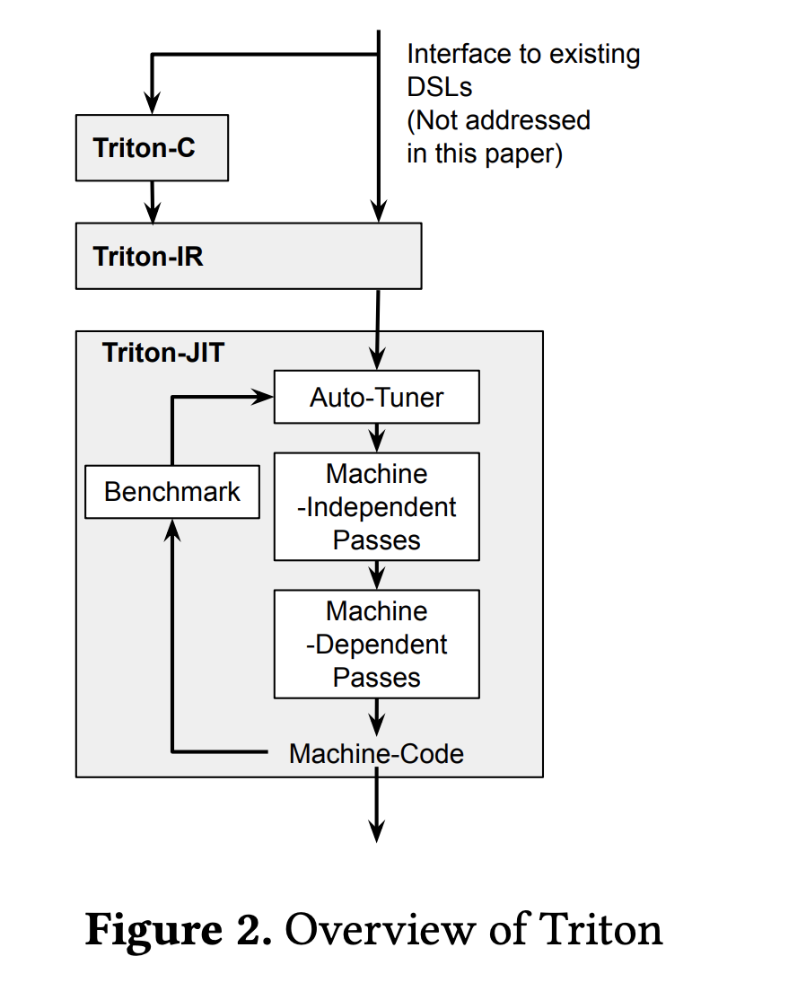
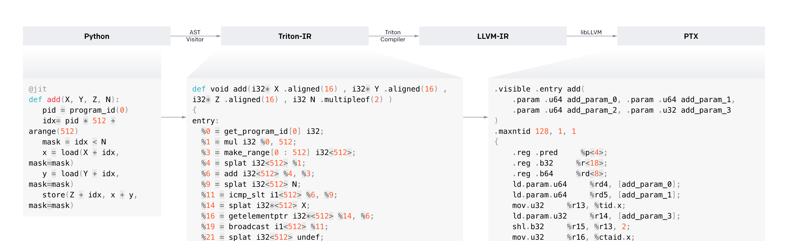

## Numba
open-source JIT compiler that translated subsets of Python and NumPy into fast machine code. in Numba, kernels are defined as **decorated Python funcitons** and launched concurrently with different instances.

支持 Intel、AMD x86，ARM CPU，以及 NV 的 GPU

## Triton

Open-Source GPU Programming for Neural Networks。 [Triton: An Intermediate Language and Compiler for Tiled Neural Network Computations](http://www.eecs.harvard.edu/~htk/publication/2019-mapl-tillet-kung-cox.pdf).

## Taichi
DiffTachi language frontend is embedded in Python, and a Python AST transformer compiles DiffTachi code to Taichi intermediate representation (IR). Unlike Python, the DiffTaichi language is compiled, stacially-typed, parallel, and differentiable. We **extend the Taichi compiler** to further compile and **automatically differentiate the generated Taichi IR** into forward and backward executables. 所以可以用于 neural network

挺有意思的，几行代码就可以模拟出三个弹簧的动画
