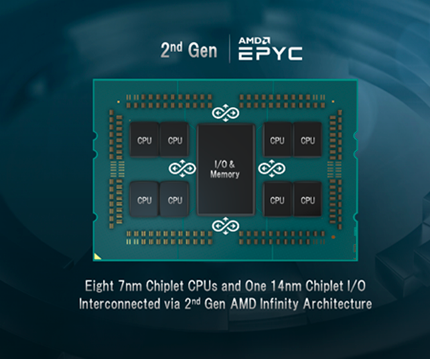
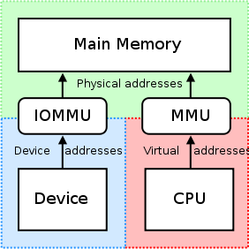
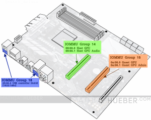

本文是为了让 Amd 2nd 代 EPYC CPU(之前叫 "Rome")，可以达到 ConnectX-6 HDR IB 上的最大性能。

它有8个 CCD(Core Cache Die：核心缓存芯片) chaplets，组成4个 quadrants(象限)，每个由两个 CCD 和**两个内存通道(memory channels)**组成。这和第一代的EPYC架构不同：它由4个 SOCs之间通过 AMD Infinity Fabric 技术互联。

## Memory DIMMs
推荐用8个，每个 socket(2 DIMMs per CPU die)。CPU可以使用更多带宽来达到 HDR IB的速度上限

推荐的 BIOS 设置

## NPS Configuration

Memory Addressing -> NUMA nodes per socket -> NPS2

NUMA Per Socket(NPS)，这样每个socket可以被分为4个 NUMA 节点。每个 NUMA 节点只会使用被指定的内存控制器

NPS 的配置项是 1，2 或者 4

NPS=1，意思是 CPU 都在单个 domain下（所有的核和所有的memory channels)。内存是在8个memory通道之间interleaved(交错）

具体原文里有图可以看，总结：

使用 NPS=1 或2比较好，因为此时memory channels 比较大（更大 memory channels = 更大带宽）

## IOMMU

PCI Access Control Services(ACS)

IO 虚拟化（也叫做 VT-d or IOMMU) 会干烧 GPU Direct，因为会重定向所有点对点的流量到 CPU root complex，导致明显的性能下降甚至是 hang。遇到性能问题时，可以尝试关闭 ACS

IOMMU groups:

NBIO -> IOMMU = Disabled

## Relaxed Ordering
Using relaxed ordering for PCI operations 是非常关键的机制，来达到 CPU 上对接的 memory 有峰值性能

有两种方法：
* API 级别打开它
* 强制所有流量都走它

## Simutaneous Multithreading(SMT)
Performance -> CCD/CORE/Thread -> Accept -> SMT Control -> SMT = Disabled

## 问题
1. ConnectX-6 是什么意思，还有其他什么型号？

## 参考资料
[Amd 2nd Gen EPYC CPU Tuning Guide for InifiniBand HPC](https://hpcadvisorycouncil.atlassian.net/wiki/spaces/HPCWORKS/pages/1280442391/AMD+2nd+Gen+EPYC+CPU+Tuning+Guide+for+InfiniBand+HPC#NPS-Configuration)

[Basic RDMA Benchmark Examples for AMD 2nd Gen EPYC CPUs over HDR InfiniBand](https://hpcadvisorycouncil.atlassian.net/wiki/spaces/HPCWORKS/pages/1284603909)