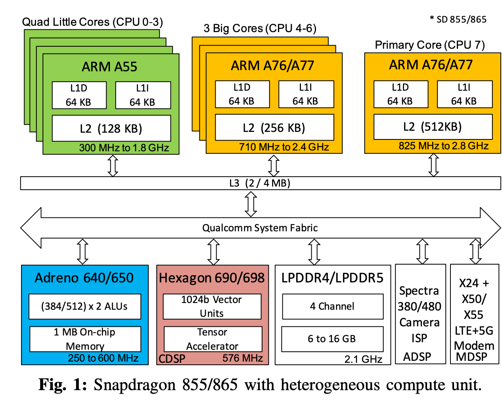
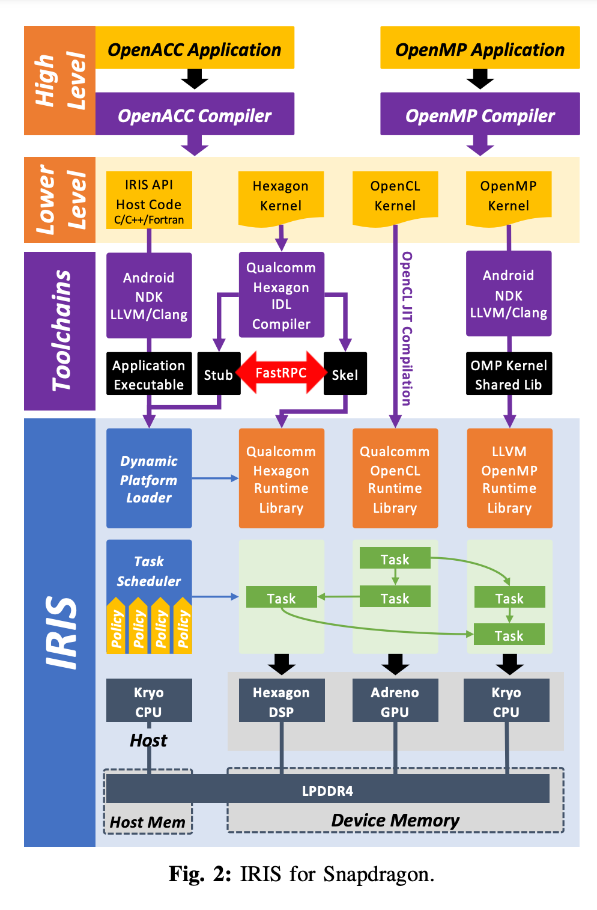

OpenCL: A parallel programming standard for heterogeneous computing systems. 主要给 端侧的 GPU 用的

市面上的设备，SoC 和 GPU 类型：

## SoC 大头是三家：
Snapdragon(骁龙 765, 430, 855, 888) 是高通的

Kirin 990 是华为的麒麟

Helio G80 是 联发科(MediaTek) 的 SoC(移动处理器） 产品。

## GPU 类型：
Mali-G76 英特尔旗下的 GPU，由 ARM 设计

Adreno (620, 505, 640) 高通公司的

snapdragon 是把 一堆芯片堆叠在一起的 SoC，能完整工作，里面包含了 CPU，GPU 和 DSP（里面有调制解调器）。DSP 用的 Hexagon
## 1. ARM CPUs 
是区分大小核的。

## 2. Adreno GPU

带的是 Adreno 640 GPU，是移动芯片，开发者是高通(Qualcomm)。用来做 2D、3D 图像加速。它有 384x2 个 ALUs，有 1MB 的片上显存，频率从 250MHz 到 600 MHz。可以使用 OpenCL 库

## 3. Hexagon DSP，NPU 和 SPectra ISP
Hexagon 是 高通的 DSP 的一个系列，也叫做 QDSP6，即第六代。
DSP 里是 VLIW(Very Long Instruction Word) 和 SIMD 架构的 处理器，高效代码需要特定架构的知识，所以编码困难。他是硬件多线程的。它里面也有 NPU 和 tensor accelerator包含三类 DSPs：
感觉是图里的东西，分为了三类：

Spectra 360 是 Image and Singal Processor(ISP)，是给 cv 用的硬件加速器
1. ADSP(Audio-DSP)
2. CDSP(Compute DSP) 向量函数单元需要特定的 HVX（Hexagon Vector Extensions) 指令集: 支持 integer 和 fixed-point 操作。
3. MDSP(modem DSP)

设备厂商相关的特定编程库：NVIDIA 的 CUDA，AMD 的 HIP，Intel 的 oneAPI, Qualcomm 的 Hexagon SDK。

OpenCL 是一个解决上述问题的方法，但只有部分设备加速器支持 OpenCL。

可以参考下图：

本文主要参考自：[Toward Performance Protable Programming for Hetergeneous System-on-Chips: Case Study with Qualcomm Snapdragon SoC](https://www.osti.gov/servlets/purl/1823330)

## TODO
看看高通的：Inferencing at the Edge and Fragmentation Challenges: https://static.linaro.org/connect/bkk19/presentations/bkk19-402.pdf
