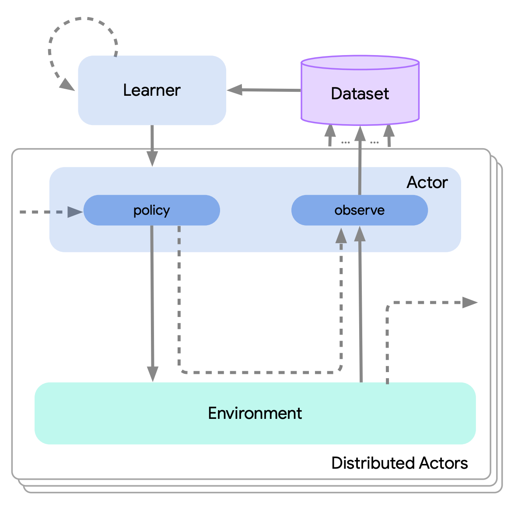

<!-- vscode-markdown-toc -->
* 1. [Papers](#Papers)
	* 1.1. [Convolution Neural Networks](#ConvolutionNeuralNetworks)
	* 1.2. [Sparsity](#Sparsity)
	* 1.3. [Transformers](#Transformers)
	* 1.4. [Attribute Recognition](#AttributeRecognition)
	* 1.5. [Classification](#Classification)
	* 1.6. [Object Detection](#ObjectDetection)
	* 1.7. [Knowledge Distillation](#KnowledgeDistillation)
	* 1.8. [Network Communication](#NetworkCommunication)
		* 1.8.1. [Gradient Compression](#GradientCompression)
	* 1.9. [OPs in Network](#OPsinNetwork)
		* 1.9.1. [Batch Normalization](#BatchNormalization)
		* 1.9.2. [Group Normalization](#GroupNormalization)
	* 1.10. [Compute Efficiency](#ComputeEfficiency)
	* 1.11. [Memory Efficiency](#MemoryEfficiency)
	* 1.12. [Compression](#Compression)
	* 1.13. [Parallelism](#Parallelism)
		* 1.13.1. [Data Parallel](#DataParallel)
		* 1.13.2. [Pipeline Parallelism](#PipelineParallelism)
		* 1.13.3. [Parallelization Strategies](#ParallelizationStrategies)
	* 1.14. [Quantization](#Quantization)
	* 1.15. [Network](#Network)
	* 1.16. [Resource Management](#ResourceManagement)
	* 1.17. [Parameter Server](#ParameterServer)
* 2. [Network Operators](#NetworkOperators)
* 3. [Course：](#Course)
	* 3.1. [[CS179: GPU Programming](http://courses.cms.caltech.edu/cs179/)](#CS179:GPUProgramminghttp:courses.cms.caltech.educs179)
	* 3.2. [ [CS231n: Convolutional Neural Networks for Visual Recognition](http://cs231n.stanford.edu/)](#CS231n:ConvolutionalNeuralNetworksforVisualRecognitionhttp:cs231n.stanford.edu)
	* 3.3. [[CSE 599W: Systems for ML](http://dlsys.cs.washington.edu/schedule)](#CSE599W:SystemsforMLhttp:dlsys.cs.washington.eduschedule)
		* 3.3.1. [[Introduction to Deep Learning](http://dlsys.cs.washington.edu/pdf/lecture1.pdf)](#IntroductiontoDeepLearninghttp:dlsys.cs.washington.edupdflecture1.pdf)
		* 3.3.2. [[Lecture 1：Distributed Training and Communication Protocols](http://dlsys.cs.washington.edu/pdf/lecture11.pdf)](#Lecture1DistributedTrainingandCommunicationProtocolshttp:dlsys.cs.washington.edupdflecture11.pdf)
		* 3.3.3. [[Lecture 3: Overview of Deep Learning System](http://dlsys.cs.washington.edu/pdf/lecture3.pdf)](#Lecture3:OverviewofDeepLearningSystemhttp:dlsys.cs.washington.edupdflecture3.pdf)
		* 3.3.4. [[Lecture 5: GPU Programming](http://dlsys.cs.washington.edu/pdf/lecture5.pdf)](#Lecture5:GPUProgramminghttp:dlsys.cs.washington.edupdflecture5.pdf)
	* 3.4. [https://ucbrise.github.io/cs294-ai-sys-sp19/](#https:ucbrise.github.iocs294-ai-sys-sp19)
* 4. [Books：](#Books)
	* 4.1. [Deep Learning](#DeepLearning)
		* 4.1.1. [Backpropation](#Backpropation)
* 5. [OpenSource Frameworks And Libs](#OpenSourceFrameworksAndLibs)
	* 5.1. [TIMM](#TIMM)
	* 5.2. [[Tensor Comprehensions]() 2018.2.13 Facebook AI Research Technical Report](#TensorComprehensions2018.2.13FacebookAIResearchTechnicalReport)
	* 5.3. [TensorFlow RunTime (TFRT)](#TensorFlowRunTimeTFRT)
	* 5.4. [OneFlow](#OneFlow)
	* 5.5. [[Pytorch]()](#Pytorch)
		* 5.5.1. [JIT](#JIT)
	* 5.6. [[Tensorflow]()](#Tensorflow)
	* 5.7. [[Acme: A Research Framework for Distributed Reinforcement Learning](https://arxiv.org/pdf/2006.00979.pdf)(arXiv: June 1 2020)](#Acme:AResearchFrameworkforDistributedReinforcementLearninghttps:arxiv.orgpdf2006.00979.pdfarXiv:June12020)
	* 5.8. [[Launchpad]()](#Launchpad)
	* 5.9. [Reverb(2020)](#Reverb2020)
	* 5.10. [[Weld](https://www.weld.rs/)(Standford)](#Weldhttps:www.weld.rsStandford)
	* 5.11. [Table Data Storage](#TableDataStorage)
* 6. [Characterizing ML Training Workloads](#CharacterizingMLTrainingWorkloads)
* 7. [Data Preprocessing](#DataPreprocessing)
* 8. [Videos](#Videos)
* 9. [Hardware](#Hardware)
* 10. [ML Compilers](#MLCompilers)
	* 10.1. [Rammer](#Rammer)
	* 10.2. [IREE(Intermediate Representation Execution Environment)](#IREEIntermediateRepresentationExecutionEnvironment)
* 11. [Profiling](#Profiling)
	* 11.1. [Memory Profiling](#MemoryProfiling)
	* 11.2. [Communication Profiling](#CommunicationProfiling)
* 12. [Parallel Programming](#ParallelProgramming)
* 13. [Mixed Precision Training](#MixedPrecisionTraining)
	* 13.1. [CUDA](#CUDA)
* 14. [Visualizing Neural Networks](#VisualizingNeuralNetworks)
* 15. [Cluster Scheduler](#ClusterScheduler)
* 16. [Misc](#Misc)

<!-- vscode-markdown-toc-config
	numbering=true
	autoSave=true
	/vscode-markdown-toc-config -->
<!-- /vscode-markdown-toc -->

##  1. Papers
ML Papers:

###  1.1. Convolution Neural Networks
[CNN Concepts](./papers/cnn-concepts.md)
[Gradient-Based Learning Applied to Document Recognition]()(1996?) : [Notes](./papers/LeNet.md), 在 OCR 领域里，用不需要像之前的方法一样，需要很多人工介入/设计/处理。对字母的大小，变体等有鲁棒性。更多依赖于从数据里自动学习，而非手工针对任务做的启发式设计。这样一个统一结构的模型可以代替过去好几个独自设计的模块

[ImageNet Classification with Deep Convolutional Neural Networks](http://www.cs.toronto.edu/~fritz/absps/imagenet.pdf)(2010) ：用 deep convolutional neural network 在 2010 年的 ImageNet LSVRC 比赛上分类 1200百万高清(当时的)图片。使用的网络有6000万参数和65万神经元，引入了 dropout 来防止过拟合。 [Notes](./papers/ImageNet.md)

[Going Deeper with Convolutions]() (ILSVRC 14) [Notes](./papers/Inception-GoogLeNet.md)

[Rich feature hierarchies for accurate object detection]() (2014) [Notes](./papers/object-detection/R-CNN.md)

Deformable Convolutional Networks (ICCV 2017) [Notes](./papers/deformable-convolutional-networks.md)

###  1.2. Sparsity
[Accelerating Sparse Approximate Matrix Multiplication on GPUs](), [Notes](./papers/sparsity/Accelerating-Sparse-Approximate-Matrix-Multiplication-on-GPUs.md)

###  1.3. Transformers
[Attention is All you need](https://proceedings.neurips.cc/paper/2017/file/3f5ee243547dee91fbd053c1c4a845aa-Paper.pdf) (Google Brain 2017) [My Notes](./papers/transformer/attention-is-all-you-need.md)

ViT: Vision Transformer: [An Image is worth 16x16 Words: Transformers for Image Recognition at Scale]() (2021.6.3) [My Notes](./papers/transformer/vit-an-image-is-worth-16x16-words.md)。影响力巨大，可以看到后续 CV，多模态都用 ViT 了，非常好的挖坑之作

ViT FRCNN(2021.12): 运用到检测上

SETR(2021.12): 运用到分割上

DETR: ViT 在目标检测上的应用

Scaling Vision Transformer: 把 ViT 的参数量搞大

SwinTransformer：多尺度的 transformer，更适合做视觉领域

lightseq: Accelerated Training for Transformer-based Models on GPUs(2021.10): 从工程角度出发实现 transformer 的训练和推理加速。[My Notes](./papers/transformer/lightseq.md) [源码阅读分析](./frameworks/lightseq/source-code.md)

Masked Autoencoders Are Scalable Vision Learners [My Notes](./papers/transformer/Masked-AutoEncoders-Are-Scalable Vision Learners.md)：第一次在分类任务上，让生成式模型比判别式模型要好。

Self-Attention Does Not Need O(n^2) Memory(2021.12) [My Notes](./papers/transformer/Self-Attention-Does-Not-Need-Memory.md)

[Deforma2ble DETR: Deformable Transformers for End to End Object Detections(ICLR 2021)](papers/transformer/deformable-detr_deformable-transformers.md)

Competition-Level Code Generation with AlphaCode. [My Notes](./papers/NLP/alpha-code.md)

FLASHATTENTION: Fast and Memory-Efficient Exact Attention with IO-Awareness. (2022) [My Notes](./papers/transformer/flash-attention.md)

SimA: Simple Softmax-free Attention for Vision Transoformers: 

FlashAttention-2: Faster Attention with Better Parallelism and Work Partitioning [My Notes](./papers/transformer/flash-attention-2.md)

FlashDecoding for long-context inference (2023.10) [My Notes](./papers/transformer/flash-decoding.md)

FlashDecoding++(2023.11) [My Notes](./papers/transformer/flash-decoding++.md)

Blockwise Parallel Transformer for Large Context Models [My Notes](./papers/transformer/blockwise-parallel-transformer.md)

###  1.4. Attribute Recognition
[Hierarchical Feature Embedding for Attribute Recognition]() (2020.5.23) [My Notes](./papers/attribute-recognition/hierarchical-feature-embedding-for-attribute-recognition.md)

###  1.5. Classification

### AIGC(AI-Generated Content)

Deep Unsupervised Learning using Noneequilibrium Thermodynamics (2015) : 最早提出

Denoising Diffusion Probabilistic Models(DDPM) (2020): 新高度

InstructPix2Pix（2022）: 给定输入图像和告诉模型需要做什么的文本描述，模型就能遵循描述指令来编辑图像

OpenAI DALLE2 和Google Imagen 都是半开源

High-Resolution Image Synthesis with Latent Diffusion Models(CVPR 2022, Stable Diffusion模型的论文, v1.4) runwayml 是背后参与的一家公司。可以做Erase and replace 的视频公司，AIGC 只是他们能力链条里的一部分. [My Notes](papers/AIGC/latent-diffusion-model.md)

Stable Diffusion 代码：https://huggingface.co/CompVis/stable-diffusion 高质量数据集 LAION 的加持。 支持：txt2image, image+txt2image, erase and replace

LAION-5B: A New Era of Open Large-Scale Multi-Modal Datasets(2022.5) [My Notes](datasets/laion-5b.md)

What are Diffusion Models? [My Notes](papers/AIGC/what-are-diffusion-models.md)

HuggingFace上对于Stable Diffusion 的介绍。 [My Notes](papers/AIGC/huggingface-stable-diffusion-intro.md)

Imagen: Photorealistic Text-to-Image Diffusion Models with Deep Language Understanding(2022.5). DrawBench 上对 VG-GAN+CLIP, Latent Diffusion Models, DALL-E-2 等做了评价

Prompt-to-Prompt Image Editing with Cross-Attention Control

Classifier-Free Diffusion Guidance(2022.7.26)

Imagic: Text-Based Real Image Editing with Diffusion Models

Character-Aware Models Improve Visual Text Rendering(2022.12.20): 主要解决视觉拼写方面的问题，提高图像生成模型渲染高质量视觉文本的能力

Muse: Text-To-Image Generation via Masked Generative Transformers: FID（quality/diversity) 和 CLIP(text-image alignment) 的分数很高；比其他模型快；一个模型支持 inpainting、outpainting [My Notes](papers/AIGC/muse.md

CLIP(Constrative Language-Image Pretraining), DALLE, Diffusion Model 之间的异同点？

CLIP: Constrative Language-Image Pretraining(2021.1.5): [My Notes](papers/multimodal/CLIP.md), [Intro](papers/multimodal/CLIP-intro.md) : Leanrning **Transferable** Visual Models From **Natural Language** Supervision

EVA-CLIP: Improved Training Techniques for CLIP at Scale(2023.3.27)

Speed Is All You Need: On-Device Acceleration of Large DIffusion Models via GPU-Aware Optimizations: [My Notes](papers/multimodal/speed-is-all-you-need.md) (Google 2023 4.21)

ImageBind: One Embedding Space To Bind Them All(2023.5.9) [My Notes](papers/multimodal/imagebind.md)

Q-Diffusion: Quantizing Diffusion Models (2023.2.10) [My Notes](papers/AIGC/q-diffusion_quantizing-diffusion-models.md)

Decompose and Realign: Tackling Condition Misaglignment in Text-to-Image Diffusion Models(6.26 2023)

Tune-A-Video: One-Shot Tuning of Image Diffusion Models for Text-to-Video Generation (2023.3.17) [My Notes](papers/AIGC/tune-a-video.md)

RAPHAEL: Text-to-Image Generation via Large Mixture of Diffusion Paths(2023.5.29) [My Notes](papers/AIGC/raphael.md)

ControlNet 1.1 [My Notes](frameworks/controlnet/controlnet1.1.md)

TryOnDiffusion: A Tale of Two UNets() [My Notes](papers/AIGC/try-on-diffusion.md)

苹果的 Stable Diffusion with Core ML:  https://github.com/apple/ml-stable-diffusion [My Notes](frameworks/coreml/stable-diffusion-with-coreml.md)

[端侧设备的 MISC](hardware/device/device.md)

[高通的技术栈](hardware/device/qualcomm-stack.md)

[Stable Diffusion on 高通](hardware/device/sd-on-qualcomm-ai-stack.md)

mlc-llm: Enable everyone to develop, optimize and deploy AI models natively on everyone's devices.

DALL*E3 [Intro](papers/AIGC/dall-e-3-intro.md)
###  1.6. Object Detection

[Concepts](./papers/object-detection/concepts.md)

[Fast R-CNN](): (2015) 提出用一个统一的网络来训练 R-CNN，而不是之前的三个阶段，不同的网络. [My Notes](./papers/object-detection/Fast-R-CNN.md)

[Faster R-CNN: Towards Real-Time Object Detection with Region Proposal Networks](https://arxiv.org/pdf/1506.01497.pdf) (2016)：提出了 Region Proposal Network (RPN)，和检测网络共享图片卷积特征，因此 region proposal 的代价非常小。 [My Notes](./papers/object-detection/Faster-R-CNN.md)

[YOLO]() : (2016): [My Notes](./papers/object-detection/YOLO.md)

End-to-End Object Detection with Transformers : (2020 FaceBook Research) [My Notes](papers/object-detection/end-to-end-object-detection-with-transformers.md)

Focal Loss for Dense Object Detection:(2017): [My Notes](papers/object-detection/focal-loss-for-dense-object-detection.md), 第一次解决了一阶段检测的精度问题，为了使用这个loss算法，自己构造了 RetinaNet，精度超越了faster rcnn

DETR(DEtection TRansformer): End to end object detection with transformers (2020) [My Notes](papers/object-detection/end-to-end-object-detection-with-transformers.md)
### Model Compression
Model compression(2006)：ensemble 模式下的多个模型的知识，可以压缩到一个模型里

蒸馏算是从上述模型压缩进一步发展而来的

###  1.7. Knowledge Distillation
[Contrastive Representation Distillation](https://arxiv.org/pdf/1910.10699.pdf) (2020) [My Notes](./papers/knownledge-distillation/contrastive-representation-distillation.md)

Search to Distill: Pearls are Everywhere but not the Eyes(2020) 除了参数外，还考虑了网络结构的蒸馏，结果发现好的老师无法教出在各方面都很优秀的学生  [My Notes](./papers/knowledge-distillation/search-to-distill.md)

A Gift from Knowledge Distillation: Fast optimization, Network Minimization and Transfer Learning (2017 韩国):  [My Notes](./papers/knowledge-distillation/a-gift-from-knowledge-distillation.md)

Distilling the Knowledge in a Neural Network Geoffrey Hinto 和 Jeff Dean(2015): 第一次提出模型蒸馏的概念及方法, 可以通过蒸馏让小模型能力提升很高（是语音场景）。提出了一种新的 ensemble 方法 [My Notes](./papers/knowledge-distillation/distilling-the-knowledge-in-a-neural-network.md)

###  1.8. Network Communication
[Flare: Flexible In-Network Allreduce](https://arxiv.org/pdf/2106.15565.pdf) 2021-6-29:  SwitchML 不灵活，他们设计了一个交换机：by using as a building block PsPIN, a RISC-V architecture implementing the sPIN programming model. 

In-Network Aggregation，[slides](https://www.usenix.org/system/files/nsdi21_slides_sapio.pdf), [Video](https://www.usenix.org/conference/nsdi21/presentation/sapio) [笔记](/network-communication/SwitchML.md) 18 年的

paper: [Scaling Distributed Machine Learning with In-Network Aggregation](https://www.usenix.org/system/files/nsdi21-sapio.pdf)

[NVIDIA SHARP](./network-communication/NVIDIA-Scalable-Hierarchical-Aggregation-and-Reduction-Protocol.md): 看起来跟上述开源方案的非常相似，对比见[这里](./network-communication/SwitchML.md#compare). 16 年就发论文了

[NetReduce: RDMA-Compatible In-Network Reduction for Distributed DNN Training Acceleration](https://arxiv.org/pdf/2009.09736.pdf) : 华为做的，需要硬件实现，好处是不需要修改网卡或交换机。

[MPI](./network-communication/MPI.md): 并行编程中的一种编程模型， Message Passing Interface

[PMI](./network-communication/PMI.md): 并行编程中的Process Management System

[InfiniBand, Remote Direct Memory Access(RDMA), Socket, Ethernet](./network-communication/basic-concepts.md)

1.8.1. Gradient Compression

[GRACE: A Compressed Communication Framework for Distributed Machine Learning](https://sands.kaust.edu.sa/papers/grace.icdcs21.pdf) (2021) : s. We instantiate GRACE on TensorFlow and PyTorch, and implement 16 such methods.
Finally, we present a thorough quantitative evaluation with a variety of DNNs (convolutional and recurrent), datasets and system configurations. We show that the DNN architecture affects the relative performance among methods. Interestingly, depending on the underlying communication library and computational cost of compression / decompression, we demonstrate that some methods may be impractical. GRACE and the entire benchmarking suite are available as open-source.

[Deep Gradient Compression: Reducing the Communication Bandwidth for Distributed Training](https://arxiv.org/abs/1712.01887)(2017.12,2020-6-23 modify) :  In this paper, we find 99.9% of the gradient exchange in distributed SGD is redundant . 它就是在 GRACE 框架基础上开发的一类算法

[Code: GRACE: A Compressed Communication Framework for Distributed Machine Learning](https://github.com/sands-lab/grace):  is an unified framework for all sorts of compressed distributed training algorithms

GC3: An Optimizing Compiler for GPU Collective Communication(ASPLOS 23)[My Notes](netwok-communication/gc3.md) . 对应的库叫 msccl, [My Notes](./network-communication/msccl.md)

###  1.9. OPs in Network

####  1.9.1. Batch Normalization

[Batch Normalization: Accelerating Deep Network Training by Reducing Internal Covariate Shift](https://arxiv.org/abs/1502.03167)(2015): 用了 BN 后学习率可以调大，初始化过程更鲁棒。也有 regularization 作用，可以一定程度代替 drop out。 faster training and high performance. [My Notes](./papers/batch-normalization.md)

Layer Normalization (2016.7) : [My Notes ](./papers/layer-normalization.md) : 想在 RNN 里引入类似 BN 的方法，来让训练速度提升，收敛的更快

[Norm matters: efficient and accurate normalization schemes in deep networks](https://arxiv.org/pdf/1803.01814.pdf)(2019 ): suggest several alternatives to the widely used L2 batch-norm, using normalization in L1 and L∞ space

Sync Batch Normalization(syncbn): [Source Code Notes](./operators/sync-bn.md)

####  1.9.2. Group Normalization

Sys Papers:

###  1.10. Compute Efficiency
[AdderNet: Do We Really Need Multiplications in Deep Learning](https://arxiv.org/abs/1912.13200v2)

[Rammer]() [My Notes](./papers/Rammer-Enabling-Holistic-DL-Optimizations-with-rTasks.md)

[1 Bit Adam]() () [My Notes](./network-communication/1-bit-Adam.md): 实现了 GPU 上的 error compensated Adam preconditioned momentum SGD。减少了 GPU 和 CPU间通信，还加速了优化器的计算

###  1.11. Memory Efficiency

[Backprop with approximate activations for memory-efficient network training]() (arXiv 2019)

[Don't waste your bits! squeeze activations and gradients for deep neural networks via tinyscript]() (ICML, 2020)

上面这俩都是对所有元素采用同样的量化方法

Gist: Efficient data encoding for deep neural network training 2018

[ZeRO]()：大模型训练的标配，把 DDP 模式下冗余的显存都给分片了，需要时从别人那里要过来 [My Notes](./papers/ZeRO.md)。里面建模了参数量为t下，adam这类优化器需要 12(4*3)t 的显存。激活值计算可以参考 megatron v3。

FSDP in fairscale: lightning used this

[ZeRO-offload]() 2021.1.18 [My Notes](./papers/ZeRO-Offload.md) : 基于 ZeRO-2，把 NLP中 Adam 优化器实现在了 CPU 上，这样能 offload 优化器的内存和计算，这个是大头

[Capuchin: Tensor-based GPU Memory Management for Deep Learning]()(2020 ASPLOS) , [My notes](./papers/capuchin.md): 目标是为了节省内存，能训更大的 batchsize。内存管理到了 tensor 级别，而且是模型/计算图无关。在运行时 profile 出来是 swap 合适还是 recompute 合适。有 prefetch / evict 机制。但是不支持动态图(dynamic model)和 dynamic shape

Dynamic tensor rematerializatio(2020): 是 Checkpoint 核心是发明的这个线上算法不需要提前知道模型信息，就能实时产出一个特别好的 checkpointing scheme。这种在线方法能处理静态和动态图。算是陈天奇提供的方法的checkpoint 方法的后续：动态做，更优。[My Notes](./memory-efficiency/dynamic-tensor-rematerialization.md), [Source Code Notes](./frameworks/pytorch/dynamic-tensor-rematerialization.md)

Pushing deep learning beyond the gpu memory limit via smart swapping. (2020)

Tensor-based gpu memory management for deep learning. (2020)

[ActNN: Reducing Training Memory Footprint via 2-Bit Activation Compressed Training](https://arxiv.org/pdf/2104.14129.pdf) (2021-7-6) [My notes](./papers/ActNN.md), [source code notes](ActNN-source-code.md)

[Low-Memory Neural Network Training: A Technical Report](https://arxiv.org/pdf/1904.10631.pdf)(2019-4-24)

[Gradient/Activation Checkpointing](./memory-efficiency/gradient-checkpointing.md)

[Checkpoint in fairscale](./memory-efficiency/ckpt_activ_fairscale.md)

[Visual Gifs to show gradient checkpointing](https://github.com/cybertronai/gradient-checkpointing)

Binaryconnect: Training deep neural networks with binary weights during propagations. (2015)

[ZeRO Infinity: Breaking the GPU Memory Wall for Extreme Scale Deep Learning]()(2021.4.16), [My Notes](./memory-efficiency/ZeRO-Infinity.md) : 在 ZeRO 基础上，把显存交换扩展到了 NVMe 硬盘上。ZeRO 系列的好处是不需要改用户的代码。ZeRO 系列主要解决内存问题（Memory wall)

PatrickStar: Parallel Training of Pre-trained Models via Chunk-based Memory Management: 实现基于 Transformer 的 NLP 里预训练场景下，高效的 swap 实现机制，让模型训练更高效，能够最大程度复用不会同时存在的 chunks [My Notes](./memory-efficiency/patrickstar.md)， [Source Code Notes](./frameworks/patrick-star.md)

ZeRO++: Extremely Efficient Collective Communication for Giant Model Training(2023.6.16)[My Notes](./papers/communication/ZeROPlusPlus.md)

Fast, Flexible Allocation for NVIDIA CUDA with RAPIDS Memory Manager(2020.12.8) [My Notes](./papers/memory-efficiency/RMM.md)
###  1.12. Compression

Deep compression: Compressing deep nerual networks with pruning, trained quantization and huffman coding. (ICLR, 2016 Song Han)

Deep gradient compression: Reducing the communication bandwidth for distributed training. (ICLR, 2018 Songhan)

MONet: Memory optimization for deep networks(ICLR 2021): 与DTR几乎同期，优势在于大部分逻辑python实现，但是因为要直接用scheduler生成fwd和bwd的python调用代码来串联各个op，而里面没完全支持所有的pytorch python语法，所以用起来麻烦

[MONeT: Memory optimization for deep networks](https://openreview.net/pdf?id=bnY0jm4l59)(ICLR 2021) : 发在了 Learning Representation 上，说明不是系统的改进，是算法的改进。[My Notes](./memory-efficiency/monet.md)
1. MONeT: Memory Optimization for Deep Networks：https://github.com/utsaslab/MONeT
### Elastic Training
Elan: Towards Generic and Efficient Elastic Training for Deep Learning(2020) [My Notes]()

TRANSFORM: An Efficient Fault-Tolerant System for Training LLMs(2023.10) [My Notes](./papers/fault-tolerant/transform.md)
### Agents
LLM Powered Autonomous Agents [My Notes](frameworks/LLM/llm-powered-automous-agents.md)

MemGPT(Berkeley):

### Generative AI
Generative Agents: Interactive Simulacra of Human Behavior(2023.4.7) [My Notes](papers/elastic-training/elan-towards-generic-and-efficient-elastic-training-for-deep-learning.md)

#### Video Generation
Language Model beats Diffusion -- Tokenizer is Key to Visual Generation(MAGVIT-v2)(2023.10.9 Google) [My Notes](papers/): 是一个共用图片视频和文本 vocabulary 的 tokenizer
。第一次让 LLM 在 video generation 也能打了

Sora(2024.2.15) [My Notes](papers/multimodal/sora.md)
### Large Multimodal Models(LMM)
ALBEF(ALign the image and text representations BEfore Fusing): Align before Fuse: Vision and Language Representation Learning with Momentum Distillation(Salesforce Research)2021.10) [My Notes](./papers/multimodal/ALBEF.md)

Flamingo: a Visual Language Model for Few-Shot Learning(2022.4): 类似多模态领域的 GPT3 时刻，结合预训练好的视觉和语言两个模型，使用文本数据训练后，就可以有 few shot 能力。有开源的版本。DeepMind 博客里介绍的标题是：Tackling multiple tasks with a single visual language model

BLIP-2: Bootstrapping Language-Image Pre-training with Frozen Image Encoders and Large Language Models [My Notes](papers/multimodal/blip2.md): 在 Flaminggo 基础上，

MiniGPT-4: Enhancing Vision-Language Understanding with Advanced Large Language Models(KAUST)

InstructBLIP(Salesforce)

VisualGLM(智谱 AI)

相关库：
LAVIS(BLIP, Salesforcee): A Python deep learning library for LAnguage-and-VISion intelligence research and applications

 Visual Instruction Tuning(2023.4 Wisconsin-Madison & Microsoft)[My Notes](papers/multimodal/visual-instruction-tuning.md). 模型叫：LLaVA(火山、岩浆）：Large Language and Vision Assistant. Visual Instruction tuning towards large language and vision models with GPT-4 level capabilities（微软和 Wisconsin-Madison）。在 [github 首页](https://github.com/haotian-liu/LLaVA)上有很多相关的论文和 notes 可以看。
 
Improved Baselines with Visual Instruction Tuning (2023 10.5): LLaVA 1.5 [My Notes](papers/multimodal/improved-baselines-with-visual-instruction-tuning.md)。 在一的基础上做了简单修改，使用公开数据集，在一台A100机器上训练一天就能达到很好的效果

Qwen-VL: A Versatile Vision-Language Model for Understanding, Localization, Text Reading, and Beyond(2023.9.14 Alibaba)

Kosmos-2:(Microsoft 2023): 主要是支持了 boudning box 和 grounding text

Shikra: Unleashing Multimodal LLM's Referential Dialogue Magic（sensetime 2023, 7）: 非常简单，没有加额外的词表，位置编码前后检测模块。所有输入输出都是自研语言的格式。比较好奇里面的位置是如何训练和计算的。数据集里有带了 box 的数据 [My Notes](papers/multimodal/shikra.md)

NExt-GPT: Any-to-Any Multimodal LLM(2023.9.11) [My Notes](papers/multimodal/next-GPT.md)

Gemini: A Family of Highly Capable Multimodal Models(2023.12.11) [My Notes](papers/multimodal/gemini.md)

DISTMM: Accelerating Distributed Multimodal Model Training(2024) [My Notes](papers/multimodal/distmm.md)

#### dataset
webdataset [My Notes](datasets/webdataset.md)
###  1.13. Parallelism

[Megatron 当前状态跟踪](frameworks/megatron.md)

[Megatron 源码解读](frameworks/megatron-lm/source-code.md)

Megatron-LM: Training Multi-Bilion Parameter Language Models Using Model Parallelism (2020.3): [My Notes](papers/NLP/megatron-lm.md)：megatron v1, 引入了 tensor 切分(Attention 里的 Proj 和 MLP 里的两个 Linear）

[Efficient Large-Scale Language Model Training on GPU Clusters](https://arxiv.org/pdf/2104.04473.pdf) (2021.4 NVIDIA, Standford, Microsoft): megatron v2, 引入了 pp 切分。里面探讨了 tp、pp、ddp 的各自特点。如何结合 tp、pp 多种并行方式，让特定 batchsize 的大transformer 模型，高通吐地运行起来。[阅读笔记](papers/efficient-large-scale-language-model-training.md)

Reducing Activation Recompution in Large Transformer Models(Megatron v3: 2022.5.10) [My Notes](./papers/NLP/megatron-v3-reducing-activation-in-large-transformer-models.md): 里面有详细的各种并行情况下**激活值的计算**，介绍了 sp 和 selective recomputation, 核心目的是进一步减少 Transformer 里的激活值内存

LightSeq: Sequence Level Parallelism for Districuted Training of Long Context Transformers(2023.10.5) [My Notes](./papers/NLP/lightseq-sequence-level-parallelism.md)

Ring Attention with Blockwise Transformers for Near-Infinite Context (2023.11.27)(Hao Liu, berkeley) [My Notes](./papers/NLP/ring-attention-with-blockwise-transformers.md)

DeepSpeed Ulysses: System Optimizations for Enabling Training of Extreme Long Sequence Transformer Models (2023.10) [My Notes](./papers/NLP/deepspeed-ulysses.md)
####  1.13.1. Data Parallel
[PyTorch Distributed: Experiences on Accelerating Data Parallel Training](https://arxiv.org/pdf/2006.15704.pdf)(2020.6.28) [My Notes](papers/PyTorch%20Distributed-Data%20Parallel%20Training.md)

[Automatic Cross-Replica Sharding of Weight Update in Data-Parallel Training](https://arxiv.org/abs/2004.13336)(2020-4-28) : 提出了 weights 的自动切分方法，通过高效的通信原语来同步，使用静态分析计算图的方法，应用于 ADAM 或 SGD

[GSPMD: General and Scalable Parallelization for ML Graphs](https://arxiv.org/pdf/2105.04663.pdf)(2021-5-10) (for transformers) ：是基于XLA上的扩展，针对 transformer来做的

####  1.13.2. Pipeline Parallelism
首先是模型并行(Model Parallel)，然后为了提高模型并行里的效率，就有了流水并行

[PipeDream: Generalized Pipeline Parallelism for DNN Training](https://cs.stanford.edu/~matei/papers/2019/sosp_pipedream.pdf)(SOSP'19) 

[GPipe: Efficient training of giant neural networks using pipeline parallelism]()(NIPS 2019): 

Memory Efficient Pipeline-Parallel DNN Training(ICML 2021): 主要是提出了 PipeDream-2BW: 自动切分模型，double buffering of weights。算是在 PipeDream基础上进行提高

[PipeDream Source Code](https://github.com/msr-fiddle/pipedream)

[fairscale pipeline parallelism source code](https://github.com/facebookresearch/fairscale/tree/master/fairscale/nn/pipe)

[torochpipe](https://github.com/kakaobrain/torchgpipe)

Zero Bubble Pipeline Parallelism (2023.11.30) [My Notes](papers/parallelism/zero-bubble-pipeline-parallelism.md)

####  1.13.3. Parallelization Strategies
[Beyond Data and Model Parallelism for Deep Neural Networks](https://arxiv.org/pdf/1807.05358.pdf)(2018)
> Defined a more comprehensive search space of parallelization strategies for DNNs called SOAP, which includes strategies to parallelize a DNN in the Sample, Operation, Attribute, and Parameter dimesions. Proposed FlexFlow, a deep learning framework that uses guided randomized search of the SOAP spaceto find a fast parallelization strategy for a specific parallel machine. To accelerate this search, FlexFlow introduces a novel execution simulator that can accurately predict a parallelizaiton strategy's performance.

jiazhihao的，里面有一个模拟器，能预测出速度

### Explain
The Internal State of an LLM Knows When It's Lying (2023.10) [My Notes](papers/explain/the-internal-state-of-an-LLm-knows-when-its-lying.md) : 读取模型内部的激活值，然后根据分类器来分类，方法叫 Statement Accuracy Prediction, based on Language Model Activations(SAPLMA)

Representation Engineering: A Top-Down Approach to AI Transparency(2023.10.10) [My Notes](papers/explain/representation-engineering.md): 开源了
Linear artificial Tomography(线性人工断层摄影术）。可以监控、控制最后行为

Language Models(Mostly) Know What They Know(2022.11.21 Anthropic): 开放问题任务上让模型自我评估，根据模型的 Loss 或者 Entropy 来判断模型知道什么，通过模型答案的分布来判断是否有幻觉（不确定，

Studying Large Language Model Generalization with Influence Funtions(Anthropic)

The Platonic Representation Hypothesis [My Notes](papers/explain/the-platonic-representation-hypothesis.md)

Mapping the Mind of a Large Language Model (Anthropic 2024.5.21)

###  1.14. Quantization 
[8-bit inference with tensorrt(2017.5.8)](papers/quantization/8-bit-inference-with-TensorRT.md)

And the bit goes down: Revisiting the quantization of neural networks. (ICLR 2020)

MQBench Towards Reproducible and Deployable Model Quantization Benchmark (NIPS 2021 workshop) 提出了一套验证量化算法在推理上可复现性和可部署性的Benchmark集合，指出了当前学术界和工业界之间的 Gap。[My Notes](./papers/quantization/MQBench.md)

Google. Gemmlowp: building a quantization paradigm from first principles 里面提到了量化感知训练的方法

###  1.15. Network
[GradientFlow: Optimizing Network Performance for Distributed DNN Training on GPU Clusters](https://arxiv.org/pdf/1902.06855.pdf)(cs.DC 2019)

> Proposed a communication backend named GradientFlow for distributed DNN training. First we integrate ring-based all-reduce, mixed-precision training, and computation/communication overlap. Second, we propose lazy allreduce to improve network throughput by fusing multiple communication operations into a singe one, and design coarse-grained sparse communication to reduce network traffic by transmitting important gradient chunks.

###  1.16. Resource Management

[Optimus on top of K8s](https://i.cs.hku.hk/~cwu/papers/yhpeng-eurosys18.pdf)

###  1.17. Parameter Server
[Scaling Distributed Machine Learning with the Parameter Server](https://www.cs.cmu.edu/~muli/file/parameter_server_osdi14.pdf)(2013?)

### 1.18 Prunning

The Lottery Ticket Hypothesis: Finding Sparse, Trainable Neural Networks(ICLR 最佳论文 2019): 著名的彩票假设，指出了新的 pruning 方法，让pruning之后的网络能从头训练，不掉点 [My Notes](./papers/pruning/the-lottery-ticket-hypothesis.md)

### 1.19 FasterMoE

 [My Notes](./papers/fasterMoe/SmartScheduling.md)

### LLM

Scale Efficiently: Insights from Pre-training and Fine-tuning Transformers [Notes](,/papers/NLP/scale-efficiently_insights-from-pretraining-and-fine-tuning-transformers.md)

[Using DeepSpeed and Megatron to Train Megatron-Turing NLG 530B, A Large-Scale Generative Language Model](./papers/NLP/using-deepspeed-and-megatron-to-train-megatron-turing-nlp-530b_a-large-scale-generative-language-model.md)(2022)

Few-Shot Learning: **Query** samples are never seen before. Query samples are from unknown classes.

(GPT-1(Improving Language Understanding by **Generative Pre-Training**))(2018.6): 0.117B, 5GB data，Generative 这种有用 [./papers/NLP/gpt1.md]：子任务上提供了一些少数样本，发现能极大提升性能

(GPT-2(Language Models are Unsupervised Multitask Learners))(2019.2): 1.5B, 40GB data，泛化性不错 => 不需要下游标签，直接在子任务上做预训练模型的预测

Language Models are Few-Shot Learners(GPT-3(Generative Pretrained Transformer))(2020.5): 175B, 45TB data

(GPT 3(Generative Pretrained Transformer))(2020)

GPT 4 (2023) [My Notes](papers/multimodal/gpt4.md)

Evaluating Large Language Models Trained on Code(Codex: openai 的 )(2021.7.14)

Competition-Level Code Generation with AlphaCode(2022.2.19):生成更长的代码和文档

[PaLM](./papers/NLP/PaLM.md)(2022.4) [My Notes](papers/NLP/PaLM.md)

Language Models are unsupervised Multitask Learners(2018)

Language Models are Few-Shot Learners(2020.7.22) [My Notes](papers/NLP/language-models-are-few-shot-learners.md)

InstructGPT(2022.1): 有论文

LaMBDA(DeepMind 2022):

ChatGPT: Optimizing Language Models for Dialogue(OpenAI 2022.11.30). 无论文。[My Notes](papers/NLP/chatgpt-intro.md)

LLaMA: Open and Efficient Foundation Language Models: 无须私有的数据集，用开源的就可以训出 13B 上比 175B 好的效果。[My Notes](papers/NLP/LLaMA.md)

下面都是基于 LLaMA，在 chatgpt 标注出的语言指令追随数据上 Finetune 的:

Vicuna: An open-source chatbot impressing gpt-4 with 90% chatgpt quality

Stanford alpaca: An instruction-following llama model

通向 AGI 之路：大型语言模型(LLM)技术精要 [My Notes](papers/NLP/go-to-agi-llm-abstract.md)

MetaGPT: Multi-Agent Meta Programming Framework(Assign different roles to GPTs to form a collaborative software entity for complex tasks.)

Auto-GPT: An experimental open-source attempt to make GPT-4 fully autonomous.

QLoRA: Efficient Finetuning of Quantized LLMs(2023 5.23): 是一个高效的 finetuning 方法，显著减少了显存的使用：可以在一个 48G 的 GPU 上微调一个 65B 参数的模型，同时保留了 16-bit 的微调任务性能。

[LMQL: is a programming language for language model interaction](https://lmql.ai/): [My Notes](frameworks/LLM/lmql.md)

Guidance(Microsoft): constrained prompting, 让模型更稳定地按照特定的格式进行输出

Numbers every LLM Developer should known [My Notes](frameworks/LLM/numbers-every-llm-developer-should-known.md)

Llama 2: Open Foundation and Fine-Tuned Chat Models(2023.7.18) [My Notes](./papers/NLP/llama2.md)

[各类模型 Finetune 调研](./frameworks/LLM/finetune-survey.md)

An Initial Exploration of Theoretical Support for Language Model Data Engineering Part1 [My Notes](./papers/NLP/an-initial-exploration-of-theoretical-support-for-language-model-data.md)

PyTorch Accelerating Generative AI with PyTorch II: GPT, Fast (2023.11.30) [My Notes](./frameworks/pytorch/accelerating-generative-ai-ii.md)

Does Fine-Tuning LLMs on New Knowledge Encourage Hallucinations?(2024.5.13) [My Notes](./papers/NLP/new-knowledge-finetuning-hallucinations.md)

#### SFT
LIMA: aligment tuning 只是简单教会了 base LLM 选择了一个跟用户交互的子分布。千个高质量的例子就足够了 [My Notes](./papers/NLP/LIMA.md)

The Unlocking Spell on Base LLMs: Rethinking Alignment via In-Context-Learning 提出了简单的、不需要训练的 alignment 方法：Untuned LLMs with Restyled In-Context ALignment.

#### Context Scaling(Longer Context)

Understanding data influence on context scaling: a close look at baseline solution(fuyao, 2023.12): 主要探讨的最基础的扩大上下文的方案里，数据相关的东西对语言模型上下文 scaling 的影响。 [My Notes](papers/NLP/understanding-data-influence-on-context-scaling.md)

[concepts.md](./papers/NLP/concepts.md)

#### Context Length
[How Long Can Open-Source LLMs Truly Promise on Context Length?](https://lmsys.org/blog/2023-06-29-longchat/): 里面有一些方法

[Extending Context is Hard...,but not Impossible](https://kaiokendev.github.io/context)(一篇非常好的博客, 2023 6.29)

[Extending Context Window of Large Language Models via Positional Interpolation](https://arxiv.org/abs/2306.15595)(Meta Yuandong Tian 6.28)

DeepSpeed Ulysses: System Optimizations for Enabling Training of Extreme Long Sequence Transformer Models(2023.8) [My Notes](frameworks/LLM/deepspeed-ulysses.md)

#### Support Chinese
Efficient and Effective Text Encoding for Chinese LLAMA and Alpaca [My notes](./papers/NLP/efficient-and-effective-text-encoding-for-chinese-llama-and-alpaca.md)

#### LLM Attacks
Universal and Transferable Adversarial Attacks on Aligned Language Models [My Notes](./papers/NLP/universal-and-transferable-adversarial-attacks-on-aligned-language-models.md): 需要开源模型的checkpoint

#### Representation Engineering (RepE)
Representation Engineering: A Top-Down Approach to AI Transparency

#### Inference
[概览](frameworks/LLM/methods.md)

llama.cpp: 把 Facebook 的 LLaMA 模型使用 C/C++ 进行移植：[My Notes](frameworks/LLM/llama.cpp.md)

vLLM: Easy, Fast, and Cheap LLM Serving with **PagedAttention** [My Notes](frameworks/LLM/vLLM.md)

How continuous batching enables 23x throughput in LLM inference while reducing p50 latency(2023 6.23) [My Notes](frameworks/LLM/continuous-batching.md)

[Hugging Face Text Generation Inference](https://github.com/huggingface/text-generation-inference/tree/main) [My Notes](frameworks/LLM/text-generation-inference.md)

Fast Distributed Inference Serving for Large Language Models(2023.5.10): 不是 FCFS 的调度，而是可以在 token 级别上抢占的

SARATHI: Efficient LLM Inference by Piggybacking Decodes with Chunked Prefills(2023.8.31) [My Notes](papers/

#### RLHF
ReaLHF: Optimized RLHF Training for Large Language Models through Parameter Reallocation (2024.6) [Notes](./papers
#### Eval
[概览](frameworks/LLM/eval-methods.md)

#### Quantization
AWQ: Activation-aware **Weight Quantization** for LLM Compression and Acceleration(Han Song 2023.6)

INT8 SmoothQuant(W8A8)(Accurate and Efficient Post-Training Quantization for Large Language Models)(Song Han 2022.11)：需要提前对权重做预处理。TensorRT-LLM 里包含了脚本来做上述处理

INT4 and INT8 Weight-Only(W4A16 and W8A16)

GPTQ: Accurate Post-Training *Quantization* for *Generative Pre-trained Transformers* (Han Song 2022.10)

### Checkpoint
Microsoft CheckFreq : [My Notes](papers/)

### Recommenders 

PERSIA: An Open, Hybrid System Scaling Deep Learning-based Recommenders up to 100 Trillion Parameters(2021) [Notes](./papers/recommender/persia.md), [Siyu Wang's Notes](./papers/recommender/Persia_note_siyuwang.md)

#### DataSet
[TaoBao AD](https://www.kaggle.com/pavansanagapati/ad-displayclick-data-on-taobaocom) [Notes](./papers/recommender/datasets/taobao-ad.md)

MMIC: 医疗影像的数据集
Bamboo: [Notes](./datasets/bamboo.md)

##  2. Network Operators
[Dropout vs Droppath](operators/dropout.md)

[Conv](operators/conv.md)

[SyncBN](operators/sync-bn.md)

[LayerNorm](operators/layer-norm.md)(2016.7)

[Softmax](operators/softmax.md)

[Embedding](operators/embedding.md)

##  3. Course：
[CS294-AI-Sys](https://ucbrise.github.io/cs294-ai-sys-sp19/)(UC Berkely)

[笔记](./courses/ucberkely-cs294-ai-sys/)

###  3.1. [CS179: GPU Programming](http://courses.cms.caltech.edu/cs179/)
[Week 4 Lec 10: cuBLAS Intro](http://courses.cms.caltech.edu/cs179/2021_lectures/cs179_2021_lec10.pdf). [My Notes](./courses/cs179/cuBLAS.md)

里面提到的一些经典论文，找到人讨论效果更佳

###  3.2.  [CS231n: Convolutional Neural Networks for Visual Recognition](http://cs231n.stanford.edu/)
>  This course is a deep dive into the details of deep learning architectures with a focus on learning end-to-end models for these tasks, particularly image classification. During the 10-week course, students will learn to implement and train their own neural networks and gain a detailed understanding of cutting-edge research in computer vision. Additionally, the final assignment will give them the opportunity to train and apply multi-million parameter networks on real-world vision problems of their choice. Through multiple hands-on assignments and the final course project, students will acquire the toolset for setting up deep learning tasks and practical engineering tricks for training and fine-tuning deep neural networks.
> 

(Vector, Matrix, and Tensor Derivatives(Erik Learned-Miller))[http://cs231n.stanford.edu/vecDerivs.pdf] [My Notes](./courses/cs231n/vector-derivatives.md)

###  3.3. [CSE 599W: Systems for ML](http://dlsys.cs.washington.edu/schedule)
> System aspect of deep learning: faster training, efficient serving, lower
memory consumption

有不少结合TVM的部分，比如 Memory Optimization, Parallel Scheduing, 其中我感兴趣的部分：

####  3.3.1. [Introduction to Deep Learning](http://dlsys.cs.washington.edu/pdf/lecture1.pdf)
##### Evolution of ConvNets:

LeNet(1998)
Alexnet(2012)
GoogleLeNet(2014): Multi-indepent pass way (Sparse weight matrix)

Inception BN (2015): Batch normalization

Residual Net(2015): Residual pass way

Convolution = Spatial Locality + Sharing

ReLU: y = max(x, 0). 

Why ReLU?

* Cheap to compute
* It is roughly linear

Dropout Regularization: Randomly zero out neurons with probability 0.5

Why Dropout? Overfitting prevention.

Batch Normalization: Stabilize the Magnitude.

* Subtract mean
* Divide by standard deviation
* Output is invariant to input scale!
  - Scale input by a constant
  - Output of BN remains the same

Impact:
* Easy to tune learning rate . ?
* Less sensitive initialization. ?

####  3.3.2. [Lecture 1：Distributed Training and Communication Protocols](http://dlsys.cs.washington.edu/pdf/lecture11.pdf)

####  3.3.3. [Lecture 3: Overview of Deep Learning System](http://dlsys.cs.washington.edu/pdf/lecture3.pdf)
Computational Graph Optimization and Execution

Runtime Parallel Scheduing / Networks

####  3.3.4. [Lecture 5: GPU Programming](http://dlsys.cs.washington.edu/pdf/lecture5.pdf)

###  3.4. https://ucbrise.github.io/cs294-ai-sys-sp19/
[AI-Sys Spring 2019](https://ucbrise.github.io/cs294-ai-sys-sp19/)(UC Berkeley)

##  4. Books：
[Neural Networks and Deep Learning](http://neuralnetworksanddeeplearning.com/chap2.html)

###  4.1. Deep Learning
[Deep Learning](https://www.deeplearningbook.org/): Ian Goodfellow and Yoshua Bengio and Aron Courville
> intended to help students and practitioners enter the field of machine learning in general and deep learning in particular. The online version of the book is now complete and will remain available online for free.

####  4.1.1. Backpropation
[How the backpropagation algorithms works](./books/neural-networks-and-deep-learning/backpropagation.md)

[Customize backward function in pytorch](./frameworks/pytorch/functions.md)

##  5. OpenSource Frameworks And Libs

###  5.1. TIMM
PyTorch Image Models (TIMM) is a library for state-of-the-art image classification. With this library you can:
* Choose from 300+ pre-trained state-of-art image classification models.
* Train models afresh on research datasets such as ImageNet using provided scripts
* Finetune pre-trained modes on your own datasets, including the latest cutting edge models.

Pytorch Image Models

###  5.2. [Tensor Comprehensions]() 2018.2.13 Facebook AI Research Technical Report

[My notes](./papers/frameworks/tensor-comprehensions.md)

###  5.3. TensorFlow RunTime (TFRT)

> aims to provide a unified, extensble infrastructure layer with best-in-class performance across a wide variety of domain specific hardware.

[TFRT DeepDive](https://drive.google.com/drive/folders/1fkLJuVP-tIk4GENBu2AgemF3oXYGr2PB)

目前还在比较早期阶段，还无法做到通用

###  5.4. OneFlow
OneFlow: Redesign the Distributed Deep Learning Framework from Scratch。主要是想让算子在分布式和单机下实现是一致的，解放研究员，然后能做自动并行。提出的完整管理依赖，actor 方式来流水和背压机制值得学习。 [My Notes](papers/frameworks/oneflow.md)

###  5.5. [Pytorch]()
 [Functions/APIs in PyTorch ](./frameworks/pytorch/functions.md)

 [Reading Source Code Snippets](./frameworks/pytorch/source-code.md)

 [ProcessGroup ProcessGroupNCCL](./frameworks/pytorch/ProcessGroupNCCL.md)

 [Pytorch Llazy Tensor Core](./frameworks/pytorch/lazy-tensor-core.md)

 [LazyTensor Paper](https://medium.com/syncedreview/facebook-googles-lazytensor-enables-expressive-domain-specific-compilers-230f695e676f)

 [Pytorch CUDA Memory Caching Allocator](./frameworks/pytorch/memory-caching-allocator.md)

 [PyTorch debug 方法合集](./frameworks/pytorch/debug.md)

 [PyTorch debug 训练过程 loss 合集](./frameworks/pytorch/debug-loss.md)
 
 
[Accelerate(hugging face)](./frameworks/pytorch/accelerate.md)

[PyTorch 里相关的一些加速变量和方法](./frameworks/pytorch/accelerate-methods.md)

[源码编译时常用的加速编译的方法](./frameworks/compile.md)
####  5.5.1. JIT

###  5.6. [Tensorflow]()
[Tensorflow: a system for large-scale machine learning]()(OSDI 2016)

[Automatic differetiation in Pytorch]()(2017)

[Mesh-tensorflow: Deep learning for supercomputers]()(NIPS 2018)

###  5.7. [Acme: A Research Framework for Distributed Reinforcement Learning](https://arxiv.org/pdf/2006.00979.pdf)(arXiv: June 1 2020)
> Agents are different scales of both complexity and computation -- including distributed versions.

让 RL 从单机版原型可以无痛扩展到多机分布式。
###  5.8. [Launchpad]()

From Acme Paper:
> Roughly speaking, Launchpad provides a mechanism for creating a distributed program as a graph cnosisting of nodes and edges. Nodes exactly correspond to the modules -- represented as class instances as described above -- whereas the edges represent a client/server channel allowing communication between two modules. The key innovation of Launchpad is that it handles the creating of these edges in such a way that from perspective of any module there is no ditinction between a local and remote communication, e.g. for an actor retrieving parameters from a learner in both instances this just looks like a method call.

直观感觉是这些领域里需要一些基础的框架和库，去解决分布式通信，把问题抽象，和具体场景解耦出来，这样研究人员复用这些轮子。跟当年互联网领域 rpc 通信框架、最近几年的微服务里服务中心、服务主键等功能类似。

###  5.9. Reverb(2020)
The dataset in RL can be backed by a low-level data storaeg system.
> It enables efficient insertion and routing of items and a flexible sampling mechanism that allows:FIFO, LIFO, unifrom, and weighted sampling schemes.

###  5.10. [Weld](https://www.weld.rs/)(Standford)
Fast rust parallel code generation for data analytics frameworks. Developed at Standford University.
> Weld is a language and runtime for improving the performance of data-intensive applications. It optimizes across libraries and functions by expressing the core computations in libraries using a common intermediate repersentation, and optimizing across each framwork.
> Modern analytics applications combine multiple functions from different libraries and frameworks to build complex workflows.
> Weld's take on solving this problem is to lazily build up a computation for the entire workflow, and then optimizingn and evaluating it only when a result is needed.

看起来就是解决掉用不同的库和框架来构建复杂工作流时的效率问题。通过引入一层中间表达，然后再实现到不同的框架里来做联合优化。

Paper: [Weld: Rethinking the Interface Between Data-Intensive Applications.](https://arxiv.org/abs/1709.06416)
> To address this problem, we propose Weld, a new interface between data-intensive libraries that can optimize across disjoint libraries and functions. Weld can be integrated into existing frameworks such as Spark, TensorFlow, Pandas and NumPy without chaning their user-facing APIs.

Related research papers: [PipeDream: General Pipeline Parallelism for DNN Training](https://cs.stanford.edu/~matei/papers/2019/sosp_pipedream.pdf) (SOSP'19)

###  5.11. Table Data Storage
[Reverb is an efficient and easy-to-use data storage and trasport system designed for machine learning research](https://github.com/deepmind/reverb)(DeepMind, 2021-4-22)

> Used an an experience replay system for distributed reinforcement learning algorithms

[Pathways: Aschronous Distributed Dataflow for ML](./papers/pathways.md)(MLSys 2022)

Analyzing and Mitigating Data Stalls in DNN Training(2021.1.19) [My Notes](./papers/analyzing-and-mitigating-data-stalls-in-dnn-training.md)

### NumPy
The NumPy array: a structure for efficient numerical computation(IEEE Computing in Science and Engineering, 2011) [My Notes](./frameworks/numpy-array.md)

### XLA

[XLA concepts](frameworks/XLA/concepts.md)

## Storage

[JuiceFS Intro](storage/juicefs/intro.md)

[磁盘读写速度测试](storage/disk-speed.md)

##  6. Characterizing ML Training Workloads
[Characterizing Deep Learning Training Workloads on Alibaba-PAI](https://arxiv.org/pdf/1910.05930)(2019-10-14): 主要看看他们是用什么方法来profile的，是否有借鉴意义

##  7. Data Preprocessing
[ImageNet-21K Pretraining for the Masses]() (2021.8.5) [My Notes](./papers/data/imagenet-21k-pretraining-for-the-masses.md)

tf.data: A Machine Learning Data Processing Framework: (2021) [My Notes](./frameworks/tensorflow/tf.data.md)

Faster Neural Network Training with Data Echoing(2020) 如果数据这块 I/O 时间过长，可以对数据进行重用

Scaling Laws and Interpretability of Learning from Repeated Data (2022.5 Anthropic): 重复数据会导致 test loss 在训练中途增加。推测是发生了记忆，泛化性降低

Scaling Laws [笔记](./papers/data/scaling-laws.md)
Data Selection for Language Modes via Importance Resampling(49 引用，2023.2)

The RefinedWeb Dataset for Falcon LLM: Outperforming Curated Corpora with Web Data, and Web Data Only（391 引用，2023.6): release 了一个 600B tokens 的数据集，在上面训了一个 1/7B 系列的模型，可以作为高质量数据集的 baseline

RedPajama Data V2 (2023.10): 100T 上去重后得到的 30T 的数据（有40多个预先计算好的数据质量的标注，可以用来做过滤和权重）。所有数据处理的脚本都开源了，数据也开源了

##  8. Videos
[Flexible systems are the next frontier of machine learning](https://www.youtube.com/watch?v=Jnunp-EymJQ&list=WL&index=14) Stanford 邀请 Jeff Dean 和 Chris Re 探讨最新的进展(2019) [My Notes](./videos/Flexible-systems-are-the-next-frontiner-of-machine-learning.md)

The Deep Learning Revolution and Its Implications for Computer Architecture and Chip Design(Jeff Dean): 里面介绍了很多 ML 在各领域的应用，也介绍了为啥做专用硬件

Let's build GPT: from scratch, in code, spelled out (2023.1.18) [My Notes](videos/build-gpt-from-scratch.md)

Let's build the GPT Tokenizer (2023.2.21) [My Notes](videos/build-gpt-tokenizer.md)

[1hr Talk] [Intro to Large Language Models](https://www.youtube.com/watch?v=zjkBMFhNj_g)(Andrej Karpthy)

State of GPT(Andrej Karpathy)

##  9. Hardware

### TPU
In-Datacenter Performance Analysis of a Tensor Processing Unit

Tensorflow: Large-Scale Machine Learning on Heterogeneous Distributed Systems

Tensorflow: A system for large-scale machine learning

Implementation of Control Flow In TensorFlow

Dynamic Control Flow in Large-Scale Machine Learning
### GPU

[Optimization](./hardware/GPU/optimization.md)

[NVLink](./hardware/GPU/nvlink.md) vs PCiE

[Mixed Precision Training](https://arxiv.org/abs/1710.03740) (2018 ICLR) [My Notes](./papers/mixed-precision-training.md)

[Training Deep Neural Networks with 8-bit Floating Point Numbers](https://arxiv.org/abs/1812.08011)(2018 NeurIPS) [My Notes](./papers/8-bit-floating-point-numbers.md)

NVIDIA Automatic Mixed Precision training [My Notes](./hardware/GPU/mixed-precision-training.md)

[What Every Programmer Should Know About Floating-Point Arithmetic](https://floating-point-gui.de/) [My Notes](./hardware/GPU/what-every-programmer-should-know-about-floating-point.md)

[bf16](./hardware/GPU/bf16.md)

[fp16](./hardware/GPU/fp16.md)

[int8: A100 里带的](./hardware/GPU/a100.md)
[fp8: Hopper 里带的](./hardware/GPU/hopper-100.md) [FP8论文：FP8 Formats for Deep Learning](2022.9) [My Notes](papers/fp8-formats-for-deep-learning.md)

Fractional GPUs: Software-based Compute and Memory Bandwidth Reservation for GPUs: 实现了比 NV 自己的 MPS 更好的划分GPU ，跑多个 程序的方式。 之前腾讯的Gaia Stack 里实现有一些限制，本质是限制了调用次数，比如 kernel 得发射很多，才比较有效，而且多个程序之间没有物理隔离。[开源了实现](https://github.com/sakjain92/Fractional-GPUs). [My Notes](./hardware/GPU/fractional-GPUs)

### Training Instability

[Is Flash Attention Stable?](./hardware/GPU/is-flash-attention-stable.md)

Optimizing Convolutitonal Layers: NV 官网的优化卷积运算的指南。[Notes](./hardware/GPU/optimizing-conv-layers.md)

[NV官网 GPU Performance Background](https://docs.nvidia.com/deeplearning/performance/dl-performance-gpu-background/index.html). [My Notes](./hardware/GPU/GPU-performance-background.md)

[Nsight Compute Notes](./hardware/GPU/nsight-compute.md)
### CUDA
CUTLASS: My Notes: [1](./hardware/GPU/cutlass.md), [2](./hardware/GPU/cutlass/cutlass.md)

[Efficient GEMM in CUTLASS](hardware/GPU/efficient_gemm.md)

[DL Performance: Matrix Multiplication](hardware/GPU/dl-performance-matrix-multiplication.md)

PyTorch Lightning Profiler. [My Notes](frameworks/lightning/profiler.md)

PyTorch 里的几种 Profiler 方式：[My Notes](frameworks/pytorch/profiler.md)

Hotline Profiler(2023): Automatic Annotation and A Multi-Scale Timeline for Visualizing Time-Use in DNN Training. [My Notes](frameworks/hotline-profiler.md)

The FLOPs Calculus of Language Model Training. [My Notes](hardware/GPU/flops-calculus-lm.md)
cuBLAS: [My Notes](./hardware/GPU/cublas.md)

[pytorch cuda api](./hardware/GPU/pytorch-cuda.md)

CUDA API: [My Notes](./hardware/GPU/CUDA-API.md)

[Cooperative Groups](./hardware/GPU/cooperative_groups.md)

[CUB: Provides state of the art, reusable software components for every layer of the CUDA programming model](./hardware/GPU/cub.md)

[SoftMax 的高效 CUDA 实现](./hardware/GPU/efficient-softmax.md)

[CUDA 里的全局 threadId 如何计算？](./hardware/GPU/indexes-in-cuda.md)

[CUDA Graphs: 可以用来节省传统 stream 方式下 cudaLaunchKernel 的时间，适合小的静态 kernel](./hardware/GPU/cuda-graphs.md)

[Shared Memory in CUDA](hardware/GPU/shared-memory.md)

[Global Memory in CUDA](hardware/GPU/global-memory.md)

[Tensor Cores](./hardware/GPU/tensor-core.md): 它是什么，如何用，如何确定使用到了 TensorCore，启用 TC 的前提条件

[Streams and Events](./hardware/GPU/stream-event.md)

[NCCL Performance : nccltest](./hardware/GPU/nccl-test.md)

[NCCL](./hardware/GPU/nccl.md)

[NCCL Environments](./hardware/GPU/nccl/environments.md)

[CUDA Scalable Parallel Programming(John Nickolls 2008)](https://web.stanford.edu/class/ee380/Abstracts/080227-Nickolls-CUDAScalableParallelProgramming.pdf)

Google FastSocket & Reduction Server : [My Notes](hardware/GPU/nccl-fastsocket.md)

[Triton vs Numba vs Taichi](hardware/GPU/triton-vs-numba-vs-taichi.md)

[cudnn benchmark 的详解](hardware/GPU/cudnn-benchmark.md)

## Triton inference server
python_backend [My Notes]()

## Segmentation
Segment Anything Model(2023.4) [My Notes](papers/segmentation/segment-anything.md)

DINOv2: State-of-the-art computer vision models with self-supervised learning(2023.4.17)[My Notes](papers/segmantation/DINOv2-State-of-the-art-cv-models-with-self-supervised-learning.md)
##  10. ML Compilers

JAX: Compiling machine learning programs via high-level tracing(2011?), [My Notes](./papers/compiler/compiling-machine-learning-programs-via-high-level-tracing.md). JAX 相当于可以用非常易用的 Python 来连接了研究员和 XLA 的加速能力

###  10.1. Rammer

###  10.2. IREE(Intermediate Representation Execution Environment)
> It's an MLIR-based end-to-end compiler and runtime that lowers ML modeles to a unified IR that scales up to meet the needs of the datacenter and down to satisfy the constraints and special considerations of mobile and edge deployments.
目前支持 TensorFlow, JAX

下面这几篇都是做 inference 的：

[IOS: Inter-Operator Scheduler For CNN Acceleration](./papers/parallelism/IOS-Inter-Operator-Scheduler-For-CNN-Acceleration.md)(MLSys 2021): 开源了。主要用 dp 来做推理时算子间的调度。因为 multi branch下conv算子更小了，而新的GPU上 SM 越来越多

[Automatic Horizontal Fusion for GPU Kernels](./papers/parallelism/automatic-horizontal-fusion-for-gpu-kernels.md)

[ROLLER](./papers/parallelism/roller.md)(OSDI 22)

[TensorRT](./hardware/GPU/tensorrt.md)

[TensorRT Model Accuracy](./hardware/GPU/tensorrt/tensorrt-model-accuracy.md)

[TensorRT Performance Best Practices](./hardware/GPU/tensorrt/performance-best-practices.md)

DeepSpeed Inference: Enabling Efficient Inference of Transformer Models at Unprecedented Scale(2022.6) [My Notes](papers/inference/deepspeed-inference.md)

TensorRT-LLM 系列：

TensorRT-LLM Architecture [My Notes](frameworks/LLM/tensorrt-llm.md)

训练相关的：

Nimble: Lightweight and Parallel GPU task Scheduling for Deep Learning(NeurIPS 2020), [My Notes](./frameworks/) 主要是通过 CUDA graph 抹掉调度开销，然后通过多 stream 来尽量并发。但是论文和开源代码只能用于 static graph和static input，据说[闭源版本支持动态](https://github.com/snuspl/nimble/issues/14#issuecomment-909925884)

[PyTorch NVFuser vs NNC vs TorchInductor](./frameworks/pytorch/backends.md)

Alpa: Automating Inter and Intra-Operator Parallelism for Distributed Deep Learning(OSDI 2022), [My Notes](papers/parallelism/alpa.md), [源码阅读](./frameworks/alpa/)

Unity: Accelerating DNN Training Through Joint Optimization of Algebraic Transformations and Parallelization(OSDI 2022). [My Notes](papers/parallelism/unity.md)。是基于 flex flow 来做的
作者斯坦福的 jiazhihao，FlexFlow, TASO 等都是他写的。unity是在之前dp+pp的基础上，加入了代数转换和op内并行策略. flexflow 是类似pytorch一样的一个新框架，它支持tf和pytorch的前端

pytorch/tau(PiPPy): [My Notes](frameworks/pytorch/tau.md)

[Triton: An Intermediate Language and Compiler for Tiled Neurual Network Computations](2019 Machine Learning And Programming Languages) [My Notes](./papers/compiler/triton.md) [Introducting Triton](hardware/GPU/introducing-triton.md)

[TensorIR: An Abstraction for Automatic Tensorized Program Optimization](2022.10.27) [My Notes](./papers/compiler/tensorir.md)
##  11. Profiling
###  11.1. Memory Profiling
[Capuchin: Tensor-based GPU Memory Management for Deep Learning]()(2020 ASPLOS) , [My notes](./papers/capuchin.md)

###  11.2. Communication Profiling
[Designing-a-profiling-and-visualization-tool-for-scalable-and-in-depth-analysis-of-high-performance-gpu-clusters]()(2019 HiPC), [My notes](./papers/designing-a-profiling-and-visualization-tool-for-scalable-and-in-depth-analysis-of-high-performance-gpu-clusters.md)

Bagua(Kuaishou): 类似 Hordvod 一样 Pytorch 里的插件，支持 Decentralized/Centralized, Quantized(or 1 bit)， Sync/Async的优化器和通信过程, 主要在一些特定场景下做了优化：Gradient AllReduce Overlaping with communicaiton, Hierarch TCP Communication Acceleration(多主机间通信), Generic Fused Optimizer(优化很多小tensor的场景). NLP 里的 Load Balanced Data Loader。[My Notes](./papers/communication/bagua-scaling-up-distributed-learning-with-system-relaxations.md). [阅读源码收获](./frameworks/bagua.md)

BytePS: A Unified Architecture for Accelerating Distributed DNN Training in Heterogeneous GPU/CPU Clusters（OSDI 2020） [My Notes](./papers/communication/a-unified-architecture-for-accelerating-designed-dnn-training-in-heterrogeneous-gpu-cpu-clusters.md)

##  12. Parallel Programming
[Persistent threads style gpu programming for gpgpu workloads]() (2012 IEEE) [My Notes](papers/persistent-threads.md)

[Persistent Threads Block](https://www.classes.cs.uchicago.edu/archive/2016/winter/32001-1/papers/AStudyofPersistentThreadsStyleGPUProgrammingforGPGPUWorkloads.pdf)

除了上面的 persistent threads block，还有 SM-Centric 的方式：

[Enabling and Exploiting Flexible Task Assignment on GPU through SM-Centric Program Transformations](papers/sm-centric-program-transformations.md)(2015): 遗憾的是没开源

无论是 persisten threads block，还是 sm-centric，还是 elasticsearch，都是为了细粒度控制GPU上资源使用的

##  14. Visualizing Neural Networks
[Deep Learning in your browser](https://cs.stanford.edu/people/karpathy/convnetjs/)

##  15. Cluster Scheduler
[Pollux: Co-adaptive Cluster Scheduling for Goodput-Optimized-Deep-Learning]() [My notes](papers/cluster_scheduler/pollux.md)

AntMan

Bamboo:  (2022): A system for running large pipeline-parallel DNNs affordably, reliably, and efficiently using spot instances. [My Notes](papers/cluster_scheduler/bamboo.md)

## Mixture Of Experts
Sparsely-gated Mixture of Experts Model (Shazeer 2017): 能千倍增加网络参数，但是计算量不增大：稀疏激活，这个领域里的种子文章 [My notes](papers/moe/outrageously-large-neural-networks-the-sparsely-gated-mixture-of-experts-layer.md)

Switch Transformers: Scaling to Trillion Parameter Models with Simple and Efficient Sparsity [My notes](papers/moe/switch-transformers.md)

GShard: Scaling Giant Models with Conditional Computation and Automatic Sharding(ICLR 2021) [My Notes](papers/moe/gshard.md)

FasterMoE: Modeling and Optimizing Training of Large-Scale Dynamic Pre-Trained Models [My Notes](papers/moe/faster-moe.md)

Scalable and Efficient MoE Training for Multitask Multilingual Models(papers/moe/scalable-and-efficient-moe-training.md)，有对 expert parallism 的解释

DeepSpeed-MoE: Advancing Mixture-of-Experts Inference and Training to Power Next-Generation AI Scale(2022.7)

TUTEL: Adaptive Mixture-of-Experts at Scale(2022.6)[My Notes](papers/moe/tutel.md)

SE-MoE: A **Scalable** And **Efficient** Mixture-of-Experts Distributed Training and Inference System(2022.5 Paddle) [My Notes](papers/moe/se-moe.md)

MegaBlocks: Efficient Sparse Training with Mixture of Experts(2022.11) [My Notes](papers/moe/megablocks.md), [Code](papers/moe/megablocks-code.md)

Mixture-of-Experts Meets Instruction Tuning: A Winning Combination for Large Language Models(2023.7) [My Notes](papers/moe/moe-meets-instruction-tuning.md)

A Hybrid Tensor-Expert-Data Parallelism Approach to Optimize Mixture-of-Experts Training(2023.5.14) [My Notes](papers/moe/hybrid-deepspeed-ted.md)

ST-MoE: Designing Stable And Transferable Sparse Expert Models [My Notes](papers/moe/st-moe.md)

## Reinforcement Learning

MINEDOJO: Building Open-Ended Embodied Agents with Internet-Scale Knowledge(NeurIPS 2022)

DreamerV3: Mastering Diverse Domains through World Models

OpenRLHF: An Easy-to-use, Scalable and High-performance RLHF Framework(2024) [My Notes](papers/RLHF/openrlhf.md)

An Adaptive Placement and Parallelism Framework for Accelerating RLHF Training [My Notes](papers/RLHF/an-adaptive-placement-and-parallelism-framework-for-accelerating-RLHF-training.md)

## Chips

The Deep Learning Revolution and Its Implications for Computer Architecture and Chip Design. [My Notes](./hardware/the-deep-learning-revolution-and-its-implications-for-computer-architecture-and-chip-design.md)

## Active Learning
希望在注解最少量样本的情况下，获得模型最大性能

[A Survey of Deep Active Learning](https://arxiv.org/pdf/2009.00236.pdf)

[Active Learning for Convolutional Neural Networks: A Core-Set Approach](https://arxiv.org/abs/1708.00489) (ICLR 2018)

## Large Model Inference 
BMInf: An Efficient Toolkit for Big Model Inference and Tuning [My Notes]()

[ModelMesh](frameworks/kserve/model-mesh.md)

[ModelMesh and KServe Bring extreme scale standized model inferencing on Kubernetes](frameworks/kserve/modelmesh-and-kserve-bring-extreme-scale-standardized-model-inferencing-on-kubernetes.md)

## Dependency and Package Management

### C/C++ Dependency and Package Manager
Conan: 主要是给C和 C++ 项目加速开发和持续集成来设计并优化的。有二进制包的管理能力. [My Notes](./package-management/conan.md)

### Python
[Python Coroutines](python/coroutines.md)

[Python Developing with asyncio](python/asyncio-dev.md)

[Python error handling](python/error-handling.md)

Conda

[pytest-explanation](python/pytest-explanation.md)

httpx

[gunicorn](python/gunicorn.md)

[Asynchronous vs Synchronus programming](python/aschronous-vs-synchronous.md)

[httpx](python/httpx.md)
##  16. Misc
[The Modern Histry of Object Recognition -- Infographic](https://medium.com/@nikasa1889/the-modern-history-of-object-recognition-infographic-aea18517c318)

[HPC-oriented Latency Numbers Every Programmer Should Know](https://gist.github.com/understeer/4d8ea07c18752989f6989deeb769b778)

[Curriculum Learning for Natural Language Understanding](https://aclanthology.org/2020.acl-main.542.pdf)()

[On The Power of Curriculum Learning in Training Deep Networks](https://arxiv.org/abs/1904.03626) (2019) : 传统的要求batch 的训练数据是均匀分布，而这个是模拟了人的学习过程：从简单的任务开始，逐步增加难度。解决了两个问题：1）根据训练难度排序数据集 2）计算逐步增加了难度的 一系列 mini-batches

[What every computer scientist should know about floating-point arithmetric](https://dl.acm.org/doi/10.1145/103162.10316)

## System Tuning
AMD 2nd Gen EPYC CPU Tuning Guide for InfiniBand HPC. [My Notes](hardware/cpu/amd-2nd-gen-epyc-cpu-tuning-guide-for-infiniband-hpc.md)

Mother Board Architecture. [My Notes](hardware/cpu/mother-board-architecture.md)
## Image Steganography
StegaStamp: Invisible Hyperlinks in Physical Photographs(2019 Berkeley) [My notes](papers/stegastamp.md)

## Chip Design

Circuit Training: An open-source framework for generating chip floor plans with distributed deep reinforcement learning.

[A Graph Placement Methoodology for Fast Chip Design. Peer Review File](https://static-content.springer.com/esm/art%3A10.1038%2Fs41586-021-03544-w/MediaObjects/41586_2021_3544_MOESM1_ESM.pdf)

[Stronger Baselines for Evaluating Deep Reinforcement Learning in Chip Placement](http://47.190.89.225/pub/education/MLcontra.pdf)

[ISPD(International Symposium on Physical Design) 2022 TOC](papers/ISPD-2022/toc.md)

## Text-Image Synthesis
空前的照相现实主义和深度语言理解 [Introduction](papers/text-image-synthesis/imagen.md), [My Notes](./papers/text-image-synthesis/photorealistic-text-to-image-diffusion-models-with-deep-language-understanding.md)

## High Availaiblity
[Netflix Hystrix](frameworks/hystrix/intro.md)
