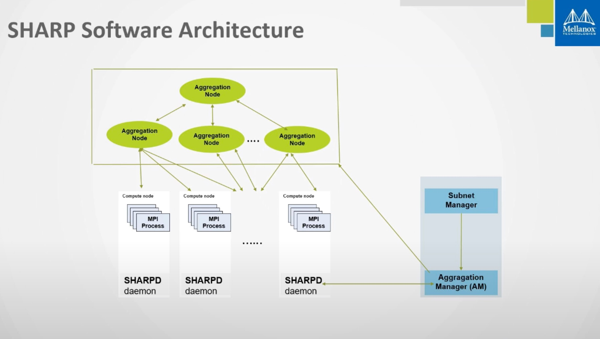

SHARP: 在 MPI 操作基础上优化了性能，通过把集合操作下放到交换机网络里，这样减少了数据需要流经的网络，急剧减少了 MPI 的操作时间。

Subnet Manager

## Aggregation Manager

central entity，在特定的主机上与 Subnet Manager 一起运行，得先激活 SM，在激活 AM。

SHARP 功能需要在 Switch-IB 2 交换机上开启(默认是关闭的)

## 运行 Mellanox SHARP Deamons
sharpd 在每个计算节点上运行，Aggregation Manager daemon (sharp_am) 在特定主机上与 subnet manager 一起运行

## 配置 subnet manager
OpenSM 开启 updn/ftree 支持

## Running OpenMPI with Mellanox SHARP
Control Flags

## Sanity Testing
聚合树诊断：
```
ibdiagnet --sharp

```





MOFED 驱动：Mellanox OpenFabrics Enterprise Distribution for Linux
