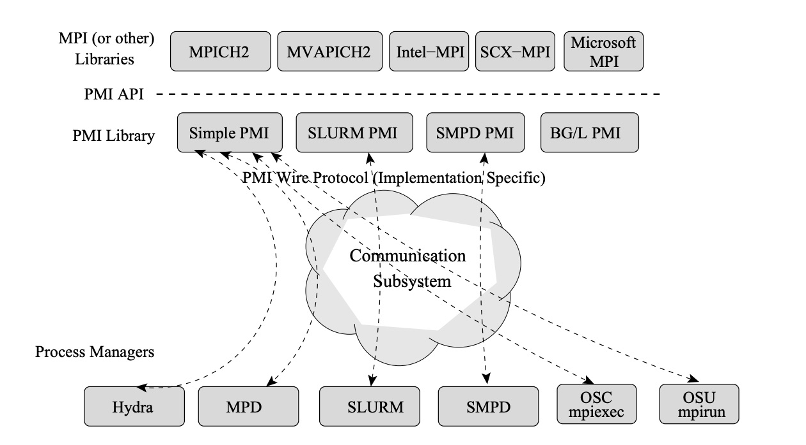

PMI: Process management interface，是在并行计算领域中，用来做进程管理的接口

## 概念
Process management system 的作用：

1. 启动一个并行的程序，里面会有很多进程，比如成千上万
2. 提供进程之间交换信息来容许互相通信的机制

MPICH2 和它的变种通过一个精心设计的接口： PMI 来实现上述，用标准化的方式让不同的进程管理系统能够和 MPI 库之间通信。比如在 MPICH2 内部使用的 Hydra，它就是一个 Process management system

PMI 除了和 MPICH2 类似这种MPI 的实现配合之外，还可以和外部的进程管理比如 SLURM 等配合

在论文的模型里，process management 主要由三个部分组成：

1. 并行编程库，比如 MPI2
2. PMI 库
3. process manager

process manager 和 PMI 需要解耦合. process manager 是一个逻辑上的集中式进程（但实践中经常是几个进程组成），他负责：

1. 进程启动(包括启动/停止，提供每个进程需要的环境信息，标准输入/输出/错误的转发，传播信号)
2. 在并行程序的多个进程中提供信息交换（比如设置通信通道）

现有的 process managers: PBS，SUN 和 SSH

PMI Library 实现了 PMI API。PMI的实现，依赖于系统自身。比如 IBM Blue General，使用系统的一些特性来提供 PMI 服务。在廉价集群里，PMI 库可以和 process manager 之间通过 比如 TCP 通信来进行交流。而 PMI2/1 里有个预定义的 “wire protocol”，就是用 scokets 接口提供数据交换的。使用这个 wire protocol，那么任何实现 PMI wire protocol 的程序都可以和任何 PMI 进程管理的实现之间进行交互，是兼容的

PM2是解决了 PM1 里的一些扩展性问题，主要是没考虑到大规模 HPC 集群的情况

PMI 定义了一些可移植的接口，可以用来让 MPI 进程put和get  key/value对。这样 P0， P1 两个进程可以把自己的信息写入进去。那此时 PMI 肯定给出了一个联系地址，可以让大家都联系它，put 和 get

## PM2 里
1. 提供了可扩展的数据交换方法，是 k/v 的。提供了 job attribute, database information scope 等减少 api 复杂度的优化

2. 还提供了动态进程：每个 job 里包含多个程序

3. 容错：respawning processes，可以代替之前同一个group 里的老进程

## 问题：
1. PMI 和 MPI 的区别和联系：上面的图看懂了就明白了。PMI 可以给任何并发编程模型，是通用的
2. 与 SLurm 这类资源管理/调度的程序的兼容性如何做到的？也是上面的图。Slurm 是 process manager ，里面实现了 pmi2，就是用来给 MPI 等通信用的

## Refercence:
1. [PMI: A Scalable Parallell Process-Management Interface for Extreme-Scale Systems](https://www.mcs.anl.gov/papers/P1760.pdf)
2. Design of high performance MVAPICH2: MPI2 over InfiniBand
3. Intel MPI: 
