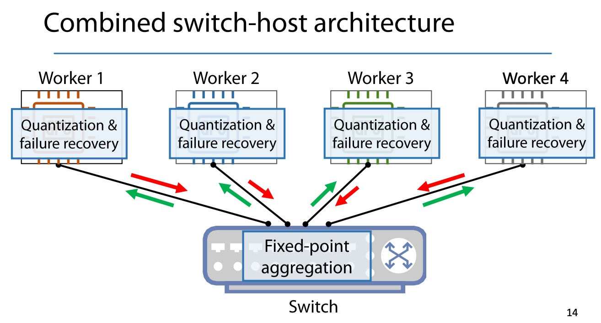

ML 程序里，每个 iteration 都需要在主机间进行梯度的 all-reduce 操作，传输的数据多大 100MB~1GB/s

主要挑战：
1. 交换机上计算和存储的空间有限
2. 不支持浮点数
3. 会有丢包情况

设计：
1. 结合 switch-host 的架构。意思是switch 有自己的host?
2. 基于池子(Pool) 的流式聚合
3. 量化整型操作
4. 失败后可恢复的协议
5. 在交换机内部的 RDMA 实现

交换机上可编程 6.5Tbps的通信带宽

1. 结合 switch-host 的架构。意思是switch 有自己的host? 

不是，看图是每个host 上的 worker 有量化和容错机制

## 实现细节
1. 交换机上的程序是给 Intel Tofino 写的，P4 语言
2. host 上有 C++ 库，提供 all-reduce 类似的 API
3. 跟 ML 框架如 PyTorch，TensorFlow 等集成了
4. 有 benchmark，可以测聚合的效率

在 100Gbps的网络里，对吞吐有 2.27x 提升。GPU 越快，效果越好，因为减少了计算/通信的占比

SwitchML 的性能(聚合消耗的时间)不取决于 worker 的数量。而传统的 NCCL，在机器数量很多时（具体多少？），会有效率下降。这是因为

## 原理
交换机上面跑 P4 写的程序，还有一个 controller 是跑在 Host 上，给交换机上的程序发控制消息

## 限制
1. allreduce 操作必须是 sum
2. 数据类型必须是 float 或 int32
3. 每个主机产出一个 tensor，或者说每个主机用一个 GPU

## 疑问
1. 并不能跨switch 吧？因为池子是维护在一个交换机上的
2. 为啥worker数量增加，性能不变？worker 数量增加后，不是得等所有人到了，才能 reduce ？ 或许可以 stream 计算，来一个计算一个。switch 里的 Pool 只取决于要合并的 tensor 数量
