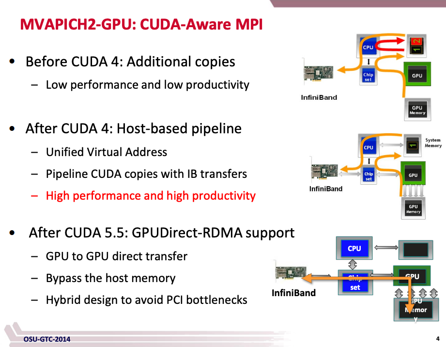
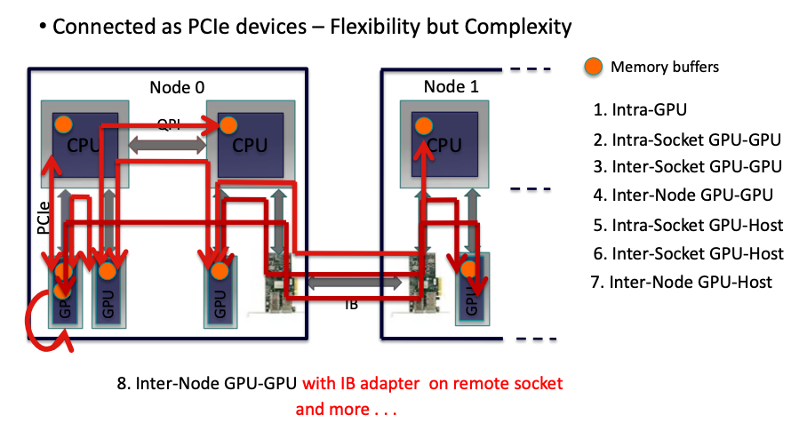
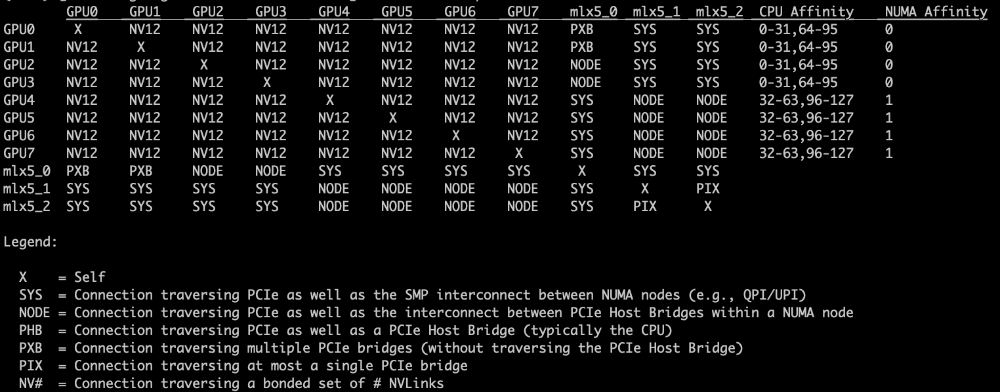

Remote direct memory access (RDMA) is a direct memory acess from the memory of one computer into that of another **without involving either one's operating system**(绕过了操作系统，实现零拷贝). 提供高吞吐、低延迟的网络，对大规模并行计算机集群很有用

由于 RDMA 是个新的通用网络协议，底层链路层就不一样，不像以太网是共享介质，所以最佳方案是用新的网卡和交换机(IB and IB Switch)。IB的厂商 Mellanox 被 NV 收购了。IB

可以看到传统 TCP/IP 协议，需要经过 user space -> kernel -> nic，中间需要几次拷贝，主要依赖 cpu 处理，但是 CPU 发展跟不上网络带宽的提速要求。

RDMA 是网卡直接可以绕过 kenrel 来进行传输，不需要拷贝，即直接从用户空间进行发送，不需要 CPU 参与。

所以 RDMA 用的不是 TCP/IP 这一套网络栈

RDMA 实现有三种：

1. InfiniBand(IB) is a point-to-point interconnect. 它需要 IB 网卡和 IB 交换机
2. Internet Wide Area RDMA Protocol(iWARP) : 以太网交换机就行
3. RDMA over Converged Ethernet(RoCE) :以太网交换机就行

## GPU Direct RDMA
而在 GPU 机器上的 RDMA，可以利用 GPU Direct 技术，实现从一台主机的GPU memory 到另一台主机 GPU memory 的传输。提供了 GPU 显存直接到/从 NV 网卡设备之间的直接 P2P 数据传输路径。这样能显著降低 GPU到GPU的通信延迟，
完全不需要CPU(completely offloads the CPU)。GPU Direct 使用 NV 网卡的 PeerDirect RDMA 和 PeerDirect ASYNC 能力

GPU Direct RDMA (GDR) 好处：

* 通过直接从或者向 pinned GPU memory 拷贝数据来避免系统里拷贝到 CPU的额外开销
* GPU 设备和 NV 的 RDMA 网络设备间 P2P 传输
* 使用高速 DMA 传输来在两个 P2P 设备间拷贝数据
* 使用 Direct memory access (DMA) 来消除 CPU 带宽和延迟的瓶颈(直接不需要CPU了，也不需要经过内存)
* 使用 GPU Direct RDMA，GPU显存可以被 RDMA 使用，更高效
* 让 MPI 应用可以零拷贝

从上述三个图的对比，也能看到趋势：

1. 用 IB
2. 内存零拷贝
3. 显存零拷贝，不走内存了。GPU和 IB之间是通过 PCI Express 连接的

GPU 集群里的数据传输如下图，可以看到 NUMA 架构下，IB 卡插在某个 PCIe 上，会离某个Numa node 近一些

NCCL 是 NV 在 GPU 上实现的集合通信库，MPI 同样是集合通信库，但是在 CPU 上 的。

### Supported Systems

What is on the path between the GPU and the third-party device:

* PCIe Switches only: 性能最好
* Single CPU/IOH: 某些 processor 架构上性能很差
* CPU/IOH <-> QPI/HT <-> CPU/IOH : 经过了 QPI/HT 链路，可能会严重影响性能或者不能正常工作

GPU 拓扑实例

可以看到：

1. mlx5_2 通过ibstatus 看过是ib
2. GPU0-3在 NUMA 0 上，通过 QPI(上文里的第三种) 连接到IB。 4-7在 NUMA 1 上，通过同一个NUMA节点里的PCIe Host Bridges 之间连接

## 参考资料：

1. http://nowlab.cse.ohio-state.edu/static/media/publications/slide/gtc14-mpi.pdf
2. https://docs.nvidia.com/cuda/gpudirect-rdma/index.html
3. [Exploring the PCIe Bus Routes](https://web.archive.org/web/20170225033933/http://www.cirrascale.com/blog/index.php/exploring-the-pcie-bus-routes)
