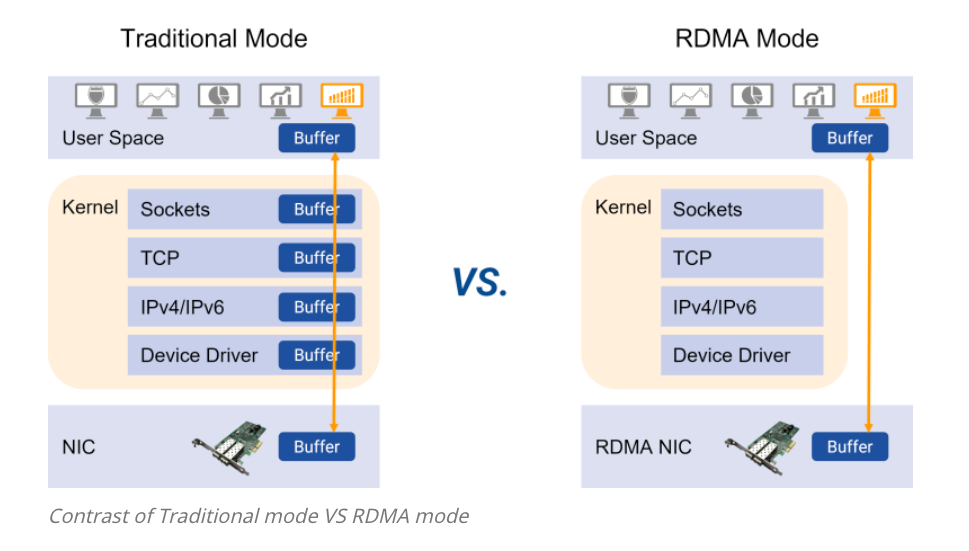
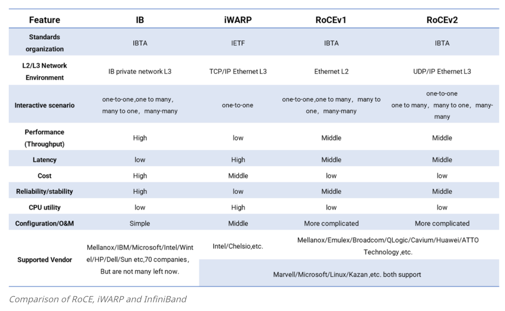

由于 RDMA 是个新的通用网络协议，所以需要用新的网卡和交换机

可以看到传统 TCP/IP 协议，需要经过 user space -> kernel -> nic，中间需要几次拷贝，主要依赖 cpu 处理，但是 CPU 发展跟不上网络带宽的提速要求。

RDMA 是网卡直接可以绕过 kenrel 来进行传输，不需要拷贝，即直接从用户空间进行发送，不需要 CPU 参与。

所以 RDMA 用的不是 TCP/IP 这一套网络栈

RDMA 实现有三种：

1. InfiniBand(IB) is a point-to-point interconnect. 它需要 IB 网卡和 IB 交换机
2. Internet Wide Area RDMA Protocol(iWARP) : 以太网交换机就行
3. RDMA over Converged Ethernet(RoCE) :以太网交换机就行

