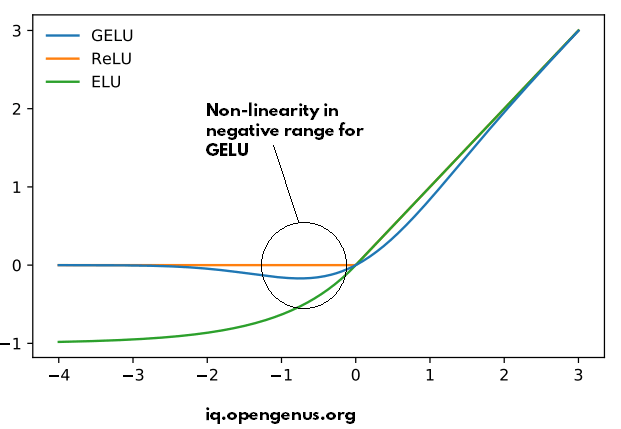

## relu
```
def ReLU(x):
    return x * (x>0)
    
def dReLU(x):
    return 1 * (x>0) # 意思是 ReLU 并不改变最终结果，只不过是把一些 neuron 给短路掉了
```

## gelu
可以画个图，对比 gelu。relu 是不连续的(0点那里），而 gelu 是让它连续起来

backward 和 forward 比较复杂，是对
