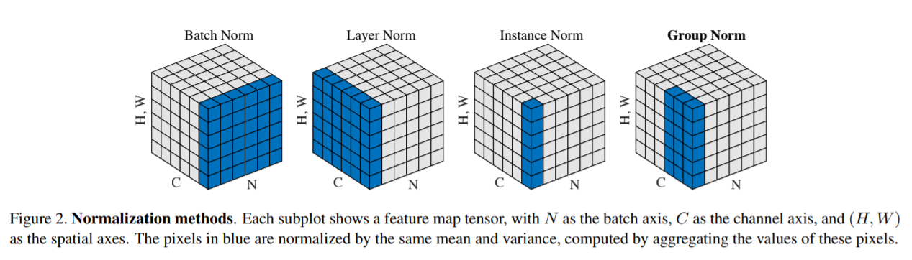

layer-norm 的输入是 [b, s, h]，输出也会是一样的 shape。它是作用在 h 这个纬度。而在 cv 里是 channel 纬度

它的论文(Geoffrey Hinto) 介绍说：dnn 是计算密集型的，计算起来很贵。一个方法是 normalize 一下它的激活值，依次来快速收敛，减少训练时间。BN的出现让 FFN 网络显著提速。但是在 RNN 里如何利用类似的思路？本文是用了 batch norm，但是放到了 layer 级别，这样跟 batch 级别无关。跟bn 不同，ln 在test和训练时计算量是一样的
