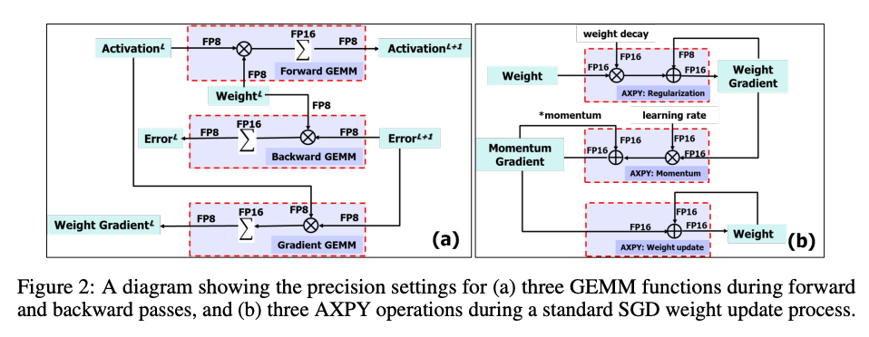

1. 在解决的是什么问题？让神经网络中的矩阵运算(dot products)可以使用低精度的方法来运算：降低 accumulator in dot products and the representation of all weights.
2. 为何成功，标志/准是什么？
3. 在前人基础上的关键创新是什么？把 chunking 这个在 HPC 领域经常用的技术应用到了 CNN 里，以及 reduced precision with stochastic rounding
4. 关键结果有哪些？
5. 有哪些局限性？如何优化？论文里没有具体介绍配套的硬件设备
6. 这个工作可能有什么深远的影响？

Reviewer 1 提到了：chunk based 这种优化在 HPC 领域很流行，作者实现了自己的硬件，但是没详细介绍。然后只在 CNN(Resnet) 的分类上做了测试。标题应该叫FP8结合的混合精度训练，因为并不是所有都fp8，而是在有限的卷积/矩阵乘这里用 fp8

在低精度训练中遇到的三类问题：

1. disentangling accumulation
2. weight update
3. store of weights, activations and gradients

## 2 8-bit floating point training
### 2.1 相关工作
Mixed Precision Training(fp16): 矩阵乘加时，乘法用fp16，加法用 fp32，之后要更新梯度时，再round到16bit。需要维护fp32的 master copy of weights。

下图展示了GEMM 和梯度更新过程的 fp8 的应用

可以看到 forward, backward, gradient GEMM(梯度也要GEMM？) 中乘法都用 fp8，求和用 fp16。GEMM 可以用在 Conv 和 Fully connected layers。

在 Stochastic Gradient Descent 方式的 Weight Update 过程中，也是类似的过程

FP8 最终选择的(1,5,2)，说是研究完网络里数据的分布后，选择出来的格式。

[可以和 fp16 混合精度训练做对比](../hardware/GPU/mixed-precision-training.md#L9)

### 2.3 Reduced Precision 下浮点数累加
GEMM 里包含很多逐个乘积结果的累加，由于浮点数加法里需要先把小的一方指数部分对齐到大的一方，即右移底数，所以可能这个小的数字由于底数(mantissa 小数位)位数限制而直接被截断，这种在 HPC 领域叫 swamping。

在 DL 里，当范围大雨 swamping 的阈值(2^(m+1)就会发生，而且会在如下情况下放大：

1. 当累加时的数据分布的均值不是0（因此累加的纬度会逐步增加到超过 swamping 阈值）
2. 一些元素的纬度很大(由于分布的长尾特性)

上述是当前平台无法降低32bit以下累加精度的原因

## 4. 讨论和Insight

### 4.1 第一和最后一层的bit精度

由于第一和最后一层对于精度的敏感性，在量化时经常会被排除掉。本文精准地实验了低比特情况。

对于第一层，输入图片经常是用 256 元素的颜色来表示，所以用 FP16。最后一层

### 4.2 累加误差

chunk-based accumulation 这个操作需要用硬件来实现

## 启发
低精度下，主要问题是：

1. 表示的范围会缩小
2. 计算GEMM 时，累加过程中会有截断误差
## 参考材料

1. [NIPS Open Review](https://proceedings.neurips.cc/paper/2018/file/335d3d1cd7ef05ec77714a215134914c-Reviews.html)

