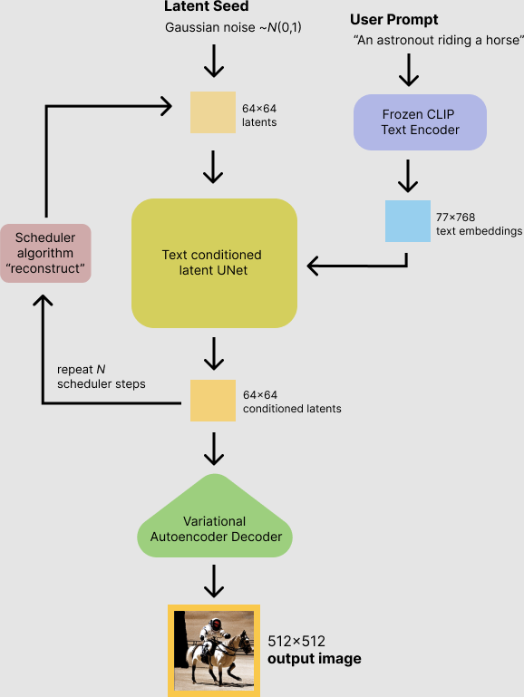

latent diffusion 相比较于之前的 diffusion 过程，减少了内存和计算复杂度，方法是在维度更低的 latent space 里，而不是在实际的像素空间里。这样在 latent diffusion里，模型是被训练为在 latent(compressed) representations 上进行图片生成

主要有三个组件：

1. An autoencoder (VAE).
2. A U-Net
3. A text-encoder, e.g. CLIP's Text Encoder

## 1. Variational Autoencoder(VAE)
变分编码器：它的目的是最小化重建误差，即在 encoder 把数据压缩到一个低维向量表示，而 decoder 可以解码这个低维向量来重建原始的数据。

它有两个部分：encoder和decoder：
1. encoder 用来把图片转换到更低维度的压缩空间里表征里，会作为 U-Net 模型的输入。再训练过程中，encoder 是在fwd过程中，用来得到图片的 latent 表征(latents)。这个过程会每一步的时候加入更多的噪音。
2. decoder：相反，它会把更低维度的表征反向转换到图片上。在推理时，反向 diffusion 的过程中产生的去噪音之后的 latents 会被 VAE decoder 转换回图片。

所以在推理时，只会用到 VAE decoder

## 2 U-Net
有一个 encoder和decoder，都是由 ResNet 块组成:

1. encoder 把一张图片**压缩**到更低分辨率的图片
2. decoder 把更低分辨率的图片**解码**回原始的高分辨率图片表征，认为是 less noisy 的

U-Net 的输出预测了 noise 的残差，可以用来计算预测的去噪之后的图片表征

为了防止U-Net在做下采样时丢失重要的信息，在encoder里的ResNet的downsampling和decoder的Resnet里的 upsampling 之间加入了 short-cut 的链接。而且，stable diffusion 的 U-Net 可以通过cross-attention 层来condition 自己的输出和 text-embeddings 。 cross-attention 层加在了 encoder 和 decoder 的 nReset 里

## 3 Text-encoder

它负责把输入的 prompt 转换为embedding space，这个space可以被 U-Net 所理解。它通常是一个简单的 transformer-based encoder，把输入 tokens 转换为一系列的 latent text-embeddings.

受 Imagen 启发，Stable Diffusion 无须训练 text-encoder，直接简单利用 CLIP 训练好的 text encoder

## 为什么 latent diffusion 快速、高效？

因为只在低纬度的空间上操作，相比pixel-space diffusion 模型是更快的。比如 autoencoder 的 reduction factor 是8，那么 一张大小为(3, 512, 512)的图片，会变成 latent space 下的 (3, 64, 64)，这会让显存减少 8*8=64 倍

## stable diffusion 的推理
把上面这些组织到一起，我们来看看 inference 的逻辑流程

stable diffusion 输入即需要 latent seed，也需要一个文本的 prompt。

下一步是 U-Net 会迭代式去除随机的 latent image表征上的噪音，同时是被 text embeddings 所 condition 的。U-Net 的输出，作为噪声的残差，用来通过一个 scheduler 算法来计算出一个去噪声的latent image 的表征。有很多scheduler 算法可以使用，每个都有优劣势。对于 Stable Diffusion，推荐：

1. PNDM 调度
2. DDIM 调度
3. K-LMS 调度

scheduler作用是根据之前的噪声表征和预测的噪声残差来计算出预测的去噪声的图片表征。更多推荐读这篇：[Elucidating the Design Space of Diffusion-Based Generative Models](https://arxiv.org/abs/2206.00364)

去噪声的过程会重复比如50次来获得更好的 latent image 表征。一但完成，这个表征会被 variation auto encoder 里的 decoder 部分解码为图片。

## 实现自己的推理pipeline
