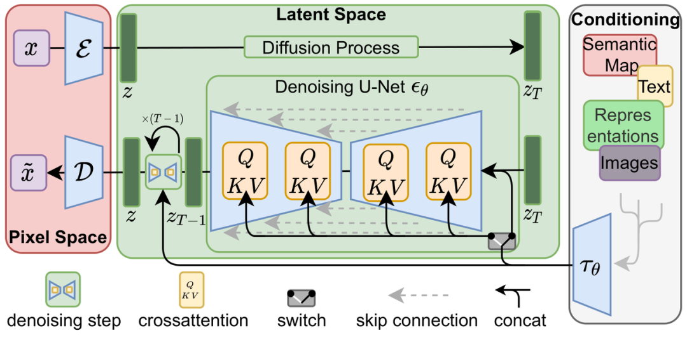

利用 cross-attention（交叉注意力层）来实现多模态训练：class-condition, text-to-image, layout-to-image

## 资料
1. [Diffusion Probabilistic Models: Theory and Applications](https://ml.cs.tsinghua.edu.cn/~fanbao/Application-DPM.pdf)
2. [Hugging Face blog : Annotated Diffusion](https://huggingface.co/blog/annotated-diffusion)
3. [What are Diffusion Models](https://lilianweng.github.io/posts/2021-07-11-diffusion-models/)
4. [Generative Modeling by Estimating Gradients of the Data Distribution](https://yang-song.net/blog/2021/score/)
