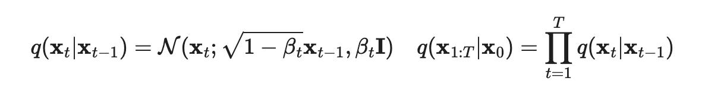

Diffusion models are inspired by non-equilibrium thermodynamics(非平衡热力学). 他们定义了一个 Markov 链里的diffusion steps来慢慢在数据里加入随机噪音，然后学习如何从diffusion过程中反向来从噪音中构造想要的数据采样。与 VAE 或 流模型不同，diffusion 是通过固定步骤(fixed procedure)来学习，而 latent 变量是高维的（和原始数据相同）

Latent Diffusion Model 是做语义压缩的，而 Autoencoder+GAN 是做感知压缩(Perceptual Compression)

## Diffusion Models 是什么？
有很多种方案被提出来：diffusion probabilistic models(2015), noise-conditioned score network(NCSN), and denoising diffuion probabilistic models(DDPM)

### Forward diffusion process
xi 代表从实际数据分布中采样出的数据点 x0 ~ q(x)，定义一个 forward 的 diffusion 过程：在T步骤里，逐步加入少量的高斯噪音，产出一系列带了噪音的采样点：x1,...,xT。step size 是通过一个在(0,1)之间的方差调度βt来控制，那么从第 t-1 步(xt-1)到第 t 步(xt)的过程可以用高斯分布表示为：

从上图可见在xt-1采样下xt的采样是属于高斯分布的。而在x0 已知的情况下，剩余xi的分布是前者的乘积

采样的数据 x0 逐步会随着 t 的增大而丢失可辨识的 features。最终当 T -> 无穷，xT 等价于各向同性的高斯分布。

### Reverse diffusion process
我们可以逆向上述过程，从 q(xt-1|xt)里进行采样，可以从一个高斯噪音输入 xT~N(0,I) 里重建出 true sample。当 βt 足够小，**q(xt-1|xt)** 就也是高斯分布。但不幸的是，无法轻松估计出 q(xt-1|xt)，因为需要知道所有的数据集，所以我们需要学习一个模型 ptheta 来估计这些有条件的概率，以此来运行反向 diffusion 的过程

## Speed UP Diffusion Model Sampling
在 DDPM 里根据马尔科夫链来执行 diffusion 过程的逆向，产出一个 sample 的过程很慢，原因是 T 可能扩大到几千个 step。

DDIM：Denoising Diffusion Implicit Model

Compared to DDPM，DDIM 可以：

1. 使用更少的步骤来产出一个更高质量的采样
2. 有“一致性”特性，因为产出的过程是确定性的，意味着多个采样只要都基于同一个 latent 变量,那么会有一致的高阶 features。
3. 由于一致性，DDIM 可以在 latent variable 里做一些有意义的语义操作

Latent diffusion Model(LDM 2022)在latent space 而非 pixel space上运行diffusion过程，让训练代价更低，推理速度更快。一张图片的大部分bit贡献给了感知的一些细节，即使在经过激进的压缩之后，语义和概念组合(conceptual composition)依然是保留了的。

The perceptual compression process relies on an autoencoder model. An encoder theta is used to compress the input image x (H,W,3) to a smaller 2D latent vector z=theta(x). 为了避免在latent 空间里，autoencoder 训练时出现随意的大方差，使用了两种 regularization：

* KL-reg: 与 VAE 类似，小的 KL penalty
* VQ-reg: 在 decoder 里使用向量量化层，与 VQVAE 里的量化类似，但是是被 decoder 融合掉的

diffusion 和消除噪音的过程发生在 latent vector z 上。消除模型是一个 time-conditioned U-Net，使用 cross-attention 机制来处理灵活图片生成中的信息（比如类别标签，语义map等）。设计等价把不同模态的表征利用 cross attention 来融合到模型里。每种类型的调节信息(conditioning information)是伴随着一个领域特定的 encoder  Ttheta 来把调节输入 y 映射到一个中间表征，然后映射到 cross-attention 组件里去

下图是 latent diffusion 模型的架构

图里每个字母，都是有含义的，而且颜色也是有含义的

* Pixel Space, Latent Space
* z, zT-1, zT
* 绿色的表征，粉色的 Semantic Map。作为调节信息的除了文字，还可以是图片

## Conditioned Generation
通常使用类别或者描述性文本来做调节

### Classifier Guided Diffusion

### Classifier-Free Guidance

The guided diffusion model, GLIDE(2022)，探索了指导策略，CLIP guidance 和类别空闲的指导，发现后者更好。因为 CLIP 指导能发掘出 CLIP 模型里的对抗性的例子

## Scale up Generation Resolution and Quality
为了产出大分辨率下的高质量图片，Ho et al(2021)提出了在逐步增加分辨率的情况下，每个阶段使用不同的 diffusion 模型。在pipeline里的模型间的噪音调节的增强(Noise conditioning augmentation)
对于最终图片质量影响很关键，方法是给每个高分辨率的模型 ptheta(x|z)的输入z 应用数据增强。调节噪音能够帮助减少pipeline里的复合错误(compounding error)
