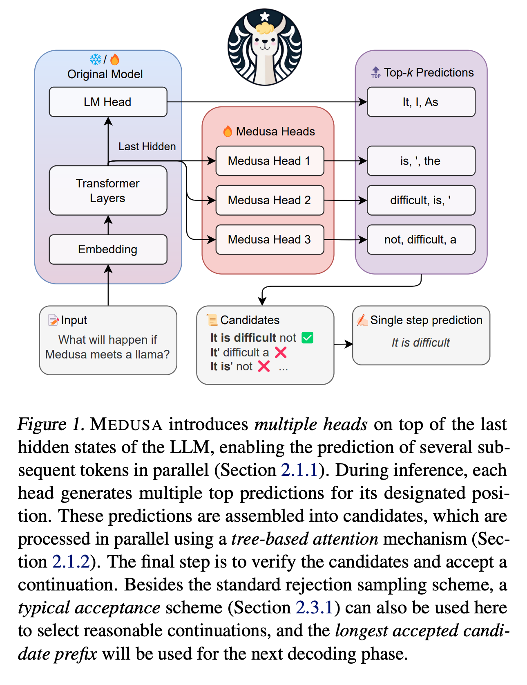

1. 在解决的是什么问题？
2. 为何成功，标志/准是什么？
3. 在前人基础上的关键创新是什么？
4. 关键结果有哪些？
5. 有哪些局限性？如何优化？
6. 这个工作可能有什么深远的影响？

Speculative decoding 虽然可以解决 decoding 过程中从 HBM 搬运 KV cache 到 GPU SHM cache 的瓶颈，但是需要单独维护一个草稿模型。本文里，我们提出 Medusa，一个高效的方法，通过增加额外的 decoding heads 来并行预测多个子序列。使用基于 tree 的注意力机制，Medusa 构建了多个潜在的 continuations 并在每个 decoding 步骤里验证他们。通过使用并行处理，Medusa 减少了所需的 decoding 次数。有两种不同的 FT 方法：

1. Medusa-1: Medusa 直接在冻住 backbone 的 LLM 上 FT，性能损失更小
2. Medusa-2: Medusa 和 backbone LLM 一起 FT，让 Medusa 的预测精度更高，更快的加速比，但是需要特定的训练方法来保证模型的能力。而且，提供了多种扩展机制，提高或者扩展了 Medusa 的能力，包括 self-distillation 来处理没有训练数据，典型的 acceptance scheme 来提高接受率，同时维持生成的质量。

问题：
1. 为什么能加速？因为一次推理出了多个 next token
2. 推理的结果，是在多个 heads 之间串联起来，还是取某个 head？

