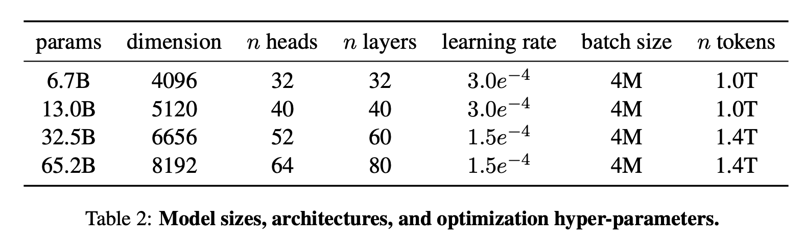
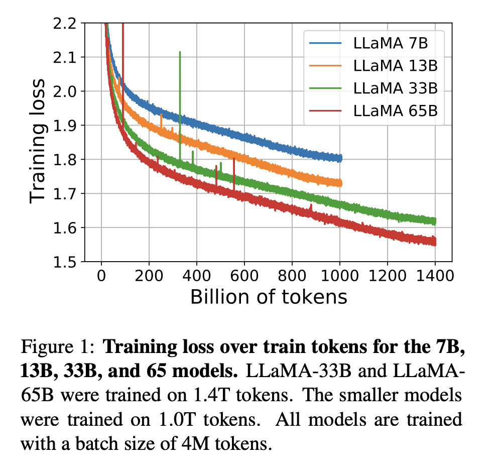
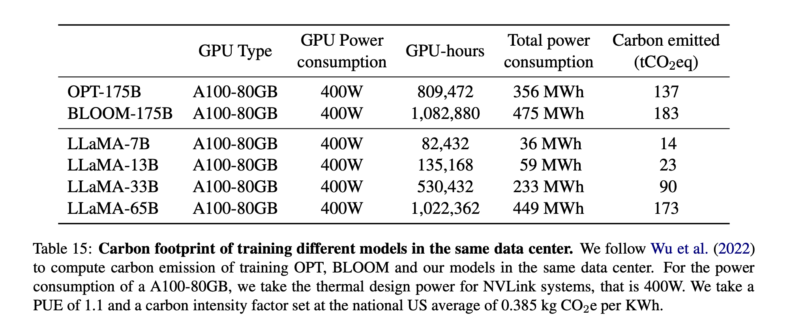

1. 在解决的是什么问题？使用开源数据集，就能训出 GPT-3 的效果
2. 为何成功，标志/准是什么？
3. 在前人基础上的关键创新是什么？
4. 关键结果有哪些？
5. 有哪些局限性？如何优化？
6. 这个工作可能有什么深远的影响？以后作为开源版本的 GPT3？

Hoffmann et al(2022) 里的是 scaling laws 表明，给定算力下，最好的性能是通过更小的模型、更多的数据来达成的，而非更大的模型。

能看到各个参数量模型的 layer num, hiddensize 和 heads 数量

Llama 2 pretrain 用了 2T 的 token 数据，都是公开的来源。context length 都是 4k。LR 随着模型增大逐渐缩小 (3e-4 -> 1.5e-4)

图1:

从上图看出:

1. 同样的 tokens 数量下，模型越大，loss 越低
2. 里面会有一些 loss 的毛刺。这个是什么原因呢？（但毛刺不高

## 问题
1. 图1 里 batch size 是 4M，这个指 gbs 是 4M？非常大呢
2. 7B 用了多少卡，训练了多久？假设用 256卡，那需要 13.4 天，1k 卡，那就3天；65B 差不多是10倍，256卡需要训 5.5 个月，1k 卡是 1.3 个月
