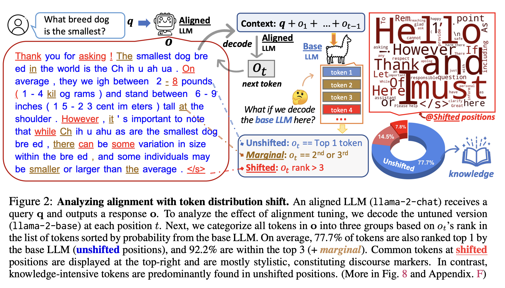

下图2 里介绍了一个 LLM(llama-2-chat) 接收到 query q ，输出一个 response o 的过程。为了分析 aligment tuning 的效果，我们decode 了 untuned 的版本 (llama2-base)的每个token在 t 位置上的情况。然后把 token 基于 ot 的 rank 分类到三组。平均下来，77.7% 的 tokens 也是被 base LLM（没有移动位置）当作 top1 的，而 92.2% 的都是在 top3 （图里土黄色）。常见的偏移了的 tokens 都是右上角的那些，而且大部分都是风格相关的。与之相比，knoowledge 密集的 tokens 都是在 unshifted 位置上。更多见图 8.

shift 的主要是 Hello，Thank 等次（更加礼貌）

SFT 时遗忘的一种可能的解释：可能过拟合到 instruction-tuning 的数据，导致忘了之前学到的知识。

而且在 decoding 过程中，越往后，token 的分布偏移逐渐消失
