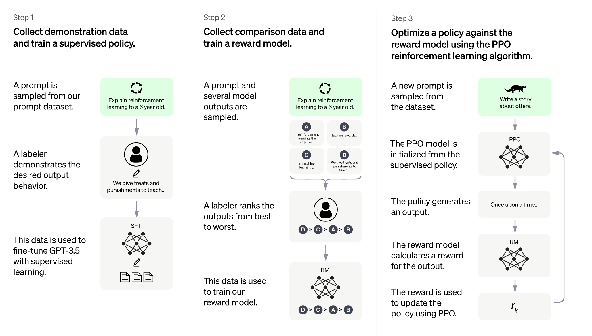

我们训练了一个模型叫 ChatGPT，是用对话形式来交互的。对话让ChatGPT可以回答连续问题，承认错误，challenge incorrect premises(让它发送上面的对话），拒绝不合适的请求(比如问如何进行入室抢劫)。
ChatGPT是 InstructGPT 这种训练来执行 prompt 里的指令，给一个详细响应的模型的兄弟模型。

## 方法
我们使用有人反馈的强化学习(Reinforcement Learning from Human Feedback)来训练这个模型，使用了与 InstructGPT 类似的方法，但是在数据收集时有些许区别。我们
使用有监督的fine-tuning来训练了初始化的模型：人类AI训练员提供人类参与的对话--用户和AI助手。我们给训练员访问模型生成的建议来帮助创作回复。

为了给强化学习创建一个反馈模型，需要收集比较的数据，包含两个或多个根据质量排序的模型的回复。为了收集这个数据，把与chatbot对话的拿过来。随机选择一条模型产出的消息，
采样几条其他的回复，然后让 AI 训练员做排序。使用这种反馈模型，我们可以使用 Proximal Policy Optimization 来精调。我们执行了好几次上述这样的迭代

ChatGPT 是从 GPT3.5 系列里 fine-tune 出来的，是在2022年早些时候训练出来的。

## 限制
### 有时它写出来的东西听起来很对，但是实际不正确或者无意义

修复比较有挑战性，需要:

1. 在RL训练阶段，目前没有真值
2. 训练模型更谨慎，让它拒绝无法正确回答的问题
3. 有监督的训练会误导模型，因为理想的答案取决于模型知道什么，而非人类指导员知道什么

### 它对输入的措辞或者同样prompt输入多次很敏感
例如，给定一个问题的一种措辞(one phrasing)，模型不知道答案，但是给一个简单的措辞，就可以正确回答

### 模型的回复经常太详细了，滥用某些句式
比如重复说它是被 OpenAI 训练的语言模型。这个问题来自于训练集里的偏见（训练员倾向于看起来更复杂的长回复），而且是熟知的过度优化问题(1,2)

### 理想情况下，模型应该在用户给了一个模糊的查询后，进行澄清
但是目前模型只是猜测用户的意图

### 尽管在努力让模型拒绝不恰当的请求，但有时它会回复有害的指令或者展示偏见

我们在使用 Moderation API 来警告或者阻止某些不安全的内容，但我们希望它有一些 false negatives and positives for now. 我们迫切希望收集
用户反馈来提高这个系统。

## 迭代式部署
今天的研究发布是OpenAI iterative deployment式的增量安全和有用系统的发布。
