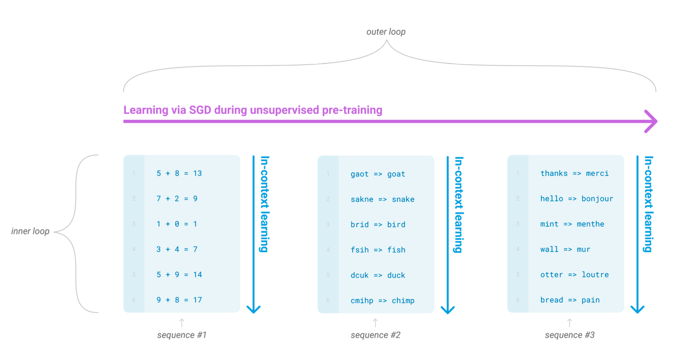
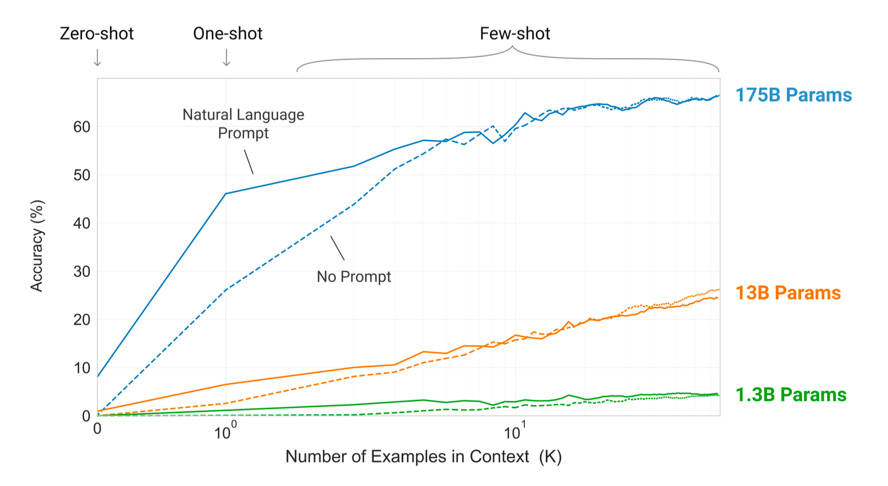
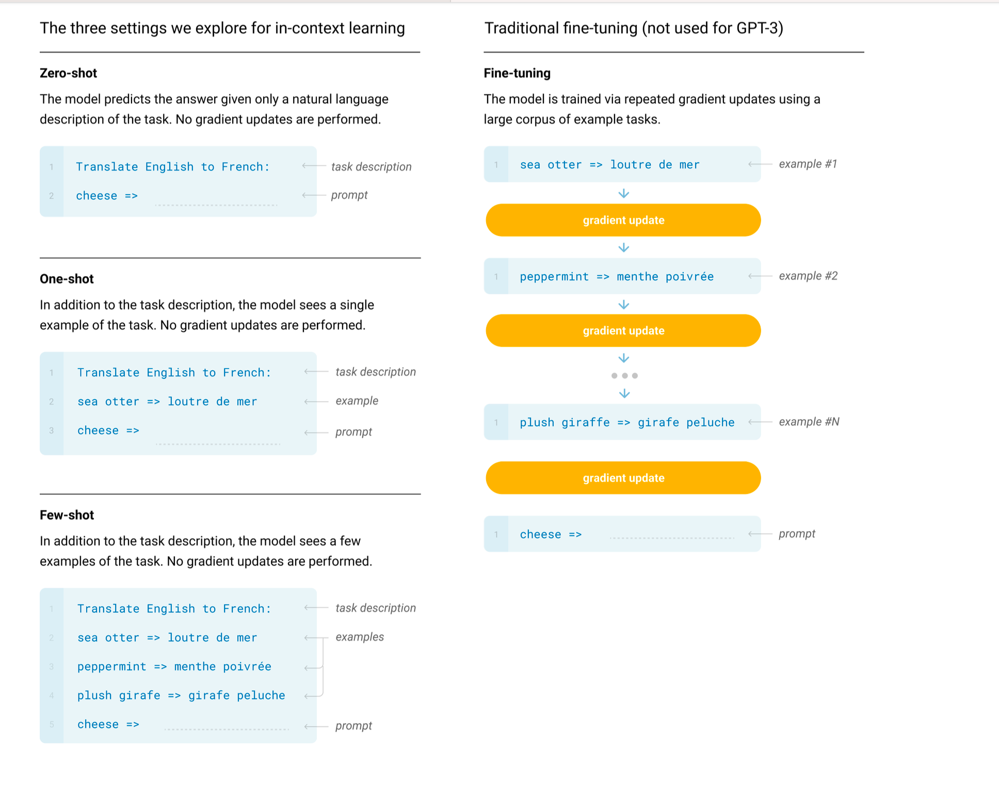

1. 在解决的是什么问题？
2. 为何成功，标志/准是什么？
3. 在前人基础上的关键创新是什么？
4. 关键结果有哪些？
5. 有哪些局限性？如何优化？
6. 这个工作可能有什么深远的影响？

## 摘要
近些年的工作说明通过在大语料数据集上做 pre-training，然后在特定任务上做 fine-tuning，在很多 NLP 任务和 benchmarks 里面有潜在收益。尽管在结构上是任务无关的，但是这种方法依然需要上万或者亿的 fine-tuning 所需的任务特定的数据集。但对比起来，人类通常根据一些简单的例子或者简单的指令来执行一个新的语言任务---这是当前 NLP 系统依然在挣扎而无法做到的领域。本文展示了扩大语言模型的参数量，可以极大地提高任务无关性，few-shot 下的性能，一些情况下达到 sota 的 fine-tuning 性能。而且，我们训练 GPT-3，一个自回归语言模型（175B）参数，比之前非稀疏语言模型要大10倍，测试了它在 few-shot setting下的性能。所有任务里，GPT-3 没有使用任何的梯度更新或者 fine-tuning，而是让任务和few-shot 例子单纯是通过文本交互来完成。GPT-3 在很多 NLP 数据集上达到了很强的性能，包括翻译，问答和填空任务，还有其他需要实时推理或者 domain adaption，例如整理文字，句子里使用新词，或者执行3位数算术。同时，我们可以也发现在一些数据集上，GPT-3 依然表现不好的，也有数据集上面临方法问题（在大的web预料上训练）。最终，我们发现GPT-3可以生成一些新文章的样例，让人类评估员都无法分辨出是否是人写的。我们会更通用地讨论此发现的广泛的社会影响。

## 介绍
近些年出现了趋势是在NLP里，朝着 pre-trained 语言表征去发展，越来越多地以任务无关地方式应用。首先是单个layer的表征，通过 word vectors来学习，然后喂给任务有关的结构里，之后是有着多层表征的 RNNs 和 文本状态倍用来组成更强的表征（尽管应用在了任务特定的结构上），最近的 pre-trained rNN 或者 transformer 语言结构被直接 fine-tuned，整个移除了任务特定的结构。

最后的这种方法导致在很多本来很有挑战的 NLP 任务比如阅读理解，问答，文本等其他领域里有很大的进步，而且能通过基于新的架构和算法来持续进步。但是很大的限制是监管结构与任务无关，但是依然需要任务特定的数据集和任务特定的fine-tuning：为了达到在目标任务上高性能，通常需要在上万以上的数据集上做fine-tuning。从以下几个原因来看，移除这个限制比较好。

1. 从实用角度来看，每个新任务需要标注一个大数据集限制了语言模型的应用。从在大量的有用的语言任务，包含修改语法，生成抽象概念的例子，生成小的故事等。这些任务里很难收集大量监督的训练数据集，尤其是当这个过程在每个新任务上都需要进行

2. 潜在的利用训练数据里伪相关性的潜能会随着模型表达能力和训练分布的变窄而增加。这会导致 pre-training 加 fine-tuning 的范式下，会有问题，模型被设计足够大来吸收 pre-training 过程中的信息，但是在非常狭窄的任务分布上做 fine-tuning。例如这个工作发现更大的模型并不是总能在分布之外泛化的更好。这也是证据表明在这种范式下取得的泛化可能很槽糕，原因是模型在训练分布上太特定了，无法在它之外泛化的很好。而且，特定benchmark上的 fine-tuned 模型的性能，即使有人类级别，也可能夸大了在任务上的实际性能。

3. 人类不需要大量监督的预料来学习大部分语言模型--很简单的自然语言（告诉我下面这个句子描述的是开心还是伤心）或者至多就是少量例子（比如以下是两个很勇敢的例子；请给我第三个例子）就足够人类去执行新的任务，而且有一定程度的完成度。除了现存 NLP 技术里的概念限制，这种能力有很实用的长处：容许人类无缝把多个任务和技能混合在一起或者切换，比如在一个对话里面执行加法。为了更有用，我们希望某一天 NLP 系统也能有这种普遍性。

一个潜在的克服此问题的方法是 meta-learning -- 在语言模型的上下文里，代表模型在训练时，发展了很广泛的技能和模式识别能力，因此在推理时快速使用或者识别出期望的任务(图1.1）

图1.1：语言模型的 meta-learning。我们使用”in-context learning“ 来描述这个过程的内部loop，在每个序列里 fwd 过程中发生。上图里的序列并不能代表模型在 pre-training 过程中能看到的，但是是特意用来展示在单个序列里，嵌入的重复的子任务。

最近的一些工作尝试通过”in-context learning“来做，对 pre-trained 语言模型，使用文本输入来作为任务规格的形式：模型是在自然语言指令为条件，需要少量这个任务的例子，之后就可以完成其他此任务的例子，用简单地预测后续序列来完成此任务。

尽管展示了一些潜在的可能，但是此方法依然不如 fine-tuning好。

在语言模型的上下文里，这种 in-context learning 有时也叫做”zer-shot 迁移“，，但是这个词有歧义：”zero-shot“指的是不需要执行梯度更新，但是需要在推理时提供一些例子给模型，所以并不是从零样本学习。为了避免歧义，叫做”meta-learning“来捕获 inner-loop、outer-loop 结构，”in context-learning" 代表 meta-learning 里的内部 loop。

图1.2：大语言模型高效地使用 in-context 信息。展示了移除句子里某个随机符号的模型，使用或者不使用 NLP 任务描述。更陡的”in-context learning 曲线“代表大模型的根据上下文信息学习任务的能力提高了。我们在很多任务上都能看到类似性质的行为。

另外一个 LM 里的趋势是提供了一种可能。近些年，transformer 模型的容量增大了，从100 m 到 300m，再到1.5b，8b，11b，17b。每一次增加都会在下游任务上涨点，这证明 log loss，把下游任务关联了起来，随着scale增大而带来收益。因此很可能随着 scale 增大，in-context learning的能力也会随之增加。

本文里，我们测试了 175b的自回归lm，叫做 GPT-3，衡量了它的 in-context learning 的能力。而且，我们评估了 GPT-3 在二十多个 NLP 测试集，同时多个创新任务，来测试快速适配到任务，而这些任务不会被包含到训练集里。每个任务上，我们用以下三种条件来评估：

* few-shot learning: 允许给定一些例子，它在模型的上下文窗口里(通常是 10 到 100）
* one-shot learning: 只有一个例子
* zero-shot learning: 没有例子，只给了自然语言形式的指令

GPT-3 当然也可以用传统的 fine-tuning 的方式去评估，但作为未来工作。

图1.2展示了我们研究的条件：模型的性能在自然语言任务描述下随着 context K 的增加而增加。Few-shot learning 也随着模型大小变大而迅速增加。尽管这个例子里的结果尤其震惊，随着模型**变大**和**上下文里的例子**增多，绝大部分我们研究的任务上都是有同样的趋势的。必须强调这些“学习”曲线里不涉及模型的 gradient updates 或者 fine-tuning，只是增加了作为条件的例子的个数。

广泛来讲，NLP任务上，GPT-3 已经达到了在 zero-shot 和 one-shot settings 下的令人鼓舞的结果，而在 few-shot setting 上有时达到甚至偶尔超过 sota（sota是 fine-tuned 模型上的）。例如，GPT-3 在 CoQA，TriviaQA。意思是 zero-shot、one-shot、few-shot上表现依次更好。

GPT-3 在 one、few shot 上很高效。后面也会展示在 few-shot setting下，GPT-3 产出的合成文章，让人类评估员很难区分出来。

同时，在一些测试集比如 语言推理类任务，如 ANLI 上，few-shot 的性能也不太行，又比如阅读理解集如 RACE, QuAC 等。通过研究 GPT-3 的优劣势，包括这些限制，希望模拟出语言模型里 few-shot 学习的研究，把精力放在最需要进展的地方。

如同图1.3里的整体结果的启发式，里面聚合了各种任务（当然它不应该被当做常规的或者有意义的benchmark）

我们也研究了“数据污染”的问题，在一些数据集比如 “Common Crawl”上训练大容量的模型时遇到的问题，会潜在影响测试集里的内容，因为这些测试内容通常也在网上。本文里我们开发了系统工具来**衡量**数据污染并量化扭曲的效果。监管我们发现数据污染在 GPT-3 的绝大部分测试集上影响很低，但我们依然发现在少数测试集上，会影响结果，们要么没有报告这些测试集的结果，或者用星号来备注，取决于严重程度。

除了以上，我们还训练了一些列更小的模型（从1.25亿到130亿）来和GPT-3在zero、one、few-shot 几个setting下做比较。广泛而言，大部分任务上，发现上述三个setting里随着模型容量增大，性能会上涨；很重要的一个模式是：这三个性能之间的gap会随着模型容量而变大，或许说明更大的模型是更高效的 meta-learners。

最终，展示了 GPT-3 的广谱能力之后，我们讨论了偏见，公平和更广的社会影响，尝试分析 GPT-3 的特点。

后面的内容如下。第二章，描述了训练方法和评估的结果，第三章代表了三个setting下完整的任务列表。第四章解决了数据污染的问题(train-test overlap)。第五章讨论了GPT-3的限制。第六章讨论广泛的影响。第七章review了相关工作，第8张总结。

## 2 方法
基本的 pre-training 方法，包括模型，数据，训练，都和 GPT-2 里描述的过程类似，相对比较直接：扩大模型大小，数据集大小和多样性，训练的长度。我们使用的 in-context learning和GPT-2里的类似，但是本文里，我们系统地探索了在 context 内学习的不同的设置。因此示定义和对比了不同的setting。这些setting可以认为是。这些setting里有4点：（图2.1）

* Fine-Tuning: 近些年最常用的方法，通过在有监督的特定任务的数据集上训练来更新一个预训练好的模型。通常需要上万条标注过的样本。主要优势是 fine-tuning 后多种测试集上效果好。主要劣势是需要每个任务上有大量数据，在分布之外的泛化性很差，而且可能会利用训练数据里的虚假的相关性，潜在地导致和人对比的不公平。本文里我们没有 fine-tune GPT-3，因为我们的目标是聚焦在**任务类型无感知**的的性能上，但是GPT-3当然可以 fine-tuned，这也是未来工作里很有前景的方向。

* Few-Shot(FS)是代表模型里给了几个特定的例子，在推理时作为条件，但是不允许做梯度更新。如图2.1所示，对于典型的数据集，有一个例子，上下文和预期的完成度，few-shot 是通过给了 K 个例子和结果，然后给一个例子，让默写补全。我们通常把 K 设置为在10到100的范围里，因为这是有多少例子能在模型的context window（nctx=2048，chatGPT里是8k？）。FS 的主要优势是不需要任务特定的数据了，消除了潜在的学习过于狭窄的分布：一开始是大的，但是因为 fine-tuning的数据集而缩小了。主要劣势是这种方法下的结果，比 sota 的fine-tuned 模型要差很多。正如名字所说，FS 需要再宽泛的任务上做学习，然后快速适配到新任务里。

* One-Shot(1S)：跟 FS 类似，只是就一个例子。之所以和 zero shot 和 few shot区分开，是因为它最接近于人处理任务的方式。

* Zero-Shot(0S) 是最符合人类执行任务的场景的

### 2.1 模型和结构

### 2.2 训练数据集

