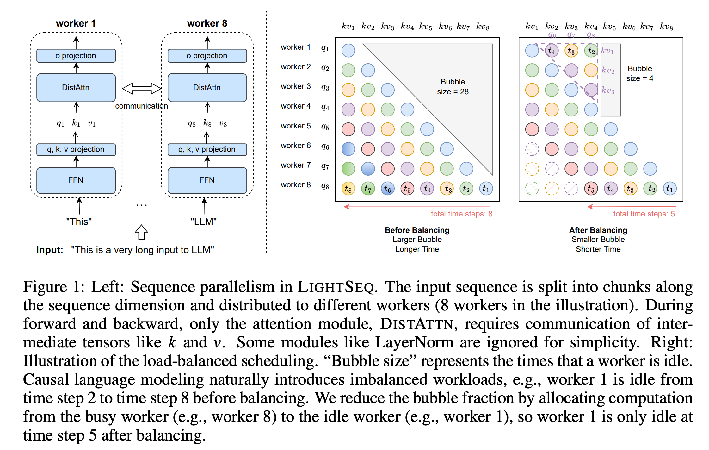
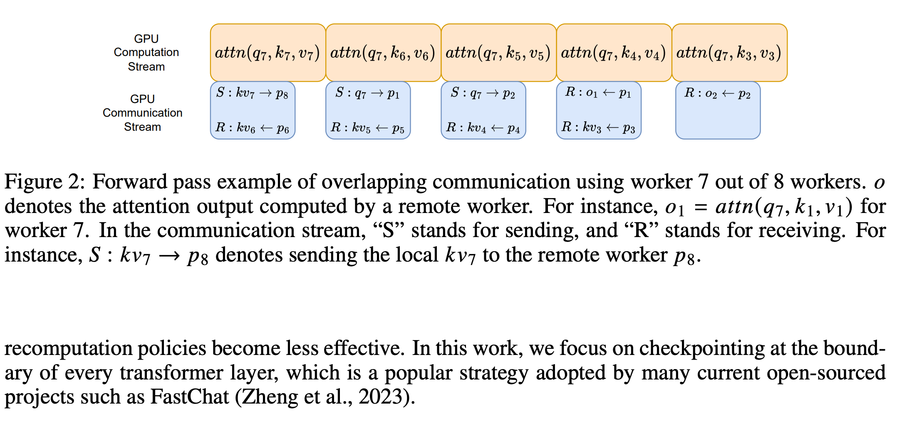

1. 在解决的是什么问题？高效地训练更长上下文的 LLM
2. 为何成功，标志/准是什么？
3. 在前人基础上的关键创新是什么？对 sequence 维度进行拆分
4. 关键结果有哪些？序列长度可以增加2~8倍，而速度提升1.24~2倍
5. 有哪些局限性？如何优化？
6. 这个工作可能有什么深远的影响？

增加 LLM 里的上下文长度能够解锁基础能力，但是会显著增加训练的显存。之前的比如 Megatron-LM 里的模型并行拆分，会并行计算不同的 attention 头，导致需要对激活值进行通信，通信容量很大，所以scale的
上限就是 attention 的头部数量，因此妨碍了进一步的适配。本文里，我们引入了新方法，lightseq，是给长上下文的 LLM 训练准备的。它有显著的优势：
1. 在 sequence 维度上切分，因此对模型架构无感，可以很容易用于 attention 头数量变化的场景，比如 Multi-Head，Multi-Query 和 Grouped-Query attention。其次，lightseq 在 LLM 上比 Megatron-LM 减少了 4.7 倍的通信量，而且把通信和计算掩盖起来。为了进一步减少训练的时间，LS 提出了一个创新的梯度 checkpointing 方法，跳过了 memory-efficient attention 里的 fwd 的计算过程。在 Llama-7b 从 32K 到 512 K 长度的范围里做了评估。通过单个和跨节点训练上进行评估，我们展示了 LS 与 Megatron-LM 相比可以达到端到端的 1.24-2 倍的加速，使用了更少的头，而有2-8倍的长序列。

LLaMA 2 使用了 grouped attention heads 技术，在 2 T 的tokens上训练了，attention heads = 32.

主要贡献：

1. 设计了 lightseq，一个长上下文的 LLM 训练协议，基于 sequence 粒度的并发。研发了分布式显存高效的 attention ： DISTATTN，使用创新的负载均衡，通信掩盖机制来做因果语言建模。

2. 提出了创新的 checkpoint 策略，当使用梯度 checkpoint 训练，使用显存高效的 attention 机制时，绕过一次 attention fwd

3. 

## 2 相关工作
** 显存高效的 attention** 

** sequence parallelism，model parallelism，FSDP**

Megatron-LM v3 里提出了混合的 tp和sp 的并行来更好地减少了单个设备商的激活值，是本文的主要基准。而 FSDP（2023）把优化器状态，梯度，模型参数都划分到不同的设备上，需要时实时收集。是跟我们工作正交的（可以一起使用）

**Gradient checkpointing** 

Selective checkpoint 目的是只重计算 attention 模块，因为它需要的计算量小，但是显存空间很大(在上下文不长的情况下）。Check-mate 使用整数线性方法搜索了最优的 checkpoint 方法。然而这些设计都没有考虑到显存高效的kernel(??)，它在计算 kernel 的内部执行重计算来避免实例化大的 tensor。

** Communication and memory analysis** : Megatron-LM 里每个 worker 需要执行 6次 all-gather 和 4次 reduce-scatter，在 (N/P)*d size tensor 上，因此通信总共是10 Nd。

而 DISTATTN 里，每个 worker 需要拿取 (N/P)/d 大小的 key 和 value，所以对应通信量是 2*(N/P)*dxP = 2Nd。而因果关系语言模型里，一半的key和value 是不参与通信的，所以 fwd 过程里的通信量是 Nd。在 backward 时，2Nd。所以总共是3Nd。
