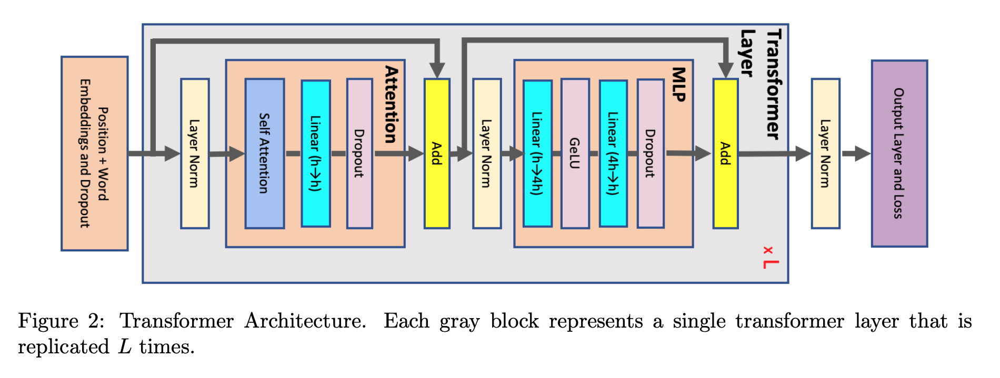

1. 在解决的是什么问题？减少激活值 recomputation
2. 为何成功，标志/准是什么？
3. 在前人基础上的关键创新是什么？ sequence parallelism 和 selective activation recomputation. 结合 TP 之后，这些技术几乎消除了重算激活值的需求。
4. 关键结果有哪些？1T 模型上，减少5倍激活值，而且重算减少了90%。比如GPT-3上的530B 参数，花了2240个A100，我们达到了 54.2%的模型Flops，比用之前纯计算的42.1%要快 29%！
5. 有哪些局限性？如何优化？
6. 这个工作可能有什么深远的影响？

## 1 介绍
LM模型在朝着T(万亿）模型参数扩展时，必须要用模型并行来把模型参数、激活值、优化器状态都需要分布式，才能放到目前的显存里。虽然模型并行 **线性** 地减少了每个设备上的参数量，比如当模型并行粒度增大2倍，每个设备上的参数减少一半。

Tensor粒度的模型并行增加了通信的要求，引入更小的、低效的矩阵乘法，这样把一个模型切分到大规模设备上就会很低效。因此，tensor-level 模型并行只限于**相对小的，而且有高速带宽的GPUs上**。因为把一个大矩阵运算切分了，所以会减少激活值显存(相对大）和参数的显存(相对小）

Pipeline 并行需要存储多个 microbatches 里的激活值来减少气泡。因此，它为了提高设备利用率(gradient accumulation)，只能帮助减少存储 **模型参数** 和 **优化器状态** 的显存，不能减少激活值。因此存储激活值很快成为一个关键的问题。

我们发现如果对一个 transformer layer 整个做重计算来节省缓存，那么引入的额外开销是 30-40%（说明fwd占1/3？）

nvidia-nemo is built on top of PyTorch and PyTorch Lightning

 在本论文里展示了可以帮助缓解激活值压力的创新技术，减少了重新计算激活值的开销。这两个技术是特定对 transformer 架构的，而且实现简单，没有或者**对计算效率有很小**的影响。我们将会在第二部分里详细描述其他减少大模型训练显存需求的技术，比如在 data parallel ranks 之间分片各种数据(ZeRO) 或者把数据 offload 到 cpu 内存。这些技术是对这里展示的补充，可以用来做更大的显存节省。但是总体而言有更高与本论文介绍的方法相比，实现代价高，对计算效率有更大的影响。分析、比较这些技术不在本论文范围里，是未来工作。

我们首先做一个简要的transformer架构的回顾，然后构建出一个 transformer 模型对存储激活值的近似公式。使用这个公式，可以研究不同的模型并行对激活值的大小影响。我们在 tensor parallelism的基础上引入 sequence parallelism 来对 **不利于**标准的tensor 并行的冗余激活值降低存储。展示了通过**选择**保存哪些激活值，哪些要重算，可以消除大部分的计算代价，而同时对与不额外计算的部分，只需要少部分显存。

## 2 相关工作

模型并行可以让多卡上训练更大的模型。模型参数和对应的优化器状态需要大量的显存，在单个 GPU 里放不下。即使单个现存里能放下（比如交换出去到主机内存里），由于计算次数巨大导致非常大的训练实践。因此需要并行，有两种形式的模型并行来分发模型参数到多个GPU上：

1. tensor parallelism: 每个层的参数被分发到不同的设备
2. pipeline 并行：模型沿着网络层的方向切分

最近一些研究证实结合这两种模型并行，可以训练到1T参数量。

模型并行的代替是与数据并行结合一些训练技术来训大模型。技术是基于在dp ranks之间切分优化器状态(OS)、梯度(G)、参数(P)。而且最近有插件可以使用 CPU off-loading 技术在少量机器上训练万亿模型。和模型并行相比，这些技术基于数据并行，没有那么高效(**为什么？**)，而且也**无法scale到大量的GPU**上([13], TODO1 里的？），因此更适合在资源受限的环境里做finetuning模型。本文只聚焦在模型并行优化上。分析这些技术不在本论文scope里

除此之外，Megatron-LM(19) 引入的 TP 可以帮助一定程度减少激活值显存。但是 transformer layer 里有一些不能在 tp ranks 之间切分的激活值。[9] 里提出的 sp 是可以把激活值在 sequence 纬度进行切分的，但是它和 ddp 类似，需要参数和激活值状态都在所有的设备上复制一份。而 Sagemaker， GSPMD 提出的显存高效的的 tp 版本可以把网络里的激活值在 hidden dimension 纬度上进行拆分，但主要劣势是其中的 layernorm 垮了多个设备，效率不高。S 里在每个 transformer layer 里需要做4次 reduce-scatter 通信。

我们的技术，把 tensor 和 seq 并行结合到一起，显著减少了激活值，而不需要额外的计算，通信和显存开销(神奇啊）
## 3

## TODO
1. 看如何结合两类模型并行(tp, mp)就做到训练1T的: Efficient large-scale language model training on gpu clusters using megatron-lm (2021，貌似就是megatron-lm？）
2. 实现了 CPU offload 的插件，可以少量机器训万亿：Zero-infinity: breaking the GPU memory wall for extreme scale deep learning.
