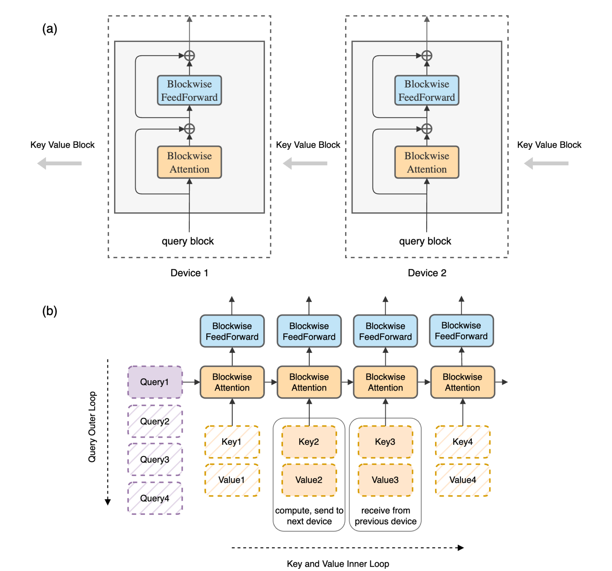

1. 在解决的是什么问题？
2. 为何成功，标志/准是什么？
3. 在前人基础上的关键创新是什么？把输入的序列使用 Ring 的方式在多个设备上计算，这样计算和通信可以并行
4. 关键结果有哪些？在非常大的输入上下文上训练时 FLOPs 都是很高效的
5. 有哪些局限性？如何优化？
6. 这个工作可能有什么深远的影响？

Ring Attention 与标准 attention 的区别：
1. 显存高效: 通过增量地计算，分布式分配计算到多个设备上来避免超过平方的显存（咋做到的
2. 可扩展: 可以随着设备的数量增加线性扩展（所以几乎可以无限）

## 1 介绍
即使计算 batch 1 情况下，100M tokens，需要超过 1000GB的内存(hidden size 1024)。

为了解决这个挑战，我们发现：通过把  self-attention 和 ffn 计算以 blockwise 方式计算，就可以把 sequence 维度拆分到多个设备上，让计算和通信并发。源于通过一块一块计算，结果和分块计算的**顺序是无关**的。对于内部循环，每个设备计算 blockwise attention 和 ffn，只需要它自己的输入块。而设备之间组成一个 ring，在内部循环里，每个设备把自己的 kv block 发送到ring 里的相邻设备，并行接收上一个设备的 kv。只要块计算比块传输时间长，那通信开销就可以被掩盖。我们使用了前任的 blockwise parallel transformers 工作，来减小显存开销，让长文情况下几乎是零开销。所以我们叫 Ring Attention with Blockwise Parallel Transformers.

BPT 里的内容：当使用 blockwise 方式来计算 sel attention，可以降低显存需求，把 FFN 的计算可以合并进去。这样不用等整个序列的 self attention 计算结束，才算 FFN。可以也按照 blockwise 的方式来计算 FFN。这个过程包含两层嵌套的循环：
1. 外层循环：迭代每个 block，计算 query：此时不需要通信:因为每个 Q 之间独立
2. 内层循环：迭代每个块来计算 k 和 v。这样用来计算当前 block 上的 attention。然后计算 ffn，残差。此时需要拿其他主机上算好的 kv。因为 Q要和每个K，然后结果要和每个 V 计算。机器之间传递的是 KV。那不需要传递 Q*K 吗？

PS:上面这个就是 `Q*KT*V` 的过程，和 FA 实现里的外层是K，里面是 Q、V 是不一样的

这样可以支持更长的输入序列
是不一样的，而维持低显存需求。

因为我们以分块的方式并行计算并把 FFN 和 self attention 计算融合到了一起，我们叫它:Blockwise Parallel Transformer.

贡献：

贡献是两方面：
1. 提出一个显存高效的 transformer 架构，让长上下文可以随着设备数增多而线性增加，同时维持住性能，避免了单个设备下的内存瓶颈。
2. 实验证明有效性

## 2. 长文下显存限制

## 3. Ring Attention with Blockwise Parallel Transformers

图2:

Top(a): 我们使用同样原版的 Transformer 架构，但是重组一下计算。图里，每个主机有一块 query block，kv blocks 是通过逐块按照 rring of hosts 来遍历 attention 和 ffn 计算。

Bottom(b): 每个主机负责迭代 query 上的外层循环里的一步（即 Qi 是固定在某台主机上计算的），而 KV 块是在主机间滚动的。如图所示，一个设备从左边的第一个 query 开始；然后它在 kv blocks 上循序迭代（水平方向）。query block，结合 kv blocks，就可以用来计算 self attention（黄色框），输出传递给 ffn（绿色框)。即 不需要 Ki*Vj 的情况？只会是 `Ki*Vi`

## 疑问
0. 实现里：怎么组成 ring？
1. 和 lightseq: sequence level parallelism 之间的异同点是什么？
2. 内存空间占用有什么帮助吗？是平方关系还是接近线性？
3. 处理 100M tokens 需要超过 1000 GB 显存，这个是怎么算的？
4. 每个块内部的计算复杂度是多少？
5. Blockwise transformers 是什么样的？
6. 它和 flash attention 之间的关系是什么？可以看我的那个 ppt，了解切分规则即可。比如 Q、K、V 各自怎么切分的

