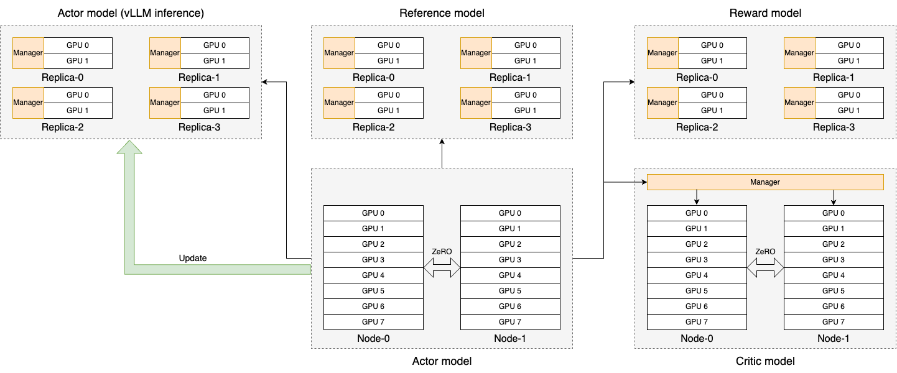

PPO 里需要维护四个模型。它的优势是比起 ColossalChat 和 Transformer Reinforcement Learning(TRL)，能支持到超过 70B 的模型（其他都是 ZeRO 来放置4个模型）。

GitHub 上它画的架构：

图里 Actor 推理（包含了 generate 和 infer logits？）、Reference model、Reward model 的推理，看起来都是用的 vLLM？tp=2？都是用一个节点来推理。Actor 和 Critic 训练都是用的 16节点。

## 调优指南

分配更多节点给 vLLM Engine。分配 16 张以上给 vLLM Engine，分别给 actor、critic。开启 colocate_critic_reward (让 ref 和 actor 复用同样的 gpus), colocate_actor_ref 和 ref_reward_offload 三个选项来合并部分节点。