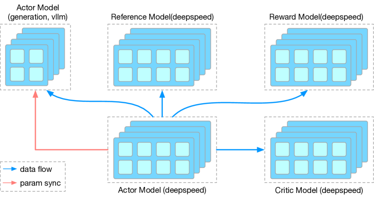
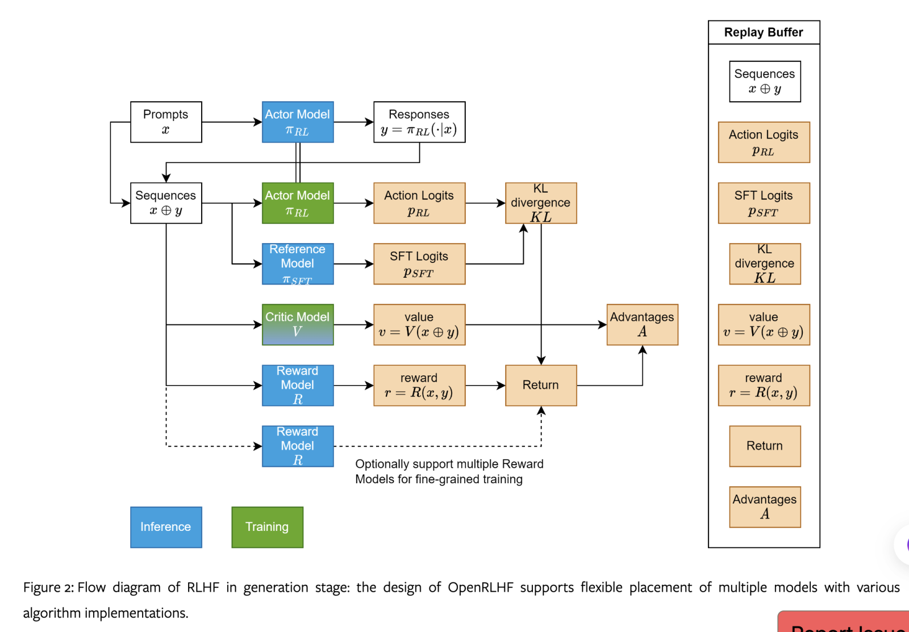
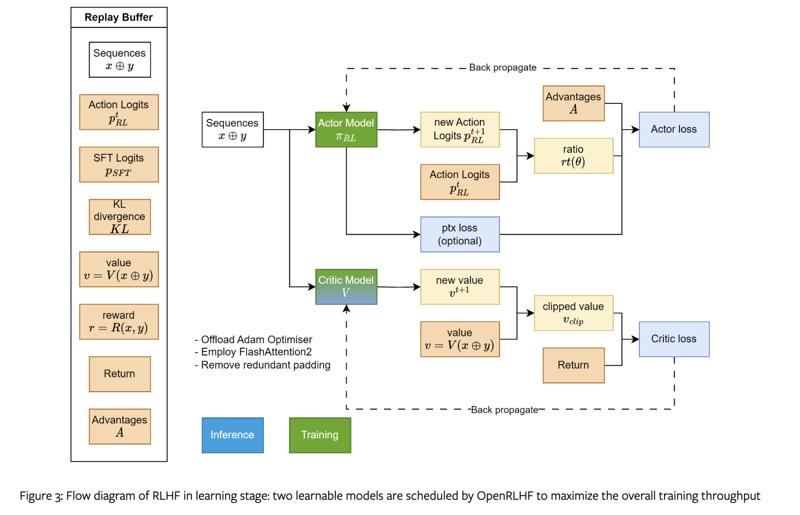
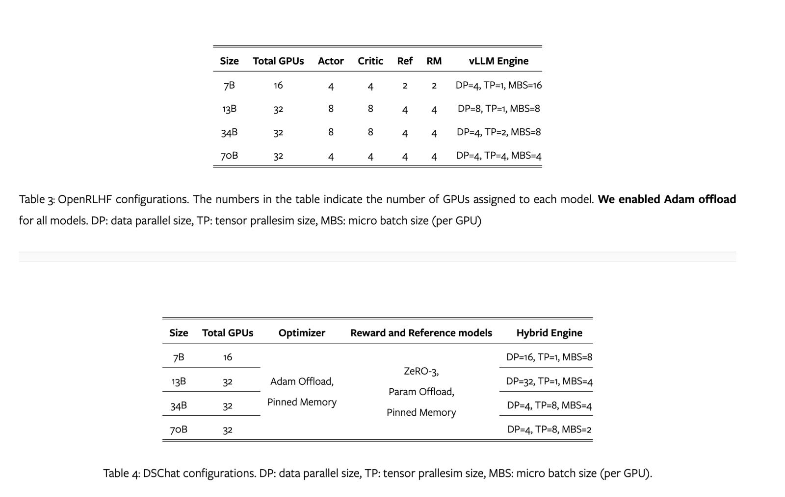

## 调优指南

分配更多节点给 vLLM Engine。分配 16 张以上给 vLLM Engine，分别给 actor、critic。开启 colocate_critic_reward (让 ref 和 actor 复用同样的 gpus), colocate_actor_ref 和 ref_reward_offload 三个选项来合并部分节点。
PPO 里需要维护四个模型。它的优势是比起 ColossalChat 和 Transformer Reinforcement Learning(TRL)，能支持到超过 70B 的模型（其他都是 ZeRO 来放置4个模型）。

GitHub 上它画的架构：


图里 Actor 推理（包含了 generate 和 infer logits？）、Reference model、Reward model 的推理，看起来都是用的 vLLM？tp=2？都是用一个节点来推理。Actor 和 Critic 训练都是用的 16节点。

7B 时，用 16卡= 4(Actor)+4(Critic)+2(Ref)+2(RM)+4(vLLM)
70B 时，用 32 卡=4(Actor)+4(Critic)+4(Ref)+4(RM)+16(vLLM)
大致是：vLLM 只给 actor 推理用，critic/reward 和 ref 都用自己的卡推理？而训练 actor 又是单独的卡。
上图的 setting 里，给各个模型分配的卡数是多少？难道是 56 = 8(vLLM)+16(Actor)+16(critic)+8(Ref)+8(RM)

## 2 Design of OpenRLHF

ORLHF 使用 Ray 来支持多个 reward 模型



图1: OpenRLHF 里的 Ray 架构图。这四个模型在多个 GPU 上，而不是单卡上。

### 2.1 Scheduling Optimization
下面是 generation 过程



图2 里剩余的三个模型都使用了 ZeRO stage 3。OpenRLHF 会在 ZeRO 和 vLLM 引擎之间使用 NCCL 和 vLLM weight loader 来同步权重，确保快速和简单集成。

根据上图，流程是：

1.actor 推理 拿到 response y，然后拼接 prompt 和 response，作为输入去：
* Reference model：SFT Logits (pSFT)
* Critic model 推理（此时不需要训练？之前训练好了）：v = V(x + y)，评估给定状态-动作对的价值(value)
* Reward 推理 r = R(x,y) (也叫 score)
* Actor Model 推理 ： pRL，计算完散度，再和 Reward model 处理为 Return，最终和 critic model 计算出 advantages A。最后怎么算的 loss？

Replay Buffer: actor 和 critic 通过共享的经验一起学习

批量更新？从 RB 中采样一批经验，更新 critic 和 actor 的参数。

### 2.2 性能优化
根据 profiling 结果，主要的瓶颈在 PPO sample generation 阶段（上图2），占据了总训练时间的 80%。主要原因是自回归的 decoding 复杂度是 O(n^2)，也是显存 bound 的。
RLHF 的 generation 和 learning stage，使用如下的技术来提高性能：
* Offloading Adam optimizer states to CPU。gradient aggregation 时，pinned memory 和 gradient accumuation 来缓解 GPU- CPU 通信代价
* FA2
* 使用 pytorch tensor slicing 来移除训练样本里的冗余 padding

下面是训练过程



图2 里剩余的三个模型都使用了 ZeRO stage 3。OpenRLHF 会在 ZeRO 和 vLLM 引擎之间使用 NCCL 和 vLLM weight loader 来同步权重，确保快速和简单集成。

### 2.3 Training Stability
附录C里说明了

### 2.4 易用
```
ray job submit -- python3 examples/train_ppo_ray.py \
2 --ref_num_nodes 1 \ # number of nodes (ref)
3 --reward_num_nodes 1 \ # number of nodes (reward)
4 --critic_num_nodes 1 \ # number of nodes (critic)
5 --actor_num_nodes 1 \ # number of nodes (actor)
6 --vllm_num_engines 4 \ # number of vLLM nodes
7 --vllm_tensor_parallel_size 4 \ # vLLM tensor_parallel size
8 --pretrain meta-llama/Llama-2-70b-chat-hf \ # pre-trained model name or path
9 --reward_pretrain meta-llama/Llama-2-70b-chat-hf \ # reward model name or path
10 --prompt_data Open-Orca/OpenOrca # datasets name or path
```

## Appendix A Performance Benchmark




The performance advantages of OpenRLHF over DSChat primarily stem from **vLLM** and Ray. On the one hand, the generation acceleration of vLLM is substantially better than that of Hybrid Engine. On the other hand, Ray **distributes the model across** different nodes, which may seem to reduce GPU utilization. However, it avoids excessive model splitting and offloading, thereby **saving GPU memory** and reducing communication overhead. This allows for an increase in the **micro-batch size per GPU** and the size of matrix multiplication in tensor parallelism(tp 可以设置小一些？），improving overall performance.

