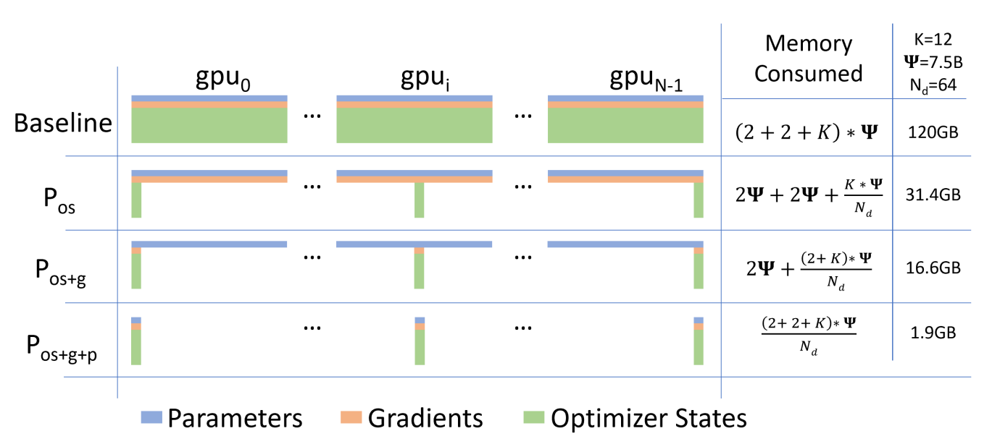
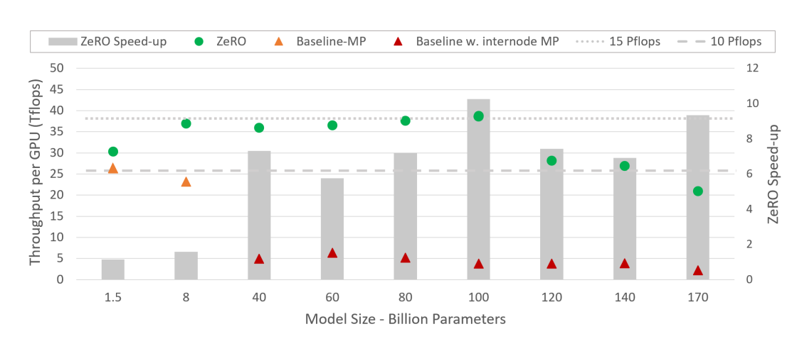
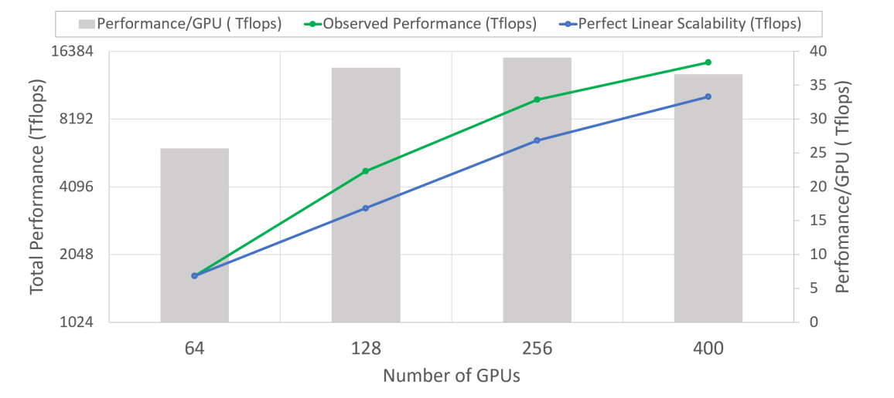

## 总结
1. 在解决的是什么问题？传统的 DDP 下，虽然多卡，但是每个卡上的显存和单卡相比，占用一样，并没有减少显存使用。最大只能训练到1.4B(32G)参数的模型
2. 为何成功，标志/准是什么？ 能支持更大的模型，效果很好，比如1k个节点上支持 1T 的参数训练，关键是非常简单，不需要模型做修改
3. 在前人基础上的关键创新是什么？去掉了DP 模式下的内存冗余，而且把内存里生命周期短的 activation 和gradient等可以进行挪动来避免内存碎片
4. 关键结果有哪些？ 能训练**最大 13B** 的模型，比 T5 11B 还大 和 Megatron GPT 8.3B 还大，此时仅靠 ZeRO 就可做到，**不需要模型并行**
5. 有哪些局限性？如何优化？ DDP 的粒度也不能无限大，否则 batch-size 太大了
6. 这个工作可能有什么深远的影响？大模型训练的标配，能训下更大的模型、更大的 batchsize

## TODO
1. 看下 section 8

## Introduction

MP 优势：能减少激活值的大小
是不需要修改网卡或交换机

弊端：scale 能力有限，因为要求的通信量较大，只能在本机内部用 NVLINK 才划算

### 优化模型状态显存
思路是尽量跟 DDP 一样有好的计算/通信开销比，同时又能兼顾 MP 这样能把所需显存通过多卡来分摊。

ZeRO-DP(ZeRO powered DP) 有三个优化阶段，下图里是具体 7.5B setting下的例子，优化器是 adam，所以 K=12，Nd是64，即64卡的 DDP。

1. Optimizer States Partitioning (Pos): 在图里是4倍速度节省，和DP一样的通信开销(这里有疑问，DP里通信开销主要是all-reduce 梯度，明显图里优化器状态比梯度要大好多倍)
2. 增加 Gradient Partitioning (Pos+g): 8倍速度节省(比1又多了2倍)，和DP同样的通信开销
3. 增加 Parameter Partitioning (Pos+g+p)：内存减小与DP的粒度Nd就完全成正比了。保守估计通信开销增大50%

从上图可以看出来，每个 stage 下节省的显存，跟被 sharding 的份数，即 Nd 成正比。而

## 一些数字

Adam 里保存两类数据：
1. time averaged momentum
2. variance of the gradients to tcompute the updates.

尤其是在混合精度训练下，优化器所耗的内存会更大：AMP 下，forward 和 backward 时的激活值和参数都是 fp16 的，这样能用起来 tensor core 加速。但是优化器里是混合的：fp32 的参数和其他所有优化器状态

t参数的模型，DDP内存用量：

fp16 的**参数**和**梯度**：
parameters：2t 
gradients: 2t

优化器里需要存储： Adam optimizer states：12 t . 其中包括了 fp32 的参数、其他优化器状态:动量(momentum)和方差(variance)

所以结合上图，可以用来计算模型在各ZeRO stage 下的内存消耗。比如一个 1T参数量的模型，放到1024个卡上： (2+2+12)*1T/1024 = 16T = 16G

### 优化其他的状态显存
除了模型状态(Optimizer states, gradients, paramters)，还有激活值，零时缓存，无法使用的内存碎片。

1. 激活值：checkpointing 技术有帮助，但是对大模型效率不高，所以我们通过分片来解决的。同时在恰当时刻 offload 到 CPU
2. 临时缓存：定义了恰当大小，来获得显存和计算开销的平衡。相当于是静态分配好，之后就在里面使用
3. 碎片问题，可以通过管理tensor的生命周期来避免碎片。那就需要on the fly 搬迁了。主要是因为临时和长期的内存混合在一起，可以时不时把它们分开。这样碎片就可以接续利用起来

### 实现和验证

虽然 ZeRO 可以在 1K 个 V100 上跑 1T 的模型，但是这样耗时很久（一年以上），所以我们聚焦在可以高效训练的10倍以上的模型(-100B参数)，使用 Pos+g 和 ZeRO-R。

这篇论文出现的背景是之前有了 Megatron，是做 Model Parallel，其实就是 Tensor 拆分。所以里面一直在跟 Megatron 比较(这个 baseline )

上图中，可以看到100B参数下(400 个V100)，每个卡上的 Tflops 最高，之后就开始下降了，达到了 38 Tflops 以上，而且与 Baseline-MP 相比加速了9倍多。里面 ZeRO Speed-up 是第二纵轴

扩展性方面：从64-400个 GPU 上是超线性扩展的，即算力在 GPUs 翻倍后翻了超两倍。这是因为增加了 DP 粒度后，可以减少更多显存，这样 bs 更大，所以性能更好。虽然论文里说400 GPU 之后依然会持续，但从之前的图可以看到单卡上的计算能力会开始下降

如何计算 NLP 里激活值的显存占用？ 

1. transformer based model: `layer_num*batch_size*hidden_dim*sequence_length`。 这个很好理解，就是每一层都需要处理这么多的文本

checkpoint activation 机制能节省大约总共激活值的开方，代价是大约33%的重计算

## 5 Deep Dive into ZeRO-DP
### 5.1 Pos: Optimizer States 状态划分
如果是 Nd 粒度的 DP，把优化器状态分为 Nd 的等份，每个进程负责对应的一部分。所以每个进程只需要:

1. (通过 all-reduce 之后的梯度)存储和更新自己负责的这 1/Nd 优化器状态
2. 同时也只能(负责)更新对应的 1/Nd 的参数。在每个 iteration 之后，通过 all-gather(相当于拼成完整的 ) 来得到最终所有进程都**完全更新后的参数*(每个人要获得其他的 (Nd-1)/Nd 份的参数)

节省后的显存：k*P/Nd。k为系数，比如 Adam 下是 12倍 

### 5.2 Pg: Gradient 划分
由于每个进程只需存储/更新自己负责的这 1/Nd 的优化器状态，进而只更新对应的 1/Nd 的参数，那么它也只需要对应的 1/Nd 的梯度。所以随着反向转播，每一层的的梯度算出后，对应负责的那个进程就可以通过 reduce(不再是 DDP 里的 all-reduce) 过程来计算出平均之后的梯度。在这之后，我们不再需要这些梯度，所以每个进程里的这部分梯度都可以释放掉

上述 reduce 过程，可以通过 bucket 机制来更高效：每次是以 bucket 粒度来做一次规约

后续等到 forward 时，其他人会通过 scatter(相对于当前负责这块梯度的人)来获得参数

节省后的显存：2*P/Nd

与 DDP 的差异：

1. DDP 需要每个卡 all-reduce 梯度
2. 现在是负责的卡 在 backward 阶段，当前层 backward 后，reduce 全局梯度就行，对应参数更新后，等下次 forward 前发过去

### 5.3 Pp: Parameter Partitioning
每次 forward 需要用到参数而正好是自己没有的这一份，就通过 all-gather 来获得。等算完当前层，参数就可以丢掉了(但如果用了 checkpoint，那 recompute forward 时还会用到)。

只会增加总共 1.5倍的通信开销

## 6 Deep Dive into ZeRO-R

### 6.1 Pa: Partitioned Activation Checkpointing
算是 Stage3 之外，把激活值也切分，但这个是跟 activation checkpoint 技术一起使用的。4.2里提到 MP 下，激活值需要复制一份，导致 GPUs 间在 MP 下有冗余。ZeRO 做法是通过切分激活值来消除冗余，一次只实例化一个layer的激活值，时机是在backpropgation过程中要用到之前。此时在 **各GPU** 上使用 **all-gather** 来获得全量的当前层激活值。

这个技术与 activation checkpoint 技术一起使用，存储的是切分后的 activation checkpoint，而非拷贝的全量。如果模型非常大，显存非常紧张，可以通过把这些分片的 activation checkpoint 放到 cpu 上来进一步节省时间。代价是需要在 CPU 和 GPU 间搬运数据。这个主要是为了解决 OOM，性能可能会有一些下降？

### 6.2 CB: Constant Size Buffers
在训练过程中，一些操作的计算效率高度取决于输入大小，更大的输入获得更高的效率。比如大的 all-reduce 操作比小的 all-reduce 操作能获得更高的效率。因此，NV 的 Apex 或者 Megatron 会把所有参数 **fuse** 到单个的buffer里，然后再 all-reduce。但这种方式下 fused buffer 大小取决于模型大小。为了解决超大模型下 fused buffer 超大问题，
我们使用高效的固定大小的 fused buffer(感觉是个常见操作)

### 6.3 MD: Memory Defragmentation 
训练中出现显存碎片的原因是 activation checkpoint 和梯度计算过程导致的。当有 activation checkpointing，只有被选中的激活值才会被保留，而大部分激活值都会被丢掉，因为backward 时会重计算。这个会导致短命的显存（被丢弃的激活值）和长命的显存（被checkpoint的激活值）交替，会导致内存碎片。类似地，backward 过程中，参数的梯度是长生命周期的，
而激活值梯度和其他用来计算参数梯度的 buffer 只是零时的，这种**长短不同生命周期的显存交替**会导致显存碎片

有限的显存碎片在有充足的空闲显存情况下也不是问题，但是当显存紧张而且是大模型时，会导致两个问题：

1. 即使有足够的空闲显存，但是因为缺乏连续的显存而导致 OOM
2. 让显存分配器变得低效

所以解法就是让不同生命周期的不要混到一起

ZeRO 在执行过程中会进行显存碎片整理：给 activation checkpoint 和 梯度(这俩长生命周期)提前分配连续的块，当它们出现时就拷贝到这里。这样能提高效率

## 7 ZeRO-DP 里的通信分析

zeRO-DP 里使用 OS+G，没有额外的通信开销，原因是它的通信量是2T，与 DDP 里的 all-reduce 梯度等价：

一般 all-reduce 分为两步：
1. reduce scatter: 分散到每个进程里做自己负责的那部分的 reduce 工作
2. all-gather: 每个进程 gather 所有其他进程 reduce 好的数据

上述这里缺一个图

所以上述总的通信量是 2T

而 zeRO-DP 里 stage2 下，也是这样:

1. scatter reduce 每个卡负责自己那部分 Gradient 的reduce 工作
2. forward 时每一层的参数需要 all-gather，让每个人获得全量的更新后参数。用完后就扔掉

### Pos+g+p

## 启发
1. 它就是分析了下内容使用，通过需要时多卡间通信来换来数据，这样每个卡可以减少冗余。思路很朴素
2. 对于 ZeRO-R 里的 activation offload，是否可以借鉴？什么时候 offload，什么时候再onload
3. 碎片问题是怎么避免的？

## 问题：
1. 节省了内存后，训练的速度也会变快？ 可能原因是数据分片，计算梯度、参数，计算优化器状态更新也都分片了？(并不是, 只是存储方面分片了，没有冗余的数据）而且内存管理更简单，所以管理内存的计算量也减小？
2. ZeRO DP 是不是只能用在 NLP 里呀，它的目标是优化NLP 里内存大头：Adam 优化器里的状态。否，也可以用在 SGD 里。因为 SGD 里 AMP 下，需要保存：
3. P2 里为什么说 ZeRO-DP 里的 Pos 节省 4倍内存，Pos+g 节省8倍？不是跟机器数量相关的么？
4. 为啥 Parameter Partitioning 的内存节省跟机器数量(DP degree) 相关呢？
5. ScatterReduce 是啥操作？ 是两个步骤
6. ZeRO 是不是除了节省内存外，还能提高训练效率？并不能
7. 如何实现？比如每个并行进程只负责更新自己负责的那部分梯度，那么优化器状态也能分片么，还是说计算自己负责的这部分梯度前，需要把优化器分片再聚合到一起？
8. 各个stage下通信开销怎么计算？
9. ZeRO-R 里临时缓存和tensor生命周期的具体实现
10. Pos 下，每个人更新自己负责的部分，那也得先把梯度都要过来? 如果只是开启了 Pos，那不需要，这个是说每个优化器只负责根据梯度来更新自己负责的部分的参数
11. 如何能提前scatter即将用到的参数？
12. Pa 里 offload 机制是啥样的？

## 其他

可以参考 ZeRO 系列其他文章，里面也有提到 ZeRO, 比如 [ZeRO-Infinity](./../memory-efficiecy/ZeRO-Infinity.md)

参考视频：[4路DDP，ZeRO Stage3](https://www.microsoft.com/en-us/research/blog/zero-deepspeed-new-system-optimizations-enable-training-models-with-over-100-billion-parameters/)
