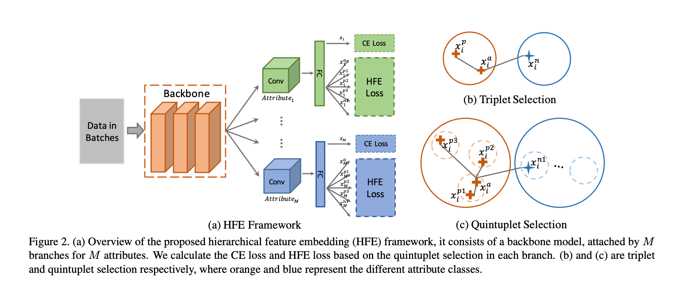

1. 在解决的是什么问题？ 人脸/行人属性识别领域
2. 为何成功，标志/准是什么？ HFE 的优势是它有能力学习到细粒度的包含了 ID 信息的复杂属性 feature的标识
3. 在前人基础上的关键创新是什么？大家都是对属性级别的 feature embedding，这里 a. 提出了层次化的 feature embedding：结合了属性和ID 信息 b, 使用了 HFE loss，使用了类内部和外部的限制 b. 构建一个绝对界限的修正：加强了原始的三元 loss c. dynamic loss weight, 这样考虑了 HFE 限制下的空间 d. 做了实现，在两个行人库和一个人脸属性库
4. 关键结果有哪些？能解决一些 hard case
5. 有哪些局限性？如何优化？
6. 这个工作可能有什么深远的影响？

思路：给同一个人的照片，应该有相同的属性。两级的 feature embedding：类别内部和类别外部。

虽然属性识别中，由于视角、光照等会有很大差异，但是通过 ID聚类，就可以让提高鲁棒性。也能解决一些 hardcase。然后通过 ID 聚类，减少异常

之所以要动态的 loss，是因为起初学习的不够多，等后面 HFE loss 的权重才会上来。

其中的图非常形象：运用 ID 先聚类，然后再看属性，此时就能挖掘出被遮盖住的属性。

## 启发
每个属性一个分支，跟目标检测里的 Fast R-CNN 系列有相似之处。前面是相同的 backbond，学习共用/相同的feature。后面每个属性一个分支，通过 CONV-FC来获取分类相关的feature。

使用不同分支的原因：

1. 不同的属性，比如年龄和性别，应该有自己独特的feature embedding
2. 使用 metric loss 是在每个属性自己的特征空间里，这个无法用在共享的特征空间。

metric learning: 目标是学习一个合适的指标 feature 空间，里面相同的sample 之间距离很小，而不同的sample 之间距离加大
## 问题
1. 属性相当于也是一个分类问题？人脸属性，行人属性。它的标记数据集是怎么做的呢？
2. 
