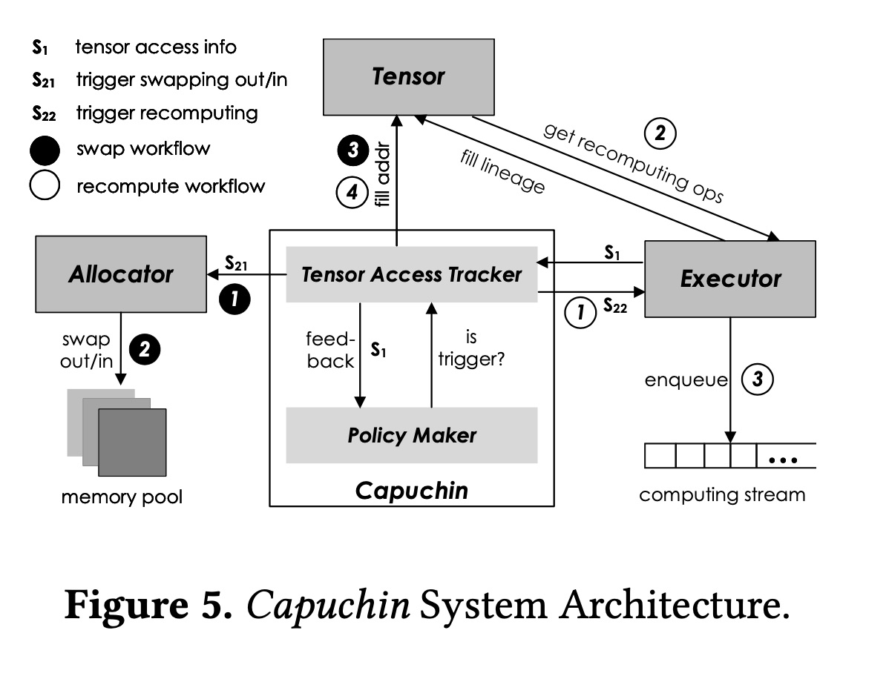

## 思考
1. 在解决的是什么问题？高效的内存使用，在现有 GPU 硬件上运行更大的模型，更大的batchsize
2. 为何成功，标志/准是什么？ 支持了更大的 batchsize 
3. 在前人基础上的关键创新是什么？ 内存管理不是常见的 layer 维度，而是更细粒度到 tensor 级别，是计算图无关的。而且是在运行时根据profile的结果来决定应该用 swap 还是 recomputation，其中 evict/prefetch，recomputing 的时机都是都是动态决策出来的。
4. 关键结果有哪些？
5. 有哪些局限性？如何优化？
6. 这个工作可能有什么深远的影响？

## 1. 介绍
Capuchin的设计基于两个关键观察:

1. 所有的深度学习框架都是基于数据流图的执行模型。所有步骤都是基于 tensor 上的操作。所有传统程序里的重用和局部性原理都适用于 DL 
2. DL应用的属性确保了我们方法的有效性：训练过程由成千上万的迭代组成，各自时间有很清晰的界限，在每个 itertaion 间，tensor 的访问是有规律和重复访问的模式

## 2. 背景
内存使用：

训练时内存主要有三部分：输入（激活值），权重，和其他比如计算卷积时需要的值，还有优化器里的状态，比如 SGD 里的二阶动量

### 2.2 DL框架执行模型的差别
Eager Mode：不构建图，直接从头开始执行。这样部署和debug 新模型比较方便，在学术界用来设计新模型时用的很多。TensorFLow 2.0 里默认就是这个。

Graph Model: 先构建一个计算图，图里的执行策略时 lazy，需要时才执行

## 3. 观察和动机
### 3.1 静态分析(vDNN, checkpoint)的局限
1. swap in 的时候，可能时机选择不合适，导致跟其他算子重叠的比例不够高。 swap 的时间取决于换入的大小及 PCIe 带宽，而某层的执行时间是由 GPU 型号和当前layer 所需算力和输入规模。
2. 同一层上同样类型的执行时间会变化。比如不同 GPU 上，不同 batchsize 下。举例，并不是说所有 CONV 都不能 recomppute。有一些计算大地家非常小，3ms左右，是可以重计算的

### 3.2 机会：Tensor 访问的常规模式(regular pattern)
不同 tensor 的多(两)次访问(forward, backward)之间间隔不同。而且不同tensor 之间的访问时间间隔也不同

## 4. Capuchin 内存管理机制
### 4.1 两个设计目标：

1. 最大代价去最小化额外开销。因为会有成千上万个 iteration
2. 足够通用，在不同 DL 框架里不需要太多代码改动

怎么没有提升多少性能之类的目标?

### 4.2 Design Overview
第一个 iteration 里进行执行的测量(measured execution)，第二个开始的 iteration 里使用自己的策略，算是被指导下的执行(guided execution)

提供 passive mode:按需进行 swap，比如 out of memory 了，就执行 swap。跟硬盘到内存，虚拟内存机制非常像。

在 measured execution 里，Capuchin 保存了 tensor 访问次序，以及 access count，timestamp，operation that produced a tensor and  its input tensor 来为重计算作准备。为了提高效率，在访问完一个 tensor，Capuchin 可以主动提前主动发起换入/换出这个内存。这样相比于有需要才切换，能够掩盖切换的开销。
 
 **关键问题**是如何选择合适的时间点来进行操作？需要集合 swap 和 recompute 的代价，既不能太早，也不能太晚。
 
 定义几个概念：
 
 1. evicted-access: 是访问 tesnor，然后出发换出操作的访问
 2. back-access：是换出之后的第一次访问。此时 tensor 可能在，也可能不在 GPU 显存里。如果没有主动的(proactive) tensor 重新产生，tensor 肯定不在 GPU 里，这样就增加了重产生的开销。我们可以在别的 tensor 访问时出发重产生当前 tensor 的操作。叫做 in-trigger(由其他 tensor 来触发) 。可以是一个 tensor 的 evicted-access 或者 back-access 来触发。如果没有指定，就认为访问失败（不在 GPU ） 后触发 re-generate
 
 上述两者之间间隔越长，越可以掩盖重新产生(swap or recompute) 的代价。1
 
 后面主要回答一下几个问题：
 
 1. 如何预估 swap 和重算的代价
 2. evict 哪些 tensor ? 时机是第一次执行 iteration 时，OOM。或者之后在约定的 evict 里（之后要 regenerate）
 3. 什么时候 evict 和 重产生? 根据 regenerate 的时间倒退的
 4. 如何重产生（swap 还是 recompute）: 哪个代价小，用哪个
 
一般情况下，swap 时，我们应该增加计算和 swap 叠加的时间

recompute 时，选择代价更小的

所以关键是预估出 swap 和重计算的代价。

### 4.3 预估 swap 和 recompute 的收益
对于 tensor 的 regneration，**目标**是把损耗尽量掩盖起来，来减小 back-access 时的等待时间。对于 swap，需要把 swap 操作和正常的计算操作并发，来掩盖额外开销。对于 recmpute 操作，尽量选择代价小的。实现这个目标的关键是精确预估 swap 和 计算的时间。

Capuchin 预估这些额外开销的方法是在 measured execution 里，通过 profiling 来预估开销。

1. FT(free time) = SwapInStartTime - SwapOutEndTime，可以用来判断 swap tensor 的效果。其中 SwapTime = memory size / PCIe 带宽。SwapOutEndTime = evicted-access time + SwapTime. SwapInStartTime = back-access time - SwapTime

2. 对于重计算，时间跟 op 算法，设备计算能力和输入大小有关。所以无法静态获取，因此通过计算 tensor 的家谱以及运行时 access time 来获得。算子的重计算开销可以通过输入/输出算子的访问时间差来获得。 MSPS (Memory Saving Per Second) = Memory Saving / Recomputing Time.

### 4.4 Determining Tensor Re-generation Cost

Swap： 可以通过计算 SwapInStartTime 来获得进行 swap in 的时机（back-access time - swap time)。但这是理想情况，时机还需要考虑如下两种情况：

1. in-trigger 不应该发生在内存峰值期间。因为会导致其他 tensor 被换出去
2. 因为 pinned memory 传输发生时，**双向的 PCIe 数据线是排他性使用的**，只有当前面的 swap 结束后，后面的 swap 才能发生。因此，实际发生 swap-in 可能会晚于 in-trigger 的时间

我们选取了时间后，可以基于下次的反馈来调整时间，比如当 back-access 时，发现还是要 swap  in 这个 tensor，说明此 tensor 的 swap 时间还需要再早一些。这个可以通过记录 tensor 的状态 (in/out) 来实现。最终发现一般基于 in-trigger 的时间，还要有5%的提前量

与 Swap 只需要 PCIe 资源而且和计算可以一起做，recompute 需要计算资源，而且发生内存不够时，大概率计算资源也不够。所以我们不用 in-trigger 这种方法来触发，而是按需的方式来用。这样不是就开销比较大么？无法掩盖 recompute 的时间（所以要挑recompute 开销小的？）

recompute 代价需要两个信息：

1. 在家谱里的 tensor 的生命周期，来决定一个 tensor（不是recomputation 的候选集） 是否可以作为源头(不能被 swap 或 recompute ，必须在显存里吧？)
2.  tensor 是否是 reomcputation 候选集。假设是在 GPU 内存里

关键发现是当一个 tensor 确定需要 recompute，会影响其他候选 tensor(recompute candidate? ) 的 MSPS。后续会更新如何迭代更新 MSPS

### 4.5 Selecting Memory Optimization

对于一个 tensor，我们优先选择 swap 的方式，因为它的代价可以掩盖，而除非无法用 intrigger 来完美掩盖 swap 的开销，此时采用 recompute 机制, 肯定带来计算资源的代价。

先选出 eviction 候选集，需要满足两个条件：
1. tensor 的 access count 必须 > 1
2. tesnsor 的访问，需要发生在峰值内存使用的那段时间里。在profiling 阶段，可以记录 allocate 和 deallocate 的时间，来推断内存使用

再选出 eviction 的集合 : 是基于算出的 FT 来排序，此时没考虑 MSPS。挨个处理这个集合，直到节省的内存够用了，不会造成峰值时期的 OOM 。

recompute 的复杂之处主要在于当一个 tensor 被选为 eviction 集合里，那么候选集合里的其他 tensor 的 recompute 来源 也会受影响，导致上述tensor 的 MSPS 受影响（分母 recomputation 代价变大）

## 5. Capuchin 实现
先介绍了实现所需的 DL 框架依赖，然后是系统架构，最后提出了两个性能优化。最终讨论了 GPU 架构下的特定问题
### 5.1 框架要求
需要有两个模块：
1. Executor： 代表基本计算 op 的处理单元。为了获取 tensor 访问的序列，我们在每个tensor 的计算开始和结束后植入 RecordTensorAccess()。这样 tensor 的家谱是动态地在运行时创建。给定一个 tensor 的唯一 ID 作为参数，可以搜出最近的作为重计算的输入 tensor。
2. Allocator: 是 cudaMalloc 和 cudaFree 的 wrapper。内存分配器需要支持额外的两个操作：swapIN 和 swapOut。这两个都接受一个地址参数，根据 GPU 或 CPU 设备来分配要求大小的内存。

### 5.2 系统架构

图5展示了架构图：

tensor_id 是唯一用来在多次迭代过程中定位同一个 tensor 的标识，因为一个 tensor 的内存地址在多次迭代中是会变化的

Capuchin 由两部分组成：
1. Tensor Access Tracker： 它和 Executor ，Tensor 和 Allocator 交互，跟踪 tensor access的信息，实施在某一次 tesnor 具体 访问上的内存管理操作。
2. PM : 负责根据 TAT 里的访存信息来指定内存管理策略

Tensor Accesss Tracker (TAT) : 维护了一个 tensor access list，每个元素包括：{tensor\_id, access\_count, timestamp}。每次访问内存，都会在 tensor access list 里插入一个上述三元组。
TAT 的设计目标是两个：
1. 实现按需进行内存 swap 的操作，克服在measure exectuion里发生的 OOM 和 Access Failure(被换出了）。
2. tracks tesnor access pattern

为了支持 按需 swapping，TAT 工作在图六所示的 passive mode。当 OOM 出现后，从 access list 里找到合适的多个 tensor，换出去。然后 evicted tensor 内存会被异步拷贝到 CPU 里，{tensor\_id, cpu\_addr} 会被保存在 TAT 里。 当后续访问这个 tensor，access failure 会发生，此时 TAT 会把 CPU里的内存拷贝到 GPU 里。

TensorFLow 里能区分出每个 iteration，通过 stepID，而 pytorch 里没有，只能通过第二次访问同一个 tensor 来知道 backward 开始了。

## 启发
1. 能够把 overlap 思想结合到 actnn 里？让解压缩提前做，这样解压缩和backward 同时进行
2. 关于 Pytorch 里的 Allocator，可以看看 ActNN 对 pytorch 里内存分配策略的修改？

## 问题
1. 算法2 和算法1 之间的关系？算法1是看对于candidate set，选出要 eviction 的集合，而且确定了要用 recompute 还是 swap。而算法2是在选出recompute targs，而且更新选择这些之后带来的对其他 tensor 的影响
2. 其实重点是 swap 的过程是提前做，而 recomputation 是swap 代价太大后的次选。

