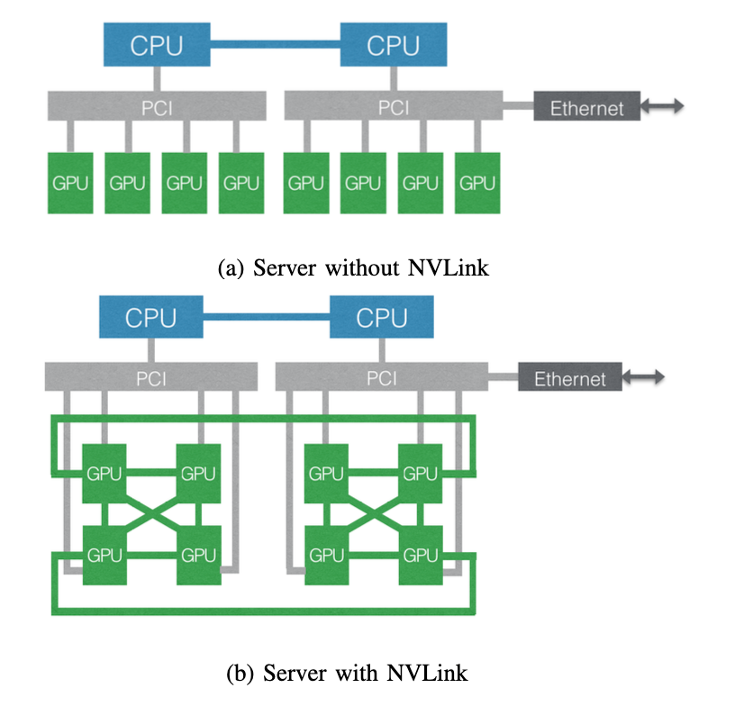

## 摘要
构建一套分析的框架，可以分析不同框架，不同负责类型的详细执行时间的分解图，目标是找到性能瓶颈。结果表明权重/梯度通行在训练任务里占据总时间的 62%，在我们所有的负载上平均的数据。
在软/硬件众多映射上，探究了软件架构选型(PS or  AllReduce) 和硬件配置方面的实际性能。发现 60% 的 P/S 负载可以在移植到 AllReduce 架构后提速，利用了 GPU 间同主机上互联的 NVLink，
平均有 1.7X 的增速，当网卡带宽从 25Gbps 升级到 10Gbps

目标不是精确衡量执行的时间，而是刻画出计算，输入和参数通信三者之间的相对时间损耗。因此没有考虑潜在的计算和通信重叠。

发现计算里，内存密集型的占比比计算密集型大

## 如何设计一套这样的系统？
pytorch 框架

我们的目标：
测量如下指标，看各自的占比(不需要精确的时间)，然后找到优化的方向
记录 输入 I/O 的时间、权重/梯度/动量等通信的时间，计算的时间，还是比较粗粒度的。可以看整个 forward 和 backward 的计算时间

### 收集信息
分两类：
1. 静态的 job 信息：申请了多少显卡，跑在什么样的硬件上，model size 是什么，是 ddp 还是
2. 动态的 信息：三方面的耗时各自多少。粒度有 Job 粒度，集群粒度，日期粒度，都是同一类任务。

### 问题
1. 为了区分这些任务，需要让研究员主动带上训练的名字，这个只是类似一个标签。我们会跟 wandb 类似，记录
2. 如何最小侵入性实现？比如实现一个模块，还是直接改 pytorch？ 先想一个方案出来，然后看可以有哪些变化？
3. 看起来这篇论文里没有考虑同一个模型，使用不同 batchsize, 超参等，导致的各项占比差异？ 估计它不关心这类太细粒度的东西
4. 采集指标的粒度，如果一个 iteration(bs) 是1s 级别，那么需要 ms 粒度的耗时统计？或者我们以一个 epoch 的时间

## 疑问：
1. 计算 Input I/O 的方法： 假设当前 batch 需要读取 10 张 共 100M 的数据，是直接假设命中 cache？命中之后的速度也会有差异吧？
2. 计算 weight / gradient communication 的方法：每次同步需要的数据量，参与者。是否有 IB 的统计？然后我们用别人的历史监控，加上我们自己记录的时间戳，两个对比，还是说我们自己采集？ 有可能就只是统计理论值即可，那问题就是怎么计算这个理论上的通信带宽值
3. 计算 运算的方法
4. 上述似乎都可以计算出来，那实际度量和计算之间的差异是为何？还会有波动，如何衡量波动的原因
5. Data IO 里，为何没有考虑磁盘或网络存储的速度？只是考虑 CPU 到 GPU 的 PCIE 影响
6. 如果是单机8卡，数据搬用时，还会有竞争？到每个卡上的带宽是多少？

## 启发： 
1. 优先关注占用资源多的任务，因为说明问题规模更大，给公司的经济利益影响大
2. 优化时考虑的因素：Data Preprocess，Ethernet，NVLink，MemoryCopy(PCIe)，Element Wise(仿寸密集型)，MatMul or Conv
3. 大 batch 对 GPU 更友好，而 element-wise 操作会成为瓶颈，计算时间可以通过 xla 在执行时融合。（特指 Multi-interests 模型里的）
## 我们的目标
1. 搞清楚集群里的资源主要被哪些任务、组占用了
2. 分析两个任务跑在一台主机上，对相互的影响有多大？看单独跑的效率，跟一起跑的效率做对比
3. 未来考虑带着超参数等，一起记录。好处是集中式记录集群上每次训练任务的精度等信息，方便对比判断，可以留有历史记录
4. 
