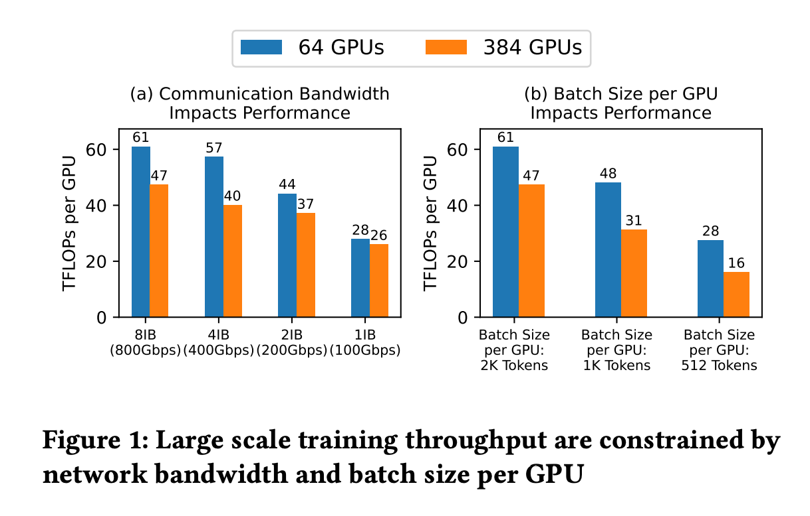

1. 在解决的是什么问题？ZeRO 通信里吞吐受限于网络带宽
2. 为何成功，标志/准是什么？通信开销从 3M 降低到了 0.75M，吞吐量在 384 GPU 的规模下，提升了 2.16 倍
3. 在前人基础上的关键创新是什么？
4. 关键结果有哪些？
5. 有哪些局限性？如何优化？
6. 这个工作可能有什么深远的影响？

## 摘要
ZeRO 被用来在大规模的 GPU 集群上做 LLM 的训练，因为使用简单，高效，扩展性很好。但是当在低带宽的集群里，或者上了规模，导致每个 GPU 上的 batchsize 变小后，ZeRO 的有效吞吐就会被限制：因为在 fwd/bwd 时需要 gather 权重，平均梯度。本文介绍了三个方法，在上述三次通信里，减少开销。都是基于 ZeRO3（显存不够用，所以 Optimizer State，Gradient, Parameters 都要切分。但是本文里主要想优化 Gradients 和 Parameters 这两部分 ）
1. block-quantization based all-gather: zero\_quantized\_weights: bool
2. data remapping，多用显存来减少通信: zero\_hpz\_partition\_size: number of ranks in hpZ(secondary partition), default =1 ,意思是主机内部不切分
3. 创新的基于 all-to-all 的量化梯度平均的方法，可以作为 reduce-scatter 通信的替代品: zero_quantized_gradients: boolean

这样通信量降低了 4 倍（3M -> 0.75M)

## 1 扩展介绍
目前有两种流行的方法来做大规模的千卡训练：3D parallelism 和 Zero Redundancy Optimizer
3D 并行的劣势是需要把修改代码来适配 3D 并行。而 ZeRO 提供了无须改代码的方法。它其实本质就是 DDP 的一个**显存更高效**的版本，把模型状态切分到了所有的 GPU 上，而不是复制很多份，然后在训练过程中 on-the-fly 地liyong  基于 gather 的collectives 来重建出来。代价是比标准的 DDP 训练的通信（2M: fp16 的参数)高(3M，M 是模型参数量)

### 1.1 ZeRO 的限制
两个场景下，ZeRO 的效率受限于通信开销：

1. 集群里主机间带宽低: 跨机带宽往往小于 100Gbps，让通信成为瓶颈。如图1所示：一个 IB 下的GPU吞吐是8个 IB 的一半
2. 每个 GPU 上 bs 低：由于在上千块卡上跑，而最大的全局batch size 在训练时不可能无限大，而且不能影响模型收敛，所以只能在一个区间里，导致此时每个 GPU  上的 bs 变小。这样每个 GPU 上的计算和通信比降低，让通信成为瓶颈。如图1（b)，每个 GPU 上的吞吐被严重影响

### 1.2 ZeRO++
假设模型参数大小为 M。在 fwd 过程中，ZeRO 使用 all-gather 操作来收集所有的参数 M。在 bwd 时，先重新收集所有参数M，然后每个GPU
计算自己的梯度。之后，ZeRO 使用 reduce-scatter 来聚合并重新分发梯度（M）。总共通信量是 3M，均匀分布在 2 次 all-gather，一次 reduce-scatter 

为了减少通信开销，ZeRO++ 有三套通信优化策略：

** 量化权重通信(fwd weight): Quantized Weight Communication for ZeRO (qwZ) : fp16 -> int8，减小一半。为了保证精度，使用 block-based quantization：在模型参数的每个子集上使用独立的量化。自己实现了 cuda 的 高效 kernel 实现

** 层次化 ZeRO 权重划分(bwd weight)：我们在每台主机上保留一份完整的模型，这样显存占用多，但是跨机的all-gather weights 就可以避免了

** 量化梯度通信(gradient): 量化会对低精度的数值产生误差并累积、放大。我们提出了创新的更高效的方法来代替 reduce-scatter 集合通信，使用 block-based int4 quantization 来通信，但是执行 reduce 算子时恢复到全精度。而且我们现在主机内部 reduce 梯度，然后再在主机间。而且我们还用主机内和主机间通信做成流水线和使用 cuda kernel fusion 来进一步缩短延迟

使用上述方法，通信量从 3M 降低到了 0.75M： 0.5M(fwd parameters: fp16 -> int8) + 0(bwd parameters) + 0.25M(int4 gradient)
