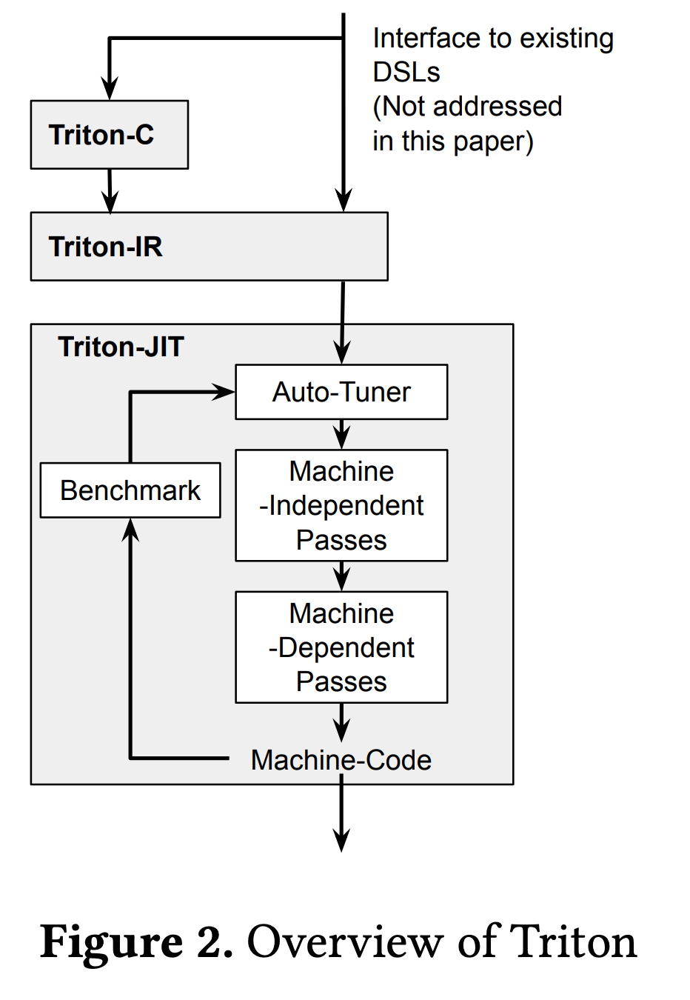

1. 在解决的是什么问题？使用 DL 加速器 vendor 的库来加速算子太难写了，门槛太高
2. 为何成功，标志/准是什么？
3. 在前人基础上的关键创新是什么？ 基于 tile(**静态**shape的多维子数组)来提供了语言和编译器，有一堆编译器优化算子来构建高效的 gpu 代码
4. 关键结果有哪些？和手工优化过的vendor 库如 cuBLAS/cuDNN 有同等加速水平
5. 有哪些局限性？如何优化？
6. 这个工作可能有什么深远的影响？

## 摘要

我们的方法包括：

1. C-based 语言和一个 LLVM-based IR 来表达以参数化 tile 变量 tensor programs
2. 几个创新的 tile 级别优化passes，可以把这些程序编译为高效的 GPU 代码。

我们实验证明了 Triton 可以用来构建可移植的矩阵和卷积kernel 实现，能够达到手工优化的 vendor lib (cuBLAS/cuDNN)一样的速度，也可以高效实现最近的研究新思路比如 shift conv

## 介绍

vendor libs 由于只支持一部分有限的tensor操作集合，让 sys ml 专家自己实现创新的原语。

这也导致出现了很多给 DNN 的 DSL 语言，基于多面体（Tensor Comprehensions) 或者循环合成的技术（Halide，TVM和 PlaidML）。

利用多面体模型来分析循环嵌套的依赖。这些工作都是自底向上。Fireiron 和 Stripe 使用嵌套的多面体结构来建模 tensor programs 以自顶向下的方法。

TensorIR 聚焦在自动化 tensorization 的进程来产生多平台上优化的代码，而无须人工干预。

AutoTVM 引入基于学习的方法通过一个学到的cost model 和模版指导的 search 来优化tensor 程序

Ansor 使用层次化搜索空间来提高自动调度

但这些经常比 vendor 库要慢，缺乏表达力来实现结构化稀疏，导致无法直接用 affine array(仿射) 下标。

这些问题经常被 micro-kernels 解决 -- 即手工编写 tile-level 的内联函数(intrinsics)，但这种方法需要大量手工，缺乏移植性。尽管最近支持tiling的高级语言抽象出现了，但是底层的编译器缺乏对 tile-level 操作的支持和优化。因此我们提出 Triton，是一个开源的
IR和编译器 ，用来写、编译tile程序到高效的GPU代码。



本文主要贡献：

* Triton-C: 一个类似 C 语言，用来表达 tensor 程序，以参数化 tile 变量视角。是为了给现有的 DNN 编译器提供稳定接口(PalidML, Tensor  Comprehensions)和熟悉 CUDA 的程序猿。List1 里是一个 Triton-C 的矩阵乘法例子

* Triton-IR: 基于 LLVM的 IR，提供了适合 tile-level程序分析、转换和优化的环境。Listing 5 展示了给 ReLU 函数的 Triton-IR 代码。这里 Triton-IR是直接通过解析 Triton-C 来构建的，但是自动从嵌入的 DSL 或者更高级别 DNN 编译器(TVM)也可以在未来支持。

* Triton-JIT：一个 JIT  编译器和代码生成的后端，用来编译 Triton-IR 程序到高效的 LLVM 字节码。这包括：一个tile-level，机器无关的passes，用来简化输入的计算kernel。一个tile-level机器相关passes：产生高效的 GPU LLVM-IR。3: auto-tuner，可以优化上述passes里的任何相关元参数

* Numerical Experiments: 展示：1.和cuBLAS一样高效的 gemm，比 RNN 和 transformer 上的DSL要快3倍 2: 重新实现 cuDNN 里的 IMPLICIT_GEMM 算法，这种 dense conv 无性能损失 3:高效实现最新的 shift-conv 模块

Tiling 是被熟知的方法，它提供了既能有数据局部性，又能有并行度的方法

## 2 相关工作

已知的三类不同的 DSL 方法的 DNN 编译器：
* Tensor-level IRs: XLA、Glow
* The polyhedral 模型：Tensor  Comprehensions、Diesel 来参数化并自动编译
* Loop synthesizers: Halide、TVM 来把 tensor 计算转换为嵌套的 loop，可以被手工使用用户定义好的（通过比如参数）调度来优化

Triton 依赖于 tile-level 操作和优化加入 到传统的编译器 pipeline 里，这样提供了：

1. 比 XLA 和 Glow 更大的灵活性
2. 与TC和 DIesel 相比，支持非仿射的 tensor 下标
3. 自动推导可能的执行调度，比如在Halide和TVM里是人工指定的

Triton 的收益的代价是增加了编程的代价：实现代码比上述几个相关工作要多一些

```
C = tf.matmul(A, tf.transpose(B)) // TF
C[i, j: I, J] = +(A[i,k]*B[j, k]); // PlaidML
C(i, j) +=! A(i, k)*B(j, k) // TC
tvm.sum(a[i, k]*B[j,k], axis=k) // TVM
```
## 3 Triton-C 语言
目的是给已有（未来）的 DNN 编译器提供一个稳定前端，也可以给熟悉 GPU 编程的人使用。描述了类 CUDA 的 语法，类似 Numpy 的语义， Single-Program，Multiple-Data 的编程模型

### 3.1 语法
Tile 声明

## 问题
1. Triton IR 和 JIT 都是基于 LLVM，那 LLVM 到底提供什么能力，而 Triton 又在之上开发了什么呢

## 和 TensorIR 的对比

triton 功能上差不多是 TensorIR 的一个子集：设计了一个 tile-level programming interface，然后自动做了一些 schedule: 比如 ti.dot 背后的 tensorize

他俩的 block 和 tiling 感觉都一样呢？

